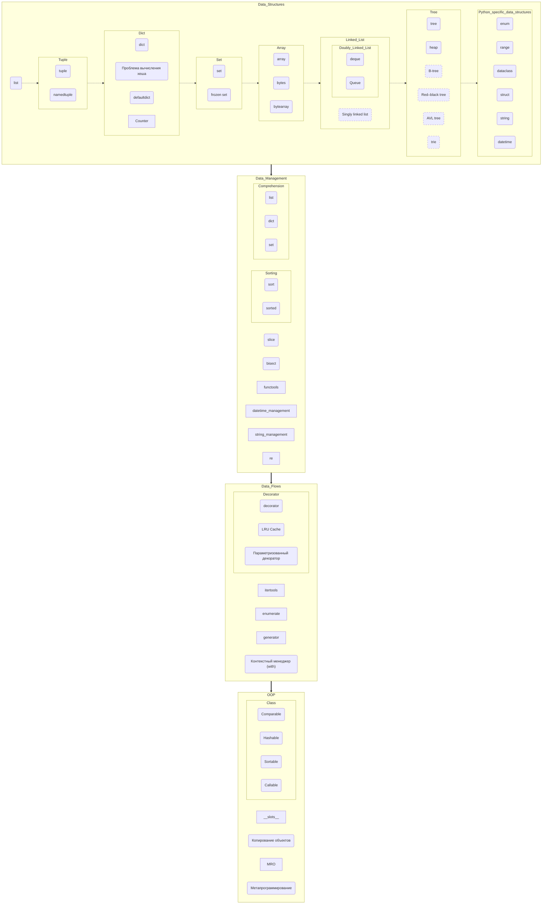

Пайтон джуньор плюс, или Карта Сокровищ

### Введение

Добрый день! Меня зовут Михаил Емельянов, по профессии я программист программ, а эту небольшую памятку по базовым возможностям языка Python меня сподвиг написать довольно существенный, на мой взгляд, разрыв между декларируемыми объемами всевозможных курсов программирования и требованиями реальных, даже достаточно скромнооплачиваеых вакансий.

Пользуясь аналогиями из игрового мира, можно сказать, что начинающий программист зачастую стоит на берегу озера кипящей лавы, в центре которого находится остров со столь вожделенными вакансиями, а промежуточные островки, по которым надо перепрыгивать, постепенно наращивая свои навыки в последовательных мини-квестах, либо отсутствуют, либо расположены несистемно и хаотично, либо достаточно ровная их последовательность обрывается, так и не успев помочь отойти сколько-нибудь далеко от берега. Давайте попробуем построить дорожку островков-подсказок, ряд которых, хоть и не без усилий, позволит-таки нам достичь цели.

Небольшое отступление про формат Jupiter Notebooks, на случай, если раньше вам не приходилось иметь с ним дела. Jupiter позволяет перемешивать текстовые заметки, исходные коды и результаты вывода программ.  
Здесь вы видите текст, который выглядит как обычная статья, но это только потому, что исходный Jupiter Notebook был при помощи nbconvert преобразован в Markdown. На самом деле **все примеры кода интерактивны, вы можете их менять, дополнять и вообще крутить как угодно**, разбираясь в тонкостях Python; поэтому многие используемые методы не «разжеваны» (да такой задачи и не ставилось), Jupiter сам по себе лучший самоучитель. Исходные тексты лежат на [github/amaargiru/pycore](https://github.com/amaargiru/pycore).

Для работы с Jupiter вы можете воспользоваться [VS Code](https://code.visualstudio.com/), JetBrains [IntelliJ](https://www.jetbrains.com/ru-ru/idea/) или каким-нибудь онлайн-инструментом, самым известным из которых являятся [Google Colab](https://colab.research.google.com/).

В этой стать 100 % есть ошибки и неточности самых разных калибров, так что, если что-то углядите, не стесняйтесь выражаться в личку, в комментариях, на почту war4one@gmail.com, а если чувствуете в себе Силу — смело форкайте репу и пишите туда всё, что считаете нужным, все исправления и дополнения бурно приветствуются.

Погружаясь в Python, не забывайте про прекрасную официальную документацию [docs.python.org](https://docs.python.org/). Изучив её, хотя бы по диагонали, и постепенно углубляясь в нужные разделы, вы сможете убедиться, что многие «хаки», «открытия» и прочие неочевидные вещи уже давно разжеваны, описаны и имеют подробные примеры применения.

Также я бы рекомендовал для изучения базового синтаксиса Python на полную катушку использовать [leetcode.com](https://leetcode.com/problemset/all/?difficulty=EASY&page=1&status=NOT_STARTED). Если отфильтровать задачи по уровню «Easy», а потом добавить дополнительную сортировку по столбцу «Acceptance», то перед вами предстанет не волчий оскал соревновательной платформы, а ванильный букварь с плавно нарастающим уровнем задачек.

Что ж, пожалуй, довольно запрягать. Погнали!  

### Оглавление

