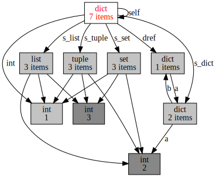
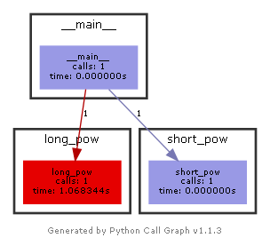
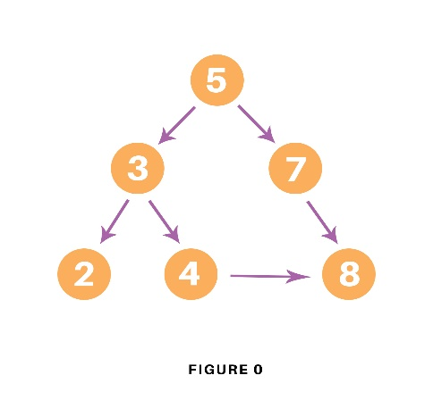
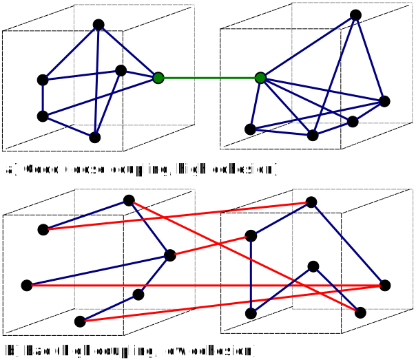
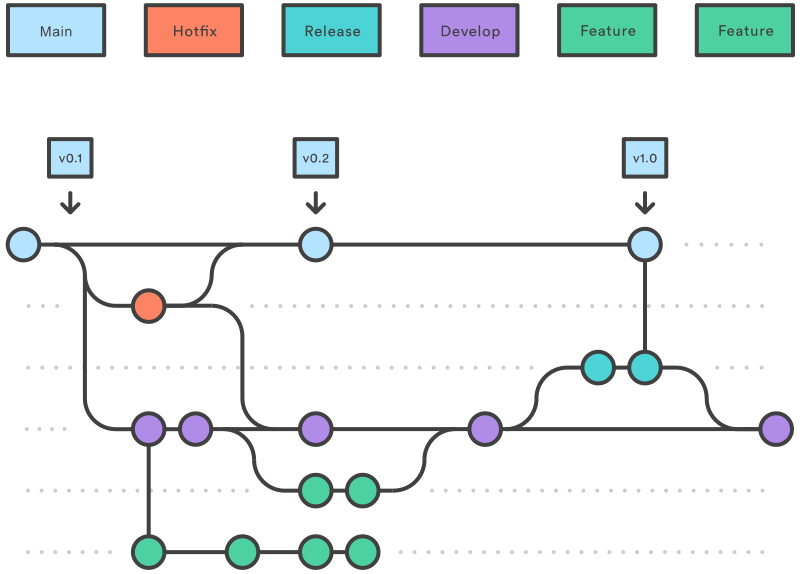

## Ядро планеты Python

Обратите внимание, пока этот материал находится в статусе **черновика**. Чем дальше вы продвинетесь вглубь текста, тем больше неувязок, косноязычия и ошибок вы там увидите, а где-то примерно в районе середины руководства окончательно попадёте в область разрозненных заметок, невнятных почеркушек и псоголовых воинов, воюющих с драконами. Пожалуйста, не судите строго, материал хоть и небыстро, но упорно корректируется, медленно дрейфуя в сторону большей читаемости.

Этот материал со всеми свежими правками доступен на [GitHub](https://github.com/amaargiru/pycore), вы вольны сколько угодно дополнять и переделывать его. Самое главное — учебник написан на [Jupiter Notebook](https://en.wikipedia.org/wiki/Project_Jupyter), а это значит, что вы можете интерактивно редактировать и исполнять код, мгновенно добавляя новые сущности или проясняя непонятные моменты.

.jpg)

### Введение

Добрый день! Меня зовут Михаил Емельянов, по профессии я программист программ, а этот небольшой мини-учебник по базовым возможностям языка Python меня сподвиг написать довольно существенный, на мой взгляд, разрыв между декларируемыми объемами всевозможных курсов программирования и требованиями даже достаточно скромнооплачиваеых, но реальных вакансий.

Пользуясь аналогиями из игрового мира, можно сказать, что начинающий программист зачастую стоит на берегу озера кипящей лавы, в центре которого находится остров со столь вожделенными вакансиями, а промежуточные островки, по которым нужно ловко прыгать, постепенно наращивая свои навыки в последовательных мини-квестах, либо отсутствуют, либо расположены несистемно и хаотично, либо достаточно ровная их последовательность обрывается, так и не успев помочь отойти сколько-нибудь далеко от берега. Давайте попробуем построить дорожку островков-подсказок, ряд которых, хоть и не без усилий, позволит-таки нам достичь цели.

В этом руководстве с вероятностью 100 % есть ошибки и неточности самых разных калибров, так что, если что-то углядите, не стесняйтесь заводить PR и создавать форки на [GitHub](https://github.com/amaargiru/pycore), любые предложения и дополнения бурно приветствуются; давайте вместе попробуем раскрыть специфику Python'а, удобство, красоту и силу этого прекрасного языка.

Разумеется, повествование может показаться вам несколько несбалансированным, т. к. я, увлёкшись, могу более подробно освещать темы, интересные лично мне, в ущерб целостности материала, и, с другой стороны, не хочу переписывать документацию на Python, нудно перечисляя методы работы со структурами данных. Кстати, не забывайте про великолепную официальную документацию [docs.python.org](https://docs.python.org/). Она достаточно объёмна, но, изучив её, хотя бы «по диагонали», и постепенно углубляясь в нужные разделы, вы сможете убедиться, что многие «хаки», «открытия» и прочие не очевидные вещи уже давно разжеваны, описаны и имеют подробные примеры применения.

> Здесь и далее вы можете увидеть вот такие вставки. Если это не эпиграф в начале главы, то это информационная вставка, содержащая ответ на вопрос собеседования. Например:
>
> __Что такое Python?__
>
> Интерпретируемый (преимущественно) язык программирования с динамической строгой типизацией и автоматическим управлением памятью.  
> Существуют реализации Python, позволяющие компилировать исходный код (например, [cython](https://github.com/cython/cython)), но, как правило, работа с Python строится при помощи интерпретатора.
>
> Такие вставки призваны закрепить материал.

Также я бы рекомендовал для изучения базового синтаксиса Python на полную катушку использовать [leetcode.com](https://leetcode.com/problemset/all/?difficulty=EASY&page=1&status=NOT_STARTED). Если отфильтровать задачи по уровню «Easy», а потом добавить дополнительную сортировку по столбцу «Acceptance», то перед вами предстанет не волчий оскал соревновательной платформы, а ванильный букварь с плавно нарастающим уровнем задачек.

Что ж, пожалуй, довольно запрягать. Погнали!

### Оглавление

Ниже вы видите оглавление, сделанное для лучшего усвоения не плоским, а в виде диаграммы-путеводителя.

Пользоваться путеводителем очень просто. Как в обычном тексте, идите слева направо и сверху вниз. Если вы только начинаете изучать Python, то идите по зеленым пунктам путеводителя. Если накопленный опыт, любопытство или необходимость толкают вас глубже, начните изучать разделы, помеченные серым. Оранжевым помечены темы, требующие углубленного изучения, ими лучше заняться (хотя бы и не копая, для начала, особенно глубоко) в третий проход. Даже если вы не собираетесь плотно использовать на практике какие-то из «оранжевых» тем, рассмотрите хотя бы их общие аспекты, на уровне чёткого понимания области применения, плюсов и минусов; держите, так сказать, в «горячем резерве».


## 1. Структуры данных

  

Как известно, программирование = структуры данных + алгоритмы (у Никлауса Вирта даже [книга](https://en.wikipedia.org/wiki/Algorithms_%2B_Data_Structures_%3D_Programs) такая есть). Начнем с данных, а потом плавненько перейдем к методам их обработки.

### Список (list)

Список — самая универсальная и популярная структура данных в Python. Если вы пока точно не определились, какая структура понадобится в вашем проекте, просто возьмите список, с него относительно просто мигрировать на что-нибудь более специализированное.

Список представляет собой упорядоченную изменяемую коллекцию объектов произвольного типа. [Внутреннее строение](https://github.com/python/cpython/blob/main/Objects/listobject.c) списка — [динамический массив](https://en.wikipedia.org/wiki/Dynamic_array) указателей, т. е. внутри списки хранят не сами объекты, а ссылки на них, что позволяет им содержать элементы разных типов.


```python
a = []  # Создаем пустой список

a: list[int] = [10, 20]
b: list[int] = [30, 40]
a.append(50)  # Добавляем значение в конец списка
b.insert(2, 60)  # Вставляем значение по определенному индексу
print(a, b)

a += b
print(f"Add: {a}")

a.reverse()
b = list(reversed(a))  # reversed() возвращает итератор, а не список
print(f"Reverse: {a}, {b}")

b = sorted(a)  # Возвращает новый отсортированный список
a.sort()  # Модифицирует исходный список и не возвращает ничего
print(f"Sort: {a}, {b}")
a.clear()  # Очистка списка
```

    [10, 20, 50] [30, 40, 60]
    Add: [10, 20, 50, 30, 40, 60]
    Reverse: [60, 40, 30, 50, 20, 10], [10, 20, 50, 30, 40, 60]
    Sort: [10, 20, 30, 40, 50, 60], [10, 20, 30, 40, 50, 60]
    


```python
s: str = "A whole string"
list_of_chars: list = list(s)
print(list_of_chars)
list_of_words: list = s.split()
print(list_of_words)

i: int = list_of_chars.index("w")  # Возвращает индекс первого вхождения искомого элемента или вызывает исключение ValueError
print(i)
list_of_chars.remove("w")  # Удаляет первое вхождение искомого элемента или вызывает исключение ValueError
e = list_of_chars.pop(9)  # Удаляет и возвращает значение, расположенное по индексу. pop() (без аргумента) удалит и вернет последний элемент списка
print(list_of_chars, e)
```

    ['A', ' ', 'w', 'h', 'o', 'l', 'e', ' ', 's', 't', 'r', 'i', 'n', 'g']
    ['A', 'whole', 'string']
    2
    ['A', ' ', 'h', 'o', 'l', 'e', ' ', 's', 't', 'i', 'n', 'g'] r
    

> __Можно ли применять отрицательный индекс при работе с итеративными типами?__
>
> Да, можно. Отрицательный индекс позволяет вести отсчёт от конца структуры данных, например, массива или списка. Финт несколько неоднозначный, может привести к ошибкам, которые будет непросто найти, поэтому, например, в Golang подобный выверт [запретили](https://groups.google.com/g/golang-nuts/c/yn9Q6HhgWi0/m/oqb5s4cL70EJ).

### Строка (string)

Строки в Python 3 — иммутабельные последовательности, использующие кодировку Unicode.


```python
se: str = ""  # Пустая строка
si: str = str(12345)  # Создает строку из числа
sj: str = " ".join(["Follow", "the", "white", "rabbit"])  # Собирает строку из кусочков, используя указанный разделитель
print(f"Joined string: {sj}")

is_contains: bool = "rabbit" in sj  # Проверка наличия подстроки
is_startswith = sj.startswith("Foll")
is_endswith = sj.endswith("bat")
print(f"is_contains = {is_contains}, is_startswith = {is_startswith}, is_endswith = {is_endswith}")

sr: str  = sj.replace("rabbit", "sheep")  # Замена подстроки. Можно указать количество замен: sr: str  = sj.replace("rabbit", "sheep", times)
print(f"After replace: {sr}")

i1 = sr.find("rabbit")  # Возвращает стартовый индекс первого вхождения или -1. Есть еще rfind(), начинающий искать с конца строки
i2 = sr.index("sheep")  #  Возвращает стартовый индекс первого вхождения или выкидывает ValueError. Есть еще rindex(), начинающий искать с конца строки
print(f"Start index of 'rabbit' is {i1}, start index of 'sheep' is {i2}")

d = str.maketrans({"a" : "x", "b" : "y", "c" : "z"})
st  = "abc".translate(d)
print(f"Translate string: {st}")

sr = sj[::-1]  # Реверс через slice с отрицательным шагом
print(f"Reverse string: {sr}")
```

    Joined string: Follow the white rabbit
    is_contains = True, is_startswith = True, is_endswith = False
    After replace: Follow the white sheep
    Start index of 'rabbit' is -1, start index of 'sheep' is 17
    Translate string: xyz
    Reverse string: tibbar etihw eht wolloF
    

### Datetime

Для работы с датами и временем в *datetime* есть типы *date*, *time*, *datetime* и *timedelta*. Все они хэшируемы и иммутабельны.


```python
from datetime import date, time, datetime, timedelta

d: date = date(year=1964, month=9, day=2)
t: time  = time(hour=12, minute=30, second=0, microsecond=0, tzinfo=None, fold=0)
dt: datetime = datetime(year=1964, month=9, day=2, hour=10, minute=30, second=0)
td: timedelta = timedelta(weeks=1, days=1, hours=12, minutes=13, seconds=14)

print (f"{d}\n {t}\n {dt}\n {td}")
```

    1964-09-02
     12:30:00
     1964-09-02 10:30:00
     8 days, 12:13:14
    

### Кортеж (tuple)  
Кортеж — тоже список, только неизменяемый (immutable) и хэшируемый (hashable). Кортеж, содержащий те же данные, что и список, занимает меньше места и быстрее работает ([разъяснение](https://stackoverflow.com/questions/68630/are-tuples-more-efficient-than-lists-in-python)):


```python
a = [2, 3, "Boson", "Higgs", 1.56e-22]
b = (2, 3, "Boson", "Higgs", 1.56e-22)

print(f"List: {a.__sizeof__()} bytes")
print(f"Tuple: {b.__sizeof__()} bytes")
```

    List: 104 bytes
    Tuple: 64 bytes
    

Сам кортеж неизменяем, но если внутри кортежа находятся изменяемые элементы, например списки или словари, то их значения можно изменить.

### Именованный кортеж (named tuple)
В полном соответствии с названием, имеет именованные поля. Удобно!


```python
from collections import namedtuple

rectangle = namedtuple('rectangle', 'length width')
r = rectangle(length = 1, width = 2)

print(r)
print(r.length)
print(r.width)
print(r._fields)
```

    rectangle(length=1, width=2)
    1
    2
    ('length', 'width')
    

> __Какая разница между списком и кортежем? Как в памяти хранятся списки и кортежи?__
>
>Список — изменяемая коллекция объектов произвольных типов. Внутреннее строение списка — динамический массив указателей.
>
> Кортеж — тоже список, только неизменяемый. Кортеж, содержащий те же данные, что и список, занимает меньше места.

### Словарь (dict)

Словарь — следующая по частоте использования структура данных в Python. Словарь — реализация хеш-таблицы, поэтому в качестве ключа нельзя брать нехэшируемый объект, например, список (тут-то нам и может пригодиться кортеж). Ключом словаря может быть любой неизменяемый объект: число, строка, datetime и даже функция. Такие объекты имеют метод **\_\_hash__()**, который однозначно сопоставляет объект с некоторым числом. По этому числу словарь ищет значение для ключа.

Списки, словари и множества (которые мы рассмотрим чуть ниже) изменяемы и не имеют метода хеширования, при попытке подставить их в словарь возникнет ошибка.


```python
d = {}  # Создаем пустой словарь

d: dict[str, str] = {"Italy": "Pizza", "US": "Hot-Dog", "China": "Dim Sum"}  # Непосредственное создание словаря

k = ["Italy", "US", "China"]
v = ["Pizza", "Hot-Dog", "Dim Sum"]
d = dict(zip(k, v))  # Создание словаря из двух коллекций при помощи zip

k = d.keys()  # Коллекция ключей. Отражает изменения в основном словаре
v = d.values()  # Коллекция значений. Тоже отражает изменения в основном словаре
k_v = d.items()  # Кортежи ключ-значение, которые тоже отражают изменения в основном словаре

print(d)
print(k)
print(v)
print(k_v)

print(f"Mapping: {k.mapping['Italy']}")

d.update({"China": "Dumplings"})  # Добавление значение. При совпадении ключа старое значение будет перезаписано
print(f"Replace item: {d}")

c = d["China"]  # Читаем значение
print(f"Read item: {c}")

try:
    v = d.pop("Spain")  # Удаляет значение или вызывает исключение KeyError
except KeyError:
    print("Dictionary key doesn't exist")

# Примеры dict comprehension (более подробно comprehension будет рассмотрено позже)
b = {k: v for k, v in d.items() if "a" in k}  # Вернет новый словарь, отфильтрованный по значению ключа
print(b)

c = {k: v for k, v in d.items() if len(v) >= 7}  # Вернет новый словарь, отфильтрованный по длине значений
print(c)

d.clear() # Очистка словаря
```

    {'Italy': 'Pizza', 'US': 'Hot-Dog', 'China': 'Dim Sum'}
    dict_keys(['Italy', 'US', 'China'])
    dict_values(['Pizza', 'Hot-Dog', 'Dim Sum'])
    dict_items([('Italy', 'Pizza'), ('US', 'Hot-Dog'), ('China', 'Dim Sum')])
    Mapping: Pizza
    Replace item: {'Italy': 'Pizza', 'US': 'Hot-Dog', 'China': 'Dumplings'}
    Read item: Dumplings
    Dictionary key doesn't exist
    {'Italy': 'Pizza', 'China': 'Dumplings'}
    {'US': 'Hot-Dog', 'China': 'Dumplings'}
    

> __Что может быть ключом в словаре?__
>
> Ключом словаря может быть любой хэшируемый объект — число, строка, datetime или даже функция, т. е., объекты, имеющие метод \_\_hash__, который однозначно сопоставляет объект с некоторым числом.

### Решение проблемы вычисления хеша при работе со словарем

Любая хеш-таблица, в том числе и питоновский словарь, должна уметь решать проблему вычисления хеша. Для этого используются техники **open addressing** или **chaining**. Python [использует](https://stackoverflow.com/questions/9010222/why-can-a-python-dict-have-multiple-keys-with-the-same-hash) open addressing.

Новый словарь инициализируется с 8 пустыми слотами.

Интерпретатор сначала пытается добавить новую запись по адресу, зависящему от хеша ключа.

```python
addr = hash(key) & mask,
```
где
```python
mask = PyDictMINSIZE - 1
```

Если этот адрес занят, то интерпретатор проверяет (при помощи ==) хеш и ключ. Если оба совпадают, то это означает, запись уже существует. Тогда начинается зондирование свободных слотов, которое идет в псевдослучайном порядке (порядок зависит от значения ключа). Новая запись будет добавлена по первому свободному адресу.

Чтение из словаря происходит аналогично, интерпретатор начинает поиск с позиции addr и идет по тому же псевдослучайному пути, пока не прочитает нужную запись.

### Defaultdict

Если попытаться прочитать из обычного словаря значение ключа, которого там нет, то будет выброшено _исключение_ KeyError (исключения будут рассмотрены ниже). Defaultdict позволяет не писать обработчик исключений, а просто воспринимает чтение несуществующего ключа как команду записать в этот ключ и вернуть значение по умолчанию; например, defaultdict(int) вернет 0, потому что значение по умолчанию для типа int равно 0.


```python
from collections import defaultdict

dd = defaultdict(int)
print(dd[10])  # Печать int, будет выведен ноль, значение по умолчанию

dd = {}  # "Обычный" пустой словарь
# print(dd[10])  # Вызовет исключение KeyError
```

    0
    

### Счетчик (counter)

Счетчик подсчитывает передаваемые ему объекты. Иногда очень удобно просто бухнуть в счетчик какой-нибудь список и сразу получить структуру данных с подсчитанными элементами.


```python
from collections import Counter

shirts_colors = ["red", "white", "blue", "white", "white", "black", "black"]
c = Counter(shirts_colors)
print(c)

c["blue"] += 1
print(f"After shopping: {c}")

```

    Counter({'white': 3, 'black': 2, 'red': 1, 'blue': 1})
    After shopping: Counter({'white': 3, 'blue': 2, 'black': 2, 'red': 1})
    

Объяснение работы Counter() при помощи defaultdict():


```python
from collections import defaultdict

shirts_colors = ["red", "white", "blue", "white", "white", "black", "black"]

d = defaultdict(int)
for shirt in shirts_colors:
    d[shirt] += 1

print(d)
```

    defaultdict(<class 'int'>, {'red': 1, 'white': 3, 'blue': 1, 'black': 2})
    

### Множество (set)

Тоже очень распространённая питоновская структура данных. Когда-то, когда Python был молод, множества представляли собой несколько редуцированные словари, но со временем их судьбы (и реализации) стали расходиться. Однако, множество всё-таки является хеш-таблицей с соответствующим быстродействием на разных типах операций.

Множество, в отличие от, например, list, не поддерживает повторяющиеся элементы.


```python
big_cities: set["str"] = {"New-York", "Los Angeles", "Ottawa"}
american_cities: set["str"] = {"Chicago", "New-York", "Los Angeles"}

big_cities |= {"Sydney"}  # Добавить значение (или add())
american_cities |= {"Salt Lake City", "Seattle"}  # Сложить множества (или update())

print(big_cities, american_cities)

union_cities: set["str"] = big_cities | american_cities  # Или union()
intersected_cities: set["str"] = big_cities & american_cities  # Или intersection()
dif_cities: set["str"] = big_cities - american_cities  # Или difference()
symdif_cities: set["str"] = big_cities ^ american_cities  # Или symmetric_difference()

issub: bool = big_cities <= union_cities  # Или issubset()
issuper: bool = american_cities >= dif_cities  # Или issuperset()

print(union_cities)
print(intersected_cities)
print(dif_cities)
print(symdif_cities)

print(issub, issuper)

big_cities.add("London")

big_cities.remove("Ottawa")  # Удаляет значение, если оно имеется или выбрасывает KeyError
big_cities.discard("Los Angeles")  # Удаляет значение без выбрасывания KeyError
big_cities.pop()  # Возвращает и удаляет случайное значение (порядок в set не определен) или выбрасывает KeyError
big_cities.clear()  # Очищает множество
```

    {'New-York', 'Los Angeles', 'Sydney', 'Ottawa'} {'New-York', 'Seattle', 'Chicago', 'Los Angeles', 'Salt Lake City'}
    {'Ottawa', 'Salt Lake City', 'Chicago', 'New-York', 'Seattle', 'Sydney', 'Los Angeles'}
    {'New-York', 'Los Angeles'}
    {'Ottawa', 'Sydney'}
    {'Seattle', 'Ottawa', 'Chicago', 'Salt Lake City', 'Sydney'}
    True False
    

### Иммутабельное множество (frozenset)

Frozenset — тоже множество, только иммутабельное и хэшируемое. Напоминает разницу между списком и кортежем, не правда ли? Frozenset не имеет никаких преимуществ перед set ни по объёму занимаемой памяти, ни по скорости работы, хэшируемость (и как следствие - возможность применения в качестве ключа в словаре) - единственный плюс frozenset.


```python
a = set({"New-York", "Los Angeles", "Ottawa"})
b = frozenset({"New-York", "Los Angeles", "Ottawa"})

print(f"Set: {a.__sizeof__()} bytes")
print(f"Frozenset: {b.__sizeof__()} bytes")
```

    Set: 200 bytes
    Frozenset: 200 bytes
    

### Массив (array, bytes, bytearray)

Я перешел на Python с языков, более приближенных к «железу» (C, C#, даже на ассемблере когда-то программировал) и сначала немного удивлялся, что обычный массив, в котором всё так удобно лежит на своих местах, используется относительно редко. Массив в Python не является структурой данных, выбираемой по умолчанию и используется только в случаях, когда решающую роль начинают играть размер структуры и скорость её обработки. Но, с другой стороны, если вы смотрите в сторону NumPy и Pandas (немного затронуты ниже), хотите быстро работать с данными, то массивы — ваше всё.

Массив хранит переменные только определенного типа, поэтому, в отличие от списка, не требует создания нового объекта для каждой новой переменной и выигрывает у списка в размерах и скорости доступа. Можно сказать, что это тонкая обёртка над Си-массивами.

Следует различать array («просто» массив, мутабелен), bytes (иммутабельный массив, содержащий только байты, наследие str из Python 2) и bytearray (мутабельный байтовый массив).


```python
from array import array

a1 = array("l", [1, 2, 3, -4])
a2 = array("b", b"1234567890")
b = bytes(a2)

print(a1)
print(a2[0])
print(b)

print(a1.index(-4))  # Возвращает индекс элементы или выбрасывает ValueError
```

    array('l', [1, 2, 3, -4])
    49
    b'1234567890'
    3
    


```python
# Создание иммутабельного массива

b1 = bytes([1, 2, 3, 4])  # Целые числа должны быть в диапазоне от 0 to 255
b2 = "The String".encode('utf-8')
b3 = (-1024).to_bytes(4, byteorder='big', signed=True)  # byteorder = "big"/"little"/"sys.byteorder", signed = False/True
b4 = bytes.fromhex('FEADCA')  # Для большей читаемости hex-значения могут быть разделены пробелами
b5 = bytes(range(10,30,2))

print(b1, b2, b3, b4, b5)

# Преобразование

c: list = list(b"\xfc\x00\x00\x00\x00\x01")
s: str = b'The String'.decode("utf-8")
b: int = int.from_bytes(b"\xfc\x00", byteorder='big', signed=False)  # byteorder = "big"/"little"/"sys.byteorder", signed = False/True
s2: str = b"\xfc\x00\x00\x00\x00\x01".hex(" ")

print(c, s, b, s2)

with open("1.bin", "wb") as file:  # Байтовая запись в файл
    file.write(b1)

with open("1.bin", "rb") as file:  # Чтение из файла
    b6 = file.read()

print(b6)
```

    b'\x01\x02\x03\x04' b'The String' b'\xff\xff\xfc\x00' b'\xfe\xad\xca' b'\n\x0c\x0e\x10\x12\x14\x16\x18\x1a\x1c'
    [252, 0, 0, 0, 0, 1] The String 64512 fc 00 00 00 00 01
    b'\x01\x02\x03\x04'
    

> __Какие типы данных есть в Python? Какие из них изменяемы, а какие нет?__
>
> str, bytes, int, float, complex, bool, None, tuple и frozenset — неизменяемы, list, set, dict, bytearray и memoryview — изменяемы.

### Двусвязный список (deque)

Ссылки в каждом узле [двусвязного списка](https://en.wikipedia.org/wiki/Linked_list#Doubly_linked_list) указывают на предыдущий и на последующий узел в списке. Можно или использовать deque, или написать свою реализацию.


```python
from collections import deque
d = deque([1, 2, 3, 4], maxlen=1000)  # Лучше всегда сами выбирайте длину списка при помощи аргумента maxlen, это поможет избежать неприятных сюрпризов

d.append(5)  # Добавить элемент в список справа
d.appendleft(0)  # Добавить элемент в список слева

d.extend([6, 7])  # Расширить список справа
d.extendleft([-1, -2])  # Расширить список слева
print(d)

a = d.pop()  # Вернуть и удалить элемент справа. Может выбросить IndexError
b = d.popleft()  # Вернуть и удалить элемент слева. Может выбросить IndexError

print(a)
print(b)
print(d)
```

    deque([-2, -1, 0, 1, 2, 3, 4, 5, 6, 7], maxlen=1000)
    7
    -2
    deque([-1, 0, 1, 2, 3, 4, 5, 6], maxlen=1000)
    

### Queue

Queue реализует FIFO со множественными поставщиками данных и множественными потребителями. Особенно полезен при многопоточности, позволяя корректно обмениваться информацией между потоками. Также существуют LifoQueue для реализации LIFO и PriorityQueue для реализации очереди с приоритетом.


```python
from queue import Queue
q = Queue(maxsize=1000)

q.put("eat", block=True, timeout=10)
q.put("sleep")  # По умолчанию block=True, timeout=None
q.put("code")
q.put_nowait("repeat")  # Эквивалент put("repeat", block=False). Если свободный слот не будет предоставлен немедленно, будет выброшено исключение queue.Full
print(q.queue)

a = q.get(block=True, timeout=10)  # Удалить и возвратить элемент из FIFO
b = q.get()  # По умолчанию block=True, timeout=None
c = q.get_nowait()  # Эквивалент get(False)
print(a, b, c, q.queue)
```

    deque(['eat', 'sleep', 'code', 'repeat'])
    eat sleep code deque(['repeat'])
    

### Односвязный список  

[Односвязный список](https://en.wikipedia.org/wiki/Linked_list#Singly_linked_list) представляет набор связанных узлов, каждый из которых хранит собственные данные и ссылку на следующий узел. В практике применим редко, но его любят использовать интервьюеры на собеседованиях, чтобы кандидат мог блеснуть своими алгоритмическими познаниями. В Python встроенной реализации не имеет, можно или использовать deque (в основе которого лежит двусвязный список), или написать свою реализацию.

### Граф

Граф как математическая абстракция есть совокупность двух множеств — множества самих объектов, называемого множеством вершин, и множества их парных связей, называемого множеством рёбер.

### Матрица смежности (adjacency matrix)

Квадратная целочисленная матрица размера V*V, в которой значение элемента a{i, j} равно числу рёбер из i-й вершины в j-ю вершину.  
Матрица смежности простого графа (не содержащего петель и кратных рёбер) является бинарной матрицей и содержит нули на главной диагонали.

### Матрица инцидентности (incidence matrix)

Способ представления графа, в которой указываются связи между инцидентными элементами графа (ребрами и вершинами). Столбцы матрицы соответствуют ребрам, строки — вершинам. Ненулевое значение в ячейке матрицы указывает связь между вершиной и ребром (их инцидентность). Если связи между вершиной и ребром нет, то в соответствующую ячейку ставится «0».  
В случае ориентированного графа каждой дуге ставится в соответствующем столбце: 1 в строке вершины x и -1 в строке вершины y.  

### Список смежности (adjacency list)

Самый распространенный формат хранения графа. Способ представления графа в виде коллекции списков вершин. Каждой вершине графа соответствует список, состоящий из «соседей» этой вершины.  
Варианты:  
• использование хеш-таблицы для ассоциации каждой вершины со списком смежных вершин;
• вершины представлены числовым индексом в массиве, каждая ячейка массива ссылается на однонаправленный связанный список соседних вершин;  
• специальные классы вершин и рёбер, каждый объект вершины содержит ссылку на коллекцию рёбер, каждый объект ребра содержит ссылки на исходящую и входящую вершины.

### Список инцидентности (incidence list)

Список инцидентности похож на список смежности, только с той разницей, что в i-ой строке записываются номера ребер, инцидентных данной i-ой вершине.

### Сравнение структур представления графов

| Метод | Память | Добавить V | Добавить E | Удалить V | Удалить E | Проверка смежн. V |
| :- | :-: | :-: | :-: | :-: | :-: | :-: |
| Матрица смежности<br>(Adjacency matrix) | V^2 | V^2 | 1 | V^2 | 1 | 1 |
| Матрица инцидентности<br>(Incidence matrix) | V*E | V*E | V*E | V*E | V*E | E |
| Список смежности<br>(Adjacency list) | V+E | 1 | 1 | V+E | E | V |
| Список инцидентности<br>(Incidence list) | V+E | 1 | 1 | E | E | E |

### Дерево (tree)

Дерево — одна из наиболее распространённых структур данных, эмулирующая древовидную структуру в виде набора связанных узлов. Является связным графом, не содержащим циклы.

### Бинарное дерево (binary tree)

Иерархическая структура данных, в которой каждый узел имеет не более двух потомков. Встроенной реализации не имеет, нужно писать свою. Как правило, используются деревья с дополнительными свойствами, рассмотренные ниже.

### Куча (heap)

Бинарное дерево, удовлетворяющее свойство кучи: если B является узлом-потомком узла A, то ключ(A) ≥ ключ(B). Куча является максимально эффективной реализацией абстрактного типа данных, который называется очередью с приоритетом и поддерживающего две обязательные операции — добавить элемент и извлечь минимум (или максимум, в зависимости от реализации).

В Python min-куча (у которой наименьшее значение всегда лежит в корне) реализована на базе списка при помощи встроенного модуля heapq. Если вам нужна max-куча, с максимальным значением в корне, можете воспользоваться [советами](https://stackoverflow.com/questions/2501457/what-do-i-use-for-a-max-heap-implementation-in-python) со Stackoverflow.


```python
import heapq

h = [211, 1, 43, 79, 12, 5, -10, 0]
heapq.heapify(h)  # Превращаем список в кучу
print(h)

heapq.heappush(h, 2)  # Добавляем элемент
print(h)

m = heapq.heappop(h)  # Извлекаем минимальный элемент
print(h, m)

```

    [-10, 0, 5, 1, 12, 211, 43, 79]
    [-10, 0, 5, 1, 12, 211, 43, 79, 2]
    [0, 1, 5, 2, 12, 211, 43, 79] -10
    

Пробежимся коротенько по остальным структурам данных, которые в Python не имеют встроенной реализации, но, тем не менее, могут весьма пригодиться в реальном проекте.

### Би-дерево (B-tree)

Сбалансированное дерево, оптимизированное для доступа к относительно медленным элементам памяти (например, дисковым структурам или индексам баз данных); как ветви, так и листья представляют собой списки (для того, чтобы можно было считать такой список в один проход для дальнейшего быстрого разбора в ОЗУ). Нужно писать свою реализацию. Либо — воспользоваться встроенной в Python поддержкой базы данных sqlite3, эта БД как раз реализована на би-дереве.

### Красно-черное дерево (red-black tree)

Самобалансирующееся двоичное дерево поиска, позволяющее быстро выполнять основные операции: добавление, удаление и поиск узла. Сбалансированность достигается за счёт введения дополнительного признака узла дерева — «цвета». Этот атрибут может принимать одно из двух возможных значений — «чёрный» или «красный». Листовые узлы КЧ деревьев не содержат данных, поэтому не требуют выделения памяти — достаточно просто записать в узле-предке нулевой указатель на потомка.

Очень быстрая, полезная и практичная структура данных. Например, контейнер std::map в C++ реализован на базе красно-чёрного дерева.

Возможно, вы читали о том, что на серьёзных алгоритмических собеседовании в FAANG претендентов «заставляют крутить красно-черное дерево на доске». Это «кружение» и есть балансировка, после операции вставки или удаления элемента дерево нужно отбалансировать, с примерным объемом необходимого кода вы можете ознакомиться [здесь](https://blog.boot.dev/python/red-black-tree-python/) или [здесь](https://codereview.stackexchange.com/questions/244971/red-black-tree-implementation-in-python).

### АВЛ-дерево (AVL tree)

В АВЛ-деревьях операции вставки и удаления работают медленнее, чем в красно-черных деревьях (при том же количестве листьев красно-чёрное дерево может быть выше АВЛ-дерева, но не более чем в 1,388 раза). Поиск же в АВЛ-дереве выполняется быстрее (максимальная разница в скорости поиска составляет 39 %).

### Префиксное дерево  

[Префиксное дерево](https://en.wikipedia.org/wiki/Trie) (или trie) — структура данных, позволяющая хранить ассоциативный массив, ключами которого являются строки. Используется для алгоритмов типа [T9](https://en.wikipedia.org/wiki/T9_(predictive_text)), [Ахо–Корасик](https://en.wikipedia.org/wiki/Aho%E2%80%93Corasick_algorithm) или [LZW](https://en.wikipedia.org/wiki/Lempel%E2%80%93Ziv%E2%80%93Welch).

### Таблица выбора структуры данных

В квадратных скобках показан худший случай.

| Структура | Реализация | Применение | Индексация | Поиск | Вставка | Удаление | Память |
| :- | :- | :- | :-: | :-: | :-: | :-: | :-: |
| Динамический массив | list |  | 1 | n | n | n | n |
| Хэш-таблица | dict, set |  |  | 1<br> [n] | 1<br> [n] | 1<br> [n] | n |
| Массив | array, bytes, bytearray | Для хранения однотипных данных | 1 | n | n | n | n |
| Односвязный список | - (~deque)|  | n | n | 1 | 1 | n |
| Двусвязный список | deque| FIFO, LIFO | n | n | 1 | 1 | n |
| Бинарное дерево | - |  | logn<br> [n] | logn<br> [n] | logn<br> [n] | logn<br> [n] | n |
| Куча | heapq | Очередь с приоритетом |   | 1<br>(find min) | logn | logn<br>(del min) | n |
| Би-дерево (B-tree) | ~sqlite | Память с медленным доступом | logn | logn | logn | logn | n |
| КЧ дерево | - |   | logn | logn | logn | logn | n |
| АВЛ дерево | - |  | logn | logn | logn | logn | n |
| Префиксное дерево (trie) | - | T9,<br> Ахо–Корасик,<br> LZW |  | key | key | key |  |

### Целочисленный диапазон (range)

range() возвращает иммутабельную последовательность чисел, которая часто используется как задатчик диапазона для цикла for.


```python
r1: range = range(11)  # Возвращает последовательность чисел от 0 до 10
r2: range = range(5, 21) # Возвращает последовательность чисел от 5 до 20
r3: range = range(20, 9, -2)  # Возвращает последовательность чисел от 20 до 10 с шагом 2

print("To exclusive: ", end="")
for i in r1:
  print(f"{i} ", end="")

print("\nFrom inclusive to exclusive: ", end="")
for i in r2:
  print(f"{i} ", end="")

print("\nFrom inclusive to exclusive with step: ", end="")
for i in r3:
  print(f"{i} ", end="")

print(f"\nFrom = {r3.start}")
print(f"To = {r3.stop}")
```

    To exclusive: 0 1 2 3 4 5 6 7 8 9 10 
    From inclusive to exclusive: 5 6 7 8 9 10 11 12 13 14 15 16 17 18 19 20 
    From inclusive to exclusive with step: 20 18 16 14 12 10 
    From = 20
    To = 9
    

### Перечисление (Enum, IntEnum)

Удобные конструкции для определения заранее известных перечислений.


```python
from enum import Enum, auto
import random

class Currency(Enum):
    euro = 1
    us_dollar = 2
    yuan = auto()

local_currency = Currency.us_dollar
print(local_currency)

local_currency = Currency["yuan"]  # Может вызвать исключение KeyError
print(local_currency)

local_currency = Currency(1)  # Может вызвать исключение ValueError
print(local_currency)

print(local_currency.name)
print(local_currency.value)

list_of_members = list(Currency)
member_names    = [e.name for e in Currency]
member_values   = [e.value for e in Currency]
random_member   = random.choice(list(Currency))

print(list_of_members, "\n",
      member_names, "\n",
      member_values, "\n",
      random_member)
```

    Currency.us_dollar
    Currency.yuan
    Currency.euro
    euro
    1
    [<Currency.euro: 1>, <Currency.us_dollar: 2>, <Currency.yuan: 3>] 
     ['euro', 'us_dollar', 'yuan'] 
     [1, 2, 3] 
     Currency.yuan
    

### Классы данных (dataclass)

Dataclass — *декоратор* (подробнее про декораторы мы поговорим позже), автоматически создающий методы init(), repr() и eq(). Нужен для создания классов, главной задачей которых является хранение данных. Аннотации типов обязательны.

Существует более продвинутая альтернатива под названием [attrs](https://pypi.org/project/attrs/), но [Глиф Лефковиц](https://en.wikipedia.org/wiki/Glyph_Lefkowitz) дополнил свою статью «[The One Python Library Everyone Needs](https://glyph.twistedmatrix.com/2016/08/attrs.html)», написанную в 2016, замечанием о том, что за прошедшие годы dataclass значительно возмужал (во многом благодаря влиянию attrs) и теперь вполне можно обойтись без attrs, просто используя dataclass.


```python
from dataclasses import dataclass
from decimal import *
from datetime import datetime

@dataclass
class Transaction:
    value: Decimal
    issuer: str = "Default Bank"
    dt: datetime = datetime.now()

t1 = Transaction(value=1000_000, issuer="Deutsche Bank", dt = datetime(2022, 1, 1, 12))
t2 = Transaction(1000)

print(t1)
print(t2)
```

    Transaction(value=1000000, issuer='Deutsche Bank', dt=datetime.datetime(2022, 1, 1, 12, 0))
    Transaction(value=1000, issuer='Default Bank', dt=datetime.datetime(2022, 9, 6, 17, 50, 36, 162897))
    

Dataclass может быть сделан иммутабельным при помощи директивы _frozen=True_.


```python
from dataclasses import dataclass

@dataclass(frozen=True)
class User:
    name: str
    account: int
```

### Бинарная запаковка (struct)

Запаковка (и распаковка, разумеется) данных в байтовые последовательности с предопределенными размерами каждого элемента данных, их порядка в структуре, а также порядка байт для многобайтовых типов данных. Нужна для [взаимодействия](https://docs.python.org/3/extending/extending.html) Python-программы с кодом на C или C++ и позволяет превращать Python-овский int в, например, «сишный» short int или long int ([подробности](https://ru.wikipedia.org/wiki/%D0%A1%D0%B8%D1%81%D1%82%D0%B5%D0%BC%D0%B0_%D1%82%D0%B8%D0%BF%D0%BE%D0%B2_%D0%A1%D0%B8) про систему типов языка Си).  
При работе со структурами вам нужно будет ориентироваться в том, что такое [little-endian](https://en.wikipedia.org/wiki/Endianness) и big-endian, а также не забывать, что размер типа данных в Си бывает разным.


```python
from struct import pack, unpack, iter_unpack

b = pack(">hhll", 1, 2, 3, 4)
print(b)

t = unpack(">hhll", b)
print(t)

i = pack("ii", 1, 2) * 5
print(i)

print(list(iter_unpack('ii', i)))
```

    b'\x00\x01\x00\x02\x00\x00\x00\x03\x00\x00\x00\x04'
    (1, 2, 3, 4)
    b'\x01\x00\x00\x00\x02\x00\x00\x00\x01\x00\x00\x00\x02\x00\x00\x00\x01\x00\x00\x00\x02\x00\x00\x00\x01\x00\x00\x00\x02\x00\x00\x00\x01\x00\x00\x00\x02\x00\x00\x00'
    [(1, 2), (1, 2), (1, 2), (1, 2), (1, 2)]
    

### memoryview

Memoryview — механизм, позволяющий получить доступ к данным объектов без предварительного копирования. Memoryview позволяет работать не со всеми объектами, а только с теми, которые поддерживают buffer protocol (мы познакомимся с ним сильно позже, в последней главе, посвященной взаимодействию Python и C кода); к таковым относятся bytes, bytearray, memoryview (да, можно взять memoryview от memoryview), массивы NumPy и изображения в библиотеке Pillow.  

У Memoryview есть несколько основных применений:  
обработка больших массивов информации;  
быстрая обработка данных;  
манипуляция данными на низком уровне.  

Подробнее про memoryview можно почитать вот [здесь](https://medium.com/@AlexanderObregon/how-pythons-memoryview-and-buffers-work-23c489fbbabb).
## 2. Обработка данных

  

### Логические операторы

В Python'е есть три простых логических оператора — not (инверсия), and (логическое "И") и or (логическое "ИЛИ"). Операторы работаю с переменными типа bool.


```python
a: bool = 15 > 10
b: bool = 20 < 5

print(a)
print(b)

print ("not:", not a)
print ("and:", a and b)
print ("or:", a or b)
```

    True
    False
    not: False
    and: False
    or: True
    

В использовании логических операторов есть два небольших нюанса.

Во-первых, у логических операторов тоже есть приоритет исполнения — наивысший приоритет у not, потом идёт and, потом or. Так что при необходимости используйте скобки.

Во-вторых, вы можете подкинуть логическим операторам другой тип данных, не bool, но тогда его поведение будет несколько странным, если заранее не знать об этой особенности. Дело в том, что логические операторы возвращают первое встреченное значение, влияющее на всю цепочку вычислений. Это True для or и False для and:


```python
print(10 or 20 or 30)
print(0 and 2 and 3)
```

    10
    0
    

Если хотите избавиться от этой особенности, просто прямо приведите тип вычисляемого выражения к bool:


```python
print(bool(10 or 20 or 30))
print(bool(0 and 2 and 3))
```

    True
    False
    

### Битовые операции

Чтобы научиться работать с битовыми операциями, нужно представлять, как то или иное число выглядит в [двоичной системе счисления](https://en.wikipedia.org/wiki/Binary_code). Вспомним, как выглядят в двоичном виде числа от 0 до 15:


```python
for a in range(0, 16):
    print(f"{a:#02d}: {a:#06b}")
```

    00: 0b0000
    01: 0b0001
    02: 0b0010
    03: 0b0011
    04: 0b0100
    05: 0b0101
    06: 0b0110
    07: 0b0111
    08: 0b1000
    09: 0b1001
    10: 0b1010
    11: 0b1011
    12: 0b1100
    13: 0b1101
    14: 0b1110
    15: 0b1111
    

Вот с этими-то единицами и нулями, отсылающими нас к реальному формату хранения данных в компьютерных системах, и работают битовые операции. Если вам прежде не приходилось работать с двоичным форматом, лучше немного попрактикуйтесь с ним; заодно изучите шестнадцатиричный формат, в котором четыре двоичных цифры представлены одним знаком от 0 до F:


```python
for a in range(0, 16):
    print(f"{a:#06b}: {a:#03x}")
```

    0b0000: 0x0
    0b0001: 0x1
    0b0010: 0x2
    0b0011: 0x3
    0b0100: 0x4
    0b0101: 0x5
    0b0110: 0x6
    0b0111: 0x7
    0b1000: 0x8
    0b1001: 0x9
    0b1010: 0xa
    0b1011: 0xb
    0b1100: 0xc
    0b1101: 0xd
    0b1110: 0xe
    0b1111: 0xf
    

Битовые операции подразделяются на:  
~ (NOT);  
& (AND);  
| (OR);  
^ (XOR);  
<<, >> (сдвиги влево и вправо).  

Если вы поняли формат представления чисел в двоичной системе счисления, то понимание логики работы этих опреаторов не вызовет у вас никаких затруднений. Есть, однако, даже в таких тихих водах несколько подводных камней, которые мы с вами тоже разберём.

~ (NOT) побитово инвертирует все единички и нолики:


```python
a: int = 8
b = ~a

print(f"{a:#06b}: {b:#06b}")
```

    0b1000: -0b1001
    

Эм, это не совсем то, что мы ожидали... Инверсия от 0b1000 вроде же должна выглядеть как 0b0111? Дело в том, что int в Python - знаковый. Операция "~" действительно инвертирует все биты числа, но затрагивает еще и знаковый бит, поэтому результат получается несколько неожиданным.

Что делать? Выход есть - нужно взять беззнаковые числа из numpy, работа с ними будет более предсказуемой:


```python
import numpy as np

a = np.uint8(0b10001100)  # Берём беззнаковое число из numpy
b = ~a

print(f"{a:#b}: {b:#b}")
```

    0b10001100: 0b1110011
    

Таблица истинности оператора & (AND) такова:  
1 & 1 = 1  
1 & 0 = 0  
0 & 1 = 0  
0 & 0 = 0  

Как видите, единичка на выходе разряда будет только тогда, когда на входе две единички.


```python
a: int = 0b1101
b: int = 0b1000

c = a & b

print(f"{c:#06b}")
```

    0b1000
    

У оператора | (OR) такая таблица истинности:
1 | 1 = 1
1 | 0 = 1
0 | 1 = 1
0 | 0 = 0


```python
a: int = 0b1001
b: int = 0b0010

c = a | b

print(f"{c:#06b}")
```

    0b1011
    

Оператор ^ (XOR) называется также "Исключающим ИЛИ", у него такая таблица истинности:
1 ^ 1 = 0
1 ^ 0 = 1
0 ^ 1 = 1
0 ^ 0 = 0

Как видите, единичка на выходе появляется только тогда, когда на входе разные переменные, для одинаковых перменных будет выдан ноль.


```python
a: int = 0b11111100
b: int = 0b00111111

c = a ^ b

print(f"{c:#010b}")
```

    0b11000011
    

Наконец, сдвиги:


```python
a = 0b1100

b = a << 1
c = a >> 1

print(f"{b:#b}: {c:#b}")
```

    0b11000: 0b110
    

Когда-то сдвиги были популярным методом ускорения умножения или деления числа на два (если вы сдвинете влево, например, 16, то получите 32), но современные компиляторы и интерпретаторы, как правило, не нуждаются в такого рода подсказках.

### Подсчет битов


```python
a: int = 4242
print(f"{a} in binary format: 0b{a:b}")

c = a.bit_count()  # Возвращает количество "единичек" в двоичном представлении числа
print(f"Bit count: {c}")
```

    4242 in binary format: 0b1000010010010
    Bit count: 4
    

### Простейшие вычисления — Sum, Count, Min, Max


```python
a: list[int] = [1, 2, 3, 4, 5, 2, 2]

s = sum(a)
print(s)

c = a.count(2)  # Вернет количество вхождений
print(c)

mn = min(a)
print(mn)

mx = max(a)
print(mx)
```

    19
    3
    1
    5
    

Присмотритесь к [встроенным функциям](https://docs.python.org/3/library/functions.html), там есть ещё кое-что, касающееся элементарной математики.

### Базовая математика


```python
from math import pi

a: float = pi ** 2  # Or pow(pi, 2)
print(f"Power: {a}")

b: float = round(pi, 2)
print(f"Round: {b}")

c: int = round(256, -2)
print(f"Int round: {c}")

d: float = abs(-pi)
print(f"Abs: {d}")

e: float = abs(10+10j)  # Or e: float = abs(complex(real=10, imag=10))
print(f"Complex abs: {e}")

```

    Power: 9.869604401089358
    Round: 3.14
    Int round: 300
    Abs: 3.141592653589793
    Complex abs: 14.142135623730951
    

### Fractions

Обеспечивает работу с рациональными числами, т. е. с числами, представимыми в виде дроби.


```python
from fractions import Fraction

f = Fraction("0.2").as_integer_ratio()

print(f)
```

    (1, 5)
    

### Евклидово расстояние между двумя точками


```python
import math

p1 = (0.22, 1, 12)
p2 = (-0.12, 3, 7)

print(math.dist(p1, p2))
```

    5.39588732276722
    

### Сортировка (sort, sorted)

В сортировке всё самое интересное спрятано под капотом (мы ненадолго вернемся к этой теме чуть ниже, в разделе «Алгоритмы»), пока рассмотрим только Python-специфичный синтаксис.  
Надо различать методы sort() и sorted(), первый сортирует данные [in-place](https://en.wikipedia.org/wiki/In-place_algorithm), второй порождает новую структуру.


```python
a: list = [5, 2, 3, 1, 4]

b: list = sorted(a)
print(a, b)

a.sort()
print(a)
```

    [5, 2, 3, 1, 4] [1, 2, 3, 4, 5]
    [1, 2, 3, 4, 5]
    

И sort(), и sorted() имеют параметр key для указания функции, которая будет вызываться на каждом элементе. Если вам больше по нраву сортировка при помощи функции, принимающей два аргумента (или вы привыкли к cmp в Python 2), присмотритесь к functools.cmp_to_key().


```python
# Регистрозависимое сравнение строк

dinos: str = "Dinosaurs were Big and small"
a = sorted(dinos.split())
print(a)

# Регистронезависимое сравнение строк

dinos: str = "Dinosaurs were Big and small"
b = sorted(dinos.split(), key=str.lower)
print(b)
```

    ['Big', 'Dinosaurs', 'and', 'small', 'were']
    ['and', 'Big', 'Dinosaurs', 'small', 'were']
    

Сложносочиненные структуры данных можно сортировать при помощи _лямбд_ (что такое лямбды, будет рассмотрено ниже) по key=lambda el: el[1] или даже, например по key=lambda el: (el[1], el[0]).

### Comprehension

Comprehension, которое переводится то как включение в список, то как абстракция списков ([Википедия](https://ru.wikipedia.org/wiki/%D0%A1%D0%BF%D0%B8%D1%81%D0%BA%D0%BE%D0%B2%D0%BE%D0%B5_%D0%B2%D0%BA%D0%BB%D1%8E%D1%87%D0%B5%D0%BD%D0%B8%D0%B5)), то вообще никак не переводится — способ компактного описания операций обработки списков (а применительно к Python — еще и словарей, и множеств). Некоторые авторы используют термин «генераторы списков», но он пересекается с собственно генераторами — объектами, использующими отложенные вычисления, что вносит еще большую путаницу.

Проще говоря, если вам нужно получить из некоторой структуры данных (например, из другого списка) список, включающий только те значения, которые удовлетворяют какому-то определенному условию, или вычисляемые из первого списка по каким-то определенным правилам, то comprehension — претендент на решение этой задачи № 1.


```python
# Примеры Comprehension

a = [i+1 for i in range(10)]  # list
b  = {i for i in range(10) if i > 5}  # set
c = (2*i+5 for i in range(10))  # iter
d = {i: i**2 for i in range(10)}  # dict

print(a,"\n", b, "\n", list(c), "\n", d)
```

    [1, 2, 3, 4, 5, 6, 7, 8, 9, 10] 
     {8, 9, 6, 7} 
     [5, 7, 9, 11, 13, 15, 17, 19, 21, 23] 
     {0: 0, 1: 1, 2: 4, 3: 9, 4: 16, 5: 25, 6: 36, 7: 49, 8: 64, 9: 81}
    

Тут главное не перегнуть палку. Если запись comprehension становится слишком сложной и нечитаемой, возможно, стоит развернуть логику в «нормальный» цикл или в другой более удобочитаемый алгоритм. Comprehension соблазняет записывать «однострочниками» достаточно сложные выражения, но не забывайте, что программист примерно 90 % времени читает код, и только 10 % пишет, так что если выражение будет плохочитаемым, вы усложните жизнь и себе, и свои коллегам.

Есть более-менее [удачные](https://leetcode.com/problems/flipping-an-image/discuss/2378360/python-1-liner-988-speed-97-mem) «однострочники», есть быстрые, но [плохочитаемые](https://leetcode.com/problems/reverse-string-ii/discuss/2281269/python-fast-beats-984-and-short-almost-1-line-solution-with-python-38-features-pep572), написанные из спортивного интереса (это ссылки на решенные мной задачки на leetcode), желательно использовать comprehension в меру; лучше написать понятный развернутый алгоритм, чем непонятный, но обложенный пояснениями (если нет особых требований к производительности, само собой).

Еще немного про list comprehension:


```python
# new_list = [expression for member in iterable (if conditional)]

fruits: list = ["Lemon", "Apple", "Banana", "Kiwi", "Watermelon", "Pear"]

e_fruits = [fruit for fruit in fruits if "e" in fruit]
#                                     ☝ условие
print(e_fruits)

upper_fruits = [fruit.upper() for fruit in fruits]
#                     ☝ выражение
print(upper_fruits)

# Пример разбиения списка на фрагменты одинаковой длины
chunk_len = 2
chunk_fruits = [fruits[i:i + chunk_len] for i in range(0, len(fruits), chunk_len)]
print(chunk_fruits)

```

    ['Lemon', 'Apple', 'Watermelon', 'Pear']
    ['LEMON', 'APPLE', 'BANANA', 'KIWI', 'WATERMELON', 'PEAR']
    [['Lemon', 'Apple'], ['Banana', 'Kiwi'], ['Watermelon', 'Pear']]
    

>__Что такое list comprehension?__
>
>List comprehension (или включение в список) — компактный способ формирования списков из других структур данных, позволяющий отфильтровать значения или провести над ними вычисления. Включение в список эквивалентно циклу for, но обладает более удобоваримой записью.

Dict comprehension, включение в словарь:


```python
# new_dict = {expression for member in iterable (if conditional)}

d: dict = {"Italy": "Pizza", "US": "Hot-Dog", "China": "Dim Sum", "South Korea": "Kimchi"}
print(d)

a: dict = {k: v for k, v in d.items() if "i" in v}  # Вернет новый словарь, отфильтрованный по значению
print(a)

b: dict = {k: v for k, v in d.items() if "i" in k}  # Вернет новый словарь, отфильтрованный по ключу
print(b)

c: dict = {k: v for k, v in d.items() if len(v) >= 7}  # Вернет новый словарь, отфильтрованный по длине значений
print(c)
```

    {'Italy': 'Pizza', 'US': 'Hot-Dog', 'China': 'Dim Sum', 'South Korea': 'Kimchi'}
    {'Italy': 'Pizza', 'China': 'Dim Sum', 'South Korea': 'Kimchi'}
    {'China': 'Dim Sum'}
    {'US': 'Hot-Dog', 'China': 'Dim Sum'}
    

Попробуйте самостоятельно поиграться с set comprehension. Не забывайте, что set «переваривает» только уникальные значения, поэтому в результате вы можете получить не совсем то, на что рассчитывали.

Попробуйте также освоить nested (вложенный) comprehension, используя конструкции вида [[func(y) for y in x] for x in n]. Для примера создайте двумерный массив, содержащий случайные значения, среднее значение которых плавно нарастает ближе к правому нижнему углу (если не получится, готовый пример есть чуть ниже, в коде, иллюстрирующем применение matplotlib).  

### Срез (slice)

Самый простой метод обработки данных, просто возвращает ту часть данных, местоположение которой (индексы) удовлетворяет определенным условиям.


```python
a:str = "Pack my box with five dozen liquor jugs"

start, stop = 8, 21

b:str = a[start:stop]  # Значения от start до stop-1
c:str = a[start:]  # Значения от start до конца структуры
d:str = a[:stop]  # Значения от начала до stop-1
e:str = a[:]  # Полная копия структуры

print(b, "\n",
      c, "\n",
      d, "\n",
      e, "\n")
```

    box with five 
     box with five dozen liquor jugs 
     Pack my box with five 
     Pack my box with five dozen liquor jugs 
    
    

Значения start и stop могут быть отрицательными, это будет означать, что отсчет ведется от конца структуры. Будьте аккуратны, используя отрицательные значениями индекса можно наделать еще больше ошибок, чем обычно; например, разработчики языка Go намеренно отказались от этой возможности.

Можно также использовать значение step, чтобы на выход среза попали не все подряд данные из входной структуры.


```python
a:str = "Step on no pets"

b:str = a[-4:]  # "Хвостик"
c:str = a[::-1]  # Реверс входной строки
d:str = a[4::-1]  # Первые четыре значения, реверсированы
e:str = a[::2]  # Каждый второй символ

print(b, "\n",
      c, "\n",
      d, "\n",
      e, "\n")

```

    pets 
     step on no petS 
      petS 
     Se nn es 
    
    

### bisect(), бинарный поиск

Бинарный поиск существенно быстрее, чем обычный (см. раздел «Алгоритмы»), но работает только с отсортированными коллекциями.

Есть [мнение](https://habr.com/ru/companies/ispsystem/articles/779224/), что бинарный поиск со всеми его особенностями и краевыми случаями — идеальная основа для собеседования, алгоритм, который при постепенном введении дополнительных условий хорошо отражает уровень подготовки кандидата. Так что присмотритесь к bisect и его конкретным реализациям повнимательнее.


```python
import bisect

a: list[int] = [12, 6, 8, 19, 1, 33]

a.sort()
print(f"Sorted: {a}")

print(bisect.bisect(a, 20))  # Найти индекс для потенциальной вставки

bisect.insort(a, 15)  # Вставка значения в отсортированную последовательность
print(a)

# Бинарный поиск

def binary_search(a, x, lo=0, hi=None):
    if hi is None:
        hi = len(a)

    pos = bisect.bisect_left(a, x, lo, hi)
    return pos if pos != hi and a[pos] == x else -1

print(binary_search(a, 15))
```

    Sorted: [1, 6, 8, 12, 19, 33]
    5
    [1, 6, 8, 12, 15, 19, 33]
    4
    

### Операции над строками. lower(), upper(), capitalize() и title()


```python
s: str = "camelCase string"

print(s.lower())
print(s.upper())
print(s.capitalize())
print(s.title())
```

    camelcase string
    CAMELCASE STRING
    Camelcase string
    Camelcase String
    

### strip(), lstrip(), rstrip()

Обрезает начальные и конечные символы в строке.


```python
s: str = "  ~~##A big blahblahblah##~~  "

s = s.strip()  # strip() без аргумента удалит начальные и конечные пробелы и символы табуляции.
print(s)

s = s.strip("~#")  # Удалит переданные символы в начале и в конце строки
print(s)

s = s.lstrip(" A")  # Удалит переданные символы слева
print(s)

s = s.rstrip("habl")  # Удалит переданные символы справа
print(s)

```

    ~~##A big blahblahblah##~~
    A big blahblahblah
    big blahblahblah
    big 
    

### split(), splitlines(), rsplit()

Разделяет строку на подстроки.


```python
s1: str = "Follow the white rabbit, Neo"

c1 = s1.split()  # split() без аргумента использует в качестве разделителей пробелы и символы табуляции
print(c1)

c2 = s1.split(sep=", ", maxsplit=1)  # В качестве разделителя будет использоваться строка ", ". Дополнительный параметр maxsplit позволяет ограничить число разделений
print(c2)

s2: str = "Beware the Jabberwock, my son!\n The jaws that bite, the claws that catch!"

c3 = s2.splitlines(keepends=False)  # При keepends=False символы разделения строк (\n\r\f\v\x1c-\x1e\x85\u2028\u2029 и \r\n) будт исключены из результирующих строк
print(c3)

# split() vs rsplit()

c4 = s2.split(maxsplit=2)
c5 = s2.rsplit(maxsplit=2)

print(c4, c5)
```

    ['Follow', 'the', 'white', 'rabbit,', 'Neo']
    ['Follow the white rabbit', 'Neo']
    ['Beware the Jabberwock, my son!', ' The jaws that bite, the claws that catch!']
    ['Beware', 'the', 'Jabberwock, my son!\n The jaws that bite, the claws that catch!'] ['Beware the Jabberwock, my son!\n The jaws that bite, the claws', 'that', 'catch!']
    

### ord(), chr()

Преобразование между символом Unicode и его целочисленным значением.


```python
s1: str = "abcABC!"

for ch in s1:
    print(f"{ch} -> {ord(ch)}")  # Возвращает целочисленное знвчение символа Unicode

nums = [72, 101, 108, 108, 111, 33]

for num in nums:
    print(f"{num} -> {chr(num)}")  # Возвращает символ Unicode
```

    a -> 97
    b -> 98
    c -> 99
    A -> 65
    B -> 66
    C -> 67
    ! -> 33
    72 -> H
    101 -> e
    108 -> l
    108 -> l
    111 -> o
    33 -> !
    

### Regex

Регулярные выражения — отдельная область знаний, и весьма-весьма непростая область. Тут, пожалуй, самое время для бородатой шутки про то, что если вы решили свою проблему при помощи регулярных выражений — теперь у вас две проблемы :)  

Регулярки похожи на вхождение в воду на пляже острова Гуам в сторону Марианской впадины — даже когда вы думаете, что погрузились *реально* глубоко, то, скорее всего, вы просто не видите бездны, лежащей впереди. Но — знать регулярные выражения, хотя бы на начальном уровне, необходимо для решения целого класса задач, а то, что вёрткие регулярки периодически поворачиваются к вам своими, кхм... новыми гранями, придется простить, переварить и принять.  

Надо заметить, что иногда нелегко не только составить нужную регулярку, но и по прошествии времени вносить в неё минимальные изменения, т. к. для того, чтобы внести достаточно небольшие коррективы в регулярное выражение, необходимо порой заново «переварить» его, упорно преодолевая слабую человекочитаемость.

Вот [здесь](https://habr.com/ru/post/349860/) есть грамотное и методически выдержанное введение в тему, пока же окинем взглядом основные возможности регулярных выражений:


```python
import re

s1: str = "123 abc ABC 456"

m1 = re.search("[aA]", s1)  # Ищет первое вхождение паттерна, при неудаче возвращает None
print(m1, m1.group(0))

m2 = re.fullmatch("[aA]", s1)  # Проверка, подходит ли строка под шаблон
print(m2)

c1: list = re.findall("[aA]", s1)  # Найти в строке все непересекающиеся шаблоны
print(c1)

def replacer(s):
    return chr(ord(s[0]) + 1)  # Следующий символ из алфавита

s2 = re.sub("\w", replacer, s1)  # Вы можете использовать функцию вместо шаблона
print(s2)

c2 = re.split("\d", s1)
print(c2)

iter = re.finditer("\D", s1)  # Итератор по непересекающимся шаблонам

for ch in iter:
    print(ch.group(0), end= "")
```

    <re.Match object; span=(4, 5), match='a'> a
    None
    ['a', 'A']
    234 bcd BCD 567
    ['', '', '', ' abc ABC ', '', '', '']
     abc ABC 

### Match Object


```python
import re

m3 = re.match(r"(\w+) (\w+)", "John Connor, leader of the Resistance")

s3: str = m3.group(0)  # Возвращает полное совпадение
s4: str = m3.group(1)  # Возвращает часть в первых скобках
t1: tuple = m3.groups()
start: int = m3.start()  # Возвращает начальный индекс совпадения
end: int = m3.end()  # Возвращает конечный индекс совпадения
t2: tuple[int, int] = m3.span()  # Кортеж (start, end)

print (f"{s3}\n {s4}\n {t1}\n {start}\n {end}\n {t2}\n")
```

    John Connor
     John
     ('John', 'Connor')
     0
     11
     (0, 11)
    
    

### Split

Разбивка строки с использованием регулярного выражения.


```python
import re

ip = '192.168.0.1:8080'

split_ip_1 = re.split(r'[.:]', ip)
split_ip_2 = [j for i in ip.split(':') for j in i.split('.')]  # Эту же задачу можно решить без regex, но придётся использовать list comprehension

print(split_ip_1, split_ip_2)
```

    ['192', '168', '0', '1', '8080'] ['192', '168', '0', '1', '8080']
    

### Compile

re.compile используется при работе с одним и тем же регулярным выражением. В этом случае Python создаёт объект, который можно использовать повторно и сэкономить ресурсы.


```python
import re
result = re.match('hell', 'hello world')

print(result)

pattern = re.compile('hell')
result = pattern.match('hello world')

print(result)

```

    <re.Match object; span=(0, 4), match='hell'>
    <re.Match object; span=(0, 4), match='hell'>
    

### Finditer

В отличие от findall, finditer выдает не список, а итератор, что может быть полезно при большом объёме выдаваемых объектов.

### Создание переменных datetime 

Python использует Unix Epoch: "1970-01-01 00:00 UTC"


```python
from datetime import datetime
from dateutil.tz import tzlocal

dt1: datetime = datetime.fromisoformat("2021-10-04 00:05:23.555+00:00")  # Может вызвать ValueError
dt2: datetime = datetime.strptime("21/10/04 17:30", "%d/%m/%y %H:%M")   # Подробнее про форматы — https://docs.python.org/3/library/datetime.html#strftime-and-strptime-format-codes
dt3: datetime = datetime.fromordinal(100_000)  # 100000-й день от 1.1.0001
dt4: datetime = datetime.fromtimestamp(20_000_000.01)  # Время в секундах с начала Unix Epoch

tz = tzlocal()
dt5: datetime = datetime.fromtimestamp(20_000_000.01, tz)  # С учетом часового пояса

print (f"{dt1}\n {dt2}\n {dt3}\n {dt4}\n {dt5}")
```

    2021-10-04 00:05:23.555000+00:00
     2004-10-21 17:30:00
     0274-10-16 00:00:00
     1970-08-20 16:33:20.010000
     1970-08-20 16:33:20.010000+05:00
    

### Преобразование переменных datetime


```python
from datetime import datetime

dt1: datetime = datetime.today()

s1: str = dt1.isoformat()
s2: str = dt1.strftime("%d/%m/%y %H:%M")  # https://docs.python.org/3/library/datetime.html#strftime-and-strptime-format-codes
i: int = dt1.toordinal()
a: float = dt1.timestamp()  # Секунды с начала Unix Epoch

print (f"{dt1}\n {s1}\n {s2}\n {i}\n {a}")
```

    2022-09-06 17:50:38.041159
     2022-09-06T17:50:38.041159
     06/09/22 17:50
     738404
     1662468638.041159
    

### Арифметика datetime


```python
from datetime import date, time, datetime, timedelta
from dateutil.tz import UTC, tzlocal, gettz, datetime_exists, resolve_imaginary

d: date  = date.today()
dt1: datetime = datetime.today()
dt2: datetime = datetime(year=1981, month=12, day=2)
td1: timedelta = timedelta(days=5)
td2: timedelta = timedelta(days=1)

d = d + td1  # date = date ± timedelta
dt3 = dt1 - td1  # datetime = datetime ± timedelta

td3 = dt1 - dt2  # timedelta = datetime - datetime

td4 = 10 * td1  # timedelta = const * timedelta
c: float = td1/td2  # timedelta/timedelta

print (f"{d}\n {dt3}\n {td3}\n {td4}\n {c}")
```

    2022-09-11
     2022-09-01 17:50:38.132916
     14888 days, 17:50:38.132916
     50 days, 0:00:00
     5.0
    

### Today, now

Получение текущей даты или даты/времени.


```python
from datetime import date, datetime
import pytz  # Позволяет воспользоваться данными о часовых поясах с www.iana.org/time-zones
import time

d: date  = date.today()
dt1: datetime = datetime.today()
dt2: datetime = datetime.now()
dt3: datetime = datetime.now(pytz.timezone('US/Pacific'))

t1 = time.time()  # Эпоха Unix
t2 = time.ctime()

print (f"{d}\n {dt1}\n {dt2}\n {dt3}\n {t1}\n {t2}")

```

    2025-05-02
     2025-05-02 16:47:58.022559
     2025-05-02 16:47:58.022588
     2025-05-02 04:47:58.022633-07:00
     1746186478.0226727
     Fri May  2 16:47:58 2025
    

### Timezone

Часовые пояса.


```python
from datetime import datetime, tzinfo
from dateutil.tz import UTC, tzlocal, gettz

tz1: tzinfo = UTC  # Часовой пояс UTC

tz2: tzinfo = tzlocal()  # Местный часовой пояс
tz3: tzinfo = gettz()  # Местный часовой пояс

tz4: tzinfo = gettz("America/Chicago")  # Или, например, "Asia/Kolkata". Полный список: en.wikipedia.org/wiki/List_of_tz_database_time_zones

local_dt = datetime.today()
utc_dt = local_dt.astimezone(UTC)  # Конвертация местного часового пояса в часовой пояс UTC

print (f"{tz1}\n {tz2}\n {tz3}\n {tz4}\n {local_dt}\n {utc_dt}")
```

    tzutc()
     tzlocal()
     tzlocal()
     tzfile('US/Central')
     2024-03-06 15:30:35.706820
     2024-03-06 10:30:35.706820+00:00
    

### Функциональное программирование (map, filter, reduce, partial)

На случай, если начиная с этого момента и до конца текущего жизненного цикла вы собираетесь к месту и не месту использовать приёмы функционального программирования, чтобы сделать свой код «воистину крутым», просто процитирую вам Джоэля Граса, автора книги «Data Science: Наука о данных с нуля»: «В первом издании этой книги были представлены функции partial, map, reduce и filter языка Python. На своем пути к просветлению я понял, что этих функций лучше избегать, и их использование в книге было заменено включениями в список, циклами и другими, более Python'овскими конструкциями». Такие дела...  


```python
import functools

# Преобразует все входящие значения при помощи указанной функции
iter1 = map(lambda x: x + 1, range(10))
print(list(iter1))

# Передает в выходной итератор только значения, удовлетворяющие условию
iter2 = filter(lambda x: x > 5, range(10))
print(list(iter2))

# Применяет указанную функцию ко всей последовательности входных данных, сводя их к единственному значению
a = functools.reduce(lambda out, x: out + x, range(10))
print(a)
```

    [1, 2, 3, 4, 5, 6, 7, 8, 9, 10]
    [6, 7, 8, 9]
    45
    


```python
import functools

def sum(a,b):
    return a + b

add_const = functools.partial(sum, 10)

print(add_const(5))
```

    15
    

Если вам не сразу станет понятно, как работает функция partial (и зачем она нужна), не расстраивайтесь, вы не одиноки :). Вот, пожалуйста, тема на Stackoverflow: «[I am not able to get my head on how the partial works](https://stackoverflow.com/questions/15331726/how-does-functools-partial-do-what-it-does)». Там, кстати, есть совет, как partial могут быть полезны при организации pipeline с включением функций, имеющих разное количество аргументов.

### Any, all

any() вернет True, если хотя бы один элемент итерируемой коллекции истинен, all() вернет True только в случае истинности всех элементов коллекции.


```python
animals = ["Squirrel", "Beaver", "Fox"]
sentence = "Bison likes squirrels and beavers"

any_animal: bool = any(animal.lower() in sentence.lower() for animal in animals)
print(any_animal)

all_animal: bool = all(animal.lower() in sentence.lower() for animal in animals)
print(all_animal)
```

    True
    False
    

### Файлы

Файловые операции стоят немного особняком от остальных методов обработки данных, как подразумевающие не сиюминутную торопливую обработку информации, а взаимодействие с неким постоянным энергонезависимым хранилищем данных. Так что если вам нужно сохранить данные *на завтра*, или, наоборот, нужно прочитать данные, которые вам предоставили *неделю назад*, то вам, очевидно, нужно будет работать с файлами. В файлах же осядет информация, которую мы передаем базам данных, но эту тему мы рассмотрим ниже.


```python
f = open("f.txt", mode='r', encoding="utf-8", newline=None)

print(f.read())
```

    Hello from file!
    

На всякий случай, если вы испытываете программистский зуд даже небольшой степени выраженности, напоминаю — обязательно прогоняйте в IDE все непонятные куски кода, не надо на них *смотреть*, их надо _видоизменять, корректировать, дорабатывать_; только когда концы свяжутся, только когда вы поймете, как функционирует этот кусочек кода, только тогда промелькнёт маленькая искорка и ваша квалификация как программиста немного подрастёт.  

Режимы (mode):  
"r" — чтение (поведение по умолчанию)  
"w" — запись (информация, ранее присутствующая в файле, будет стёрта)  
"x" — эксклюзивное создание и запись; если файл уже существует, будет выброшено исключение FileExistsError  
"a" — открытие с последующим добавлением в конец файла  
"w+" — чтение и запись  
"r+" — чтение и запись с начала файла  
"a+" — чтение и запись с конца файла  
"t" — текстовый режим ("rt", "wt" и т. д.; поведение по умолчанию)  
"b" — двоичный режим ("rb", "wb", "xb" и т. д.)  

encoding=None — будет использована кодировка по умолчанию (зависит от системы, см. getpreferredencoding()). Если нет специальных требований, просто используйте везде encoding="utf-8"; без этого, например, русский текст запишется в текстовый файл в виде человеконечитаемой последовательности.

newline=None — при чтении системные символы конца строки будут конвертированы в "\n"; при записи, наоборот, "\n" будут конвертированы в системные символы конца строки.

Возможные исключения при работе с файлами:  
*FileNotFoundError* при чтении в режиме "r" или "r+".  
*FileExistsError* при записи в режиме "x".  
*IsADirectoryError*, *PermissionError* — в любом режиме.  

### Чтение из файла

Открывает файл и возвращает файловый объект.  
Для работы с файлами лучше использовать менеджеры контекста (рассмотрены ниже), т. е. конструкции вида "with open...". Даже если что-то пойдет не так, как задумано (например, вы не обработаете исключение во время работы с файлом), менеджер контекста «зачистит хвосты», и ваша оплошность не отразится на файловой системе.


```python
with open("f.txt", encoding="utf-8") as f:
    chars = f.read(5)  # Reads chars/bytes or until EOF
    print(chars)

    f.seek(0)  # Moves to the start of the file. Also seek(offset) and seek(±offset, anchor), where anchor is 0 for start, 1 for current position and 2 for end

    lines: list[str] = f.readlines()  # Also readline()
    print(lines)
```

    Hello
    ['Hello from file!']
    

### Запись в файл


```python
with open("f.txt", "w", encoding="utf-8") as f:
    f.write("Hello from file!")  # Или f.writelines(<collection>)
```

### JSON

Человекочитаемый формат для хранения и передачи данных.


```python
import json

d: dict = {1: "Lemon", 2: "Apple", 3: "Banana!"}

object_as_string: str = json.dumps(d, indent=2)
print(object_as_string)

restored_object = json.loads(object_as_string)

# Write object to JSON file
with open("1.json", 'w', encoding='utf-8') as file:
    json.dump(d, file, indent=2)

# Read object from JSON file
with open("1.json", encoding='utf-8') as file:
    restored_from_file = json.load(file)
    
print(restored_from_file)

```

    {
      "1": "Lemon",
      "2": "Apple",
      "3": "Banana!"
    }
    {'1': 'Lemon', '2': 'Apple', '3': 'Banana!'}
    

### Пути (paths)

При работе с файлами не обойтись без манипулирования файловыми путями.


```python
from os import getcwd, path, listdir
from pathlib import Path

s1: str = getcwd()  # Возвращает текущую рабочую директорию
print(s1)

s2: str = path.abspath("f.txt")  # Возвращает полный путь
print(s2)

s3: str = path.basename(s2)  # Возвращает имя файла
s4: str = path.dirname(s2)  # Возвращает путь без файла
t1: tuple = path.splitext(s2)  # Возвращает кортеж из пути и имени файла
print(s3, s4, t1)

p = Path(s2)
st = p.stat()
print(st)

b1: bool = p.exists()
b2: bool = p.is_file()
b3: bool = p.is_dir()
print(b1, b2, b3)

c: list = listdir(path=s1)  # Возвращает список имен файлов, находящихся по указанному пути
print(c)

s5: str = p.stem  # Возвращает имя файла без расширения
s6: str  = p.suffix  # Возвращает расширение файла
t2: tuple = p.parts  # Возвращает все элементы пути как отдельные строки
print(s5, s6, t2)
```

    c:\Works\amaargiru\pycore
    c:\Works\amaargiru\pycore\f.txt
    f.txt c:\Works\amaargiru\pycore ('c:\\Works\\amaargiru\\pycore\\f', '.txt')
    os.stat_result(st_mode=33206, st_ino=2251799814917120, st_dev=3628794147, st_nlink=1, st_uid=0, st_gid=0, st_size=16, st_atime=1662468638, st_mtime=1662468638, st_ctime=1661089564)
    True True False
    ['.git', '.gitignore', '.pytest_cache', '01_python.ipynb', '01_python.md', '02_postgre.md', '03_architecture.md', '04_algorithms.ipynb', '04_algorithms.md', '05_admin_devops.md', '06_pytest_mock.ipynb', '06_pytest_mock.md', '07_fastapi.md', '08_flask.md', '1.bin', '1.json', 'compose_readme.bat', 'coupling_vs_cohesion.svg', 'f.txt', 'gitflow.svg', 'graph_for_dfs.jpg', 'pycallgraph3.png', 'readme.md']
    f .txt ('c:\\', 'Works', 'amaargiru', 'pycore', 'f.txt')
    

### Pickle

Бинарный формат для хранения и передачи данных. Экономит место, но не [сильно](https://docs.python.org/3/library/pickle.html#data-stream-format) (uses a relatively compact binary representation), так что в случае необходимости сильного сжатия информации мостоитжно рассмотреть использование специализированных алгоритмов, например, [lzma](https://docs.python.org/3/library/archiving.html).


```python
import pickle

d: dict = {1: "Lemon", 2: "Apple", 3: "Banana!"}

# Запись объекта в бинарный файл
with open("1.bin", "wb") as file:
    pickle.dump(d, file)

# Чтение объекта из файла
with open("1.bin", "rb") as file:
    restored_from_file = pickle.load(file)

print(restored_from_file)
```

    {1: 'Lemon', 2: 'Apple', 3: 'Banana!'}
    

### Protocol Buffers
Если вы хотите передавать и хранить данные, используя универсальную структуру, одинаково хорошо понимаемую всеми языками программирования (как JSON) и занимающую мало места (как Pickle), то можно посмотреть в сторону Protocol Buffers ([Wikipedia](https://en.wikipedia.org/wiki/Protocol_Buffers), [примеры для Python](https://developers.google.com/protocol-buffers/docs/pythontutorial)). Есть еще альтернативы, например, [FlatBuffers](https://google.github.io/flatbuffers/), [Apache Avro](https://avro.apache.org/) или [Thrift](https://thrift.apache.org/).

### IOBase

IOBase — это базовый класс для всех потоков ввода-вывода, который нельзя использовать напрямую. Он определяет общие методы, но не реализует их.


```python
from io import IOBase

file = open('f.txt', 'r')
print(isinstance(file, IOBase))  # Проверка, является ли объект потоком
file.close()
```

    True
    

### StringIO

Поток для работы с текстом. Имитирует файл в памяти для работы со строками.


```python
from io import StringIO

stream = StringIO()  # Создание "виртуального файла"

stream.write('First string.\n') # Запись данных
stream.write('Second string.')

stream.seek(0) # Перемещение курсора в начало

# Чтение данных
print(stream.read())  # Выведет все содержимое
stream.close()
```

    First string.
    Second string.
    

### BytesIO

Работает с данными.


```python
from io import BytesIO

stream = BytesIO()

# Запись
stream.write(b'\x48\x65\x6c\x6c\x6f')  # 'Hello'
stream.seek(0)

# Чтение
print(stream.read())
stream.close()
```

    b'Hello'
    

### RawIOBase

Используется для небуферизированных низкоуровневых операций.


```python
from io import RawIOBase

file = open('f.txt', 'rb', buffering=0)  # Открытие файла в небуферизованном режиме

# Проверка типа
print(isinstance(file, RawIOBase))

# Чтение байтов
data = file.read(4)
print(data)  # Первые 4 байта файла
file.close()
```

    True
    b'Hell'
    

### BufferedIOBase

Класс BufferedIOBase предоставляет буферизованные байтовые потоки. Буферизация позволяет минимизировать количество операций ввода-вывода за счет накопления данных в памяти перед их записью или чтением. BufferedIOBase можно использовать для повышения производительности при частых мелких операциях чтения-записи.


```python
from io import BufferedIOBase
import sys

# Открытие файла в буферизованном режиме (по умолчанию)
with open("data.bin", "wb") as file:
    print(isinstance(file, BufferedIOBase))  # Проверка типа

    file.write(b"Hello, BufferedIOBase!\n")  # Запись в буфер
    file.flush()  # Принудительный сброс буфера на диск
```

    True
    

### stdin, stdout, stderr

stdin – стандартный поток ввода, stdout – стандартный вывод, stderr – стандартный вывод ошибок. Стандартные потоки доступны с помощью модуля sys.


```python
import sys

# Чтение из stdin
print("Введите текст:")
user_input = sys.stdin.readline()
print(f"Вы ввели: {user_input}")

# Вывод в stdout и stderr
sys.stdout.write("Это обычный вывод\n")  # Аналог print()
sys.stderr.write("Это ошибка!\n")
```

    Это обычный вывод
    

    Это ошибка!
    


    12


Поток stdout буферизируется, поэтому вывод может «тормозить». Например, при выполнении print() в цикле данные могут накапливаться в буфере и выводиться пачкой (обходится при помощи sys.stdout.flush()). stderr не буферизируется, поэтому сообщения об ошибках выводятся сразу же.
## 3. Потоки данных

  

### Itertools

Методы модуля itertools возвращают *итераторы*.

Итератор — механизм поэлементного обхода данных, который использует метод next() для получения следующего значения последовательности. Подробнее создание итераторов будет рассмотрено ниже, в разделе «ООП / Утиная типизация». В «нормальные» данные итераторы превращаются посредством for, next или list().

Itertools содержит множество готовых итераторов, которые могут быть бесконечными (порождаются при помощи count, cycle или repeat), конечными (accumulate, chain, takewhile и другие) и комбинаторными (product, combinations, combinations_with_replacement, permutations). Лучше изучить их все, хотя бы поверхностно, потому что даже относительно редко употребляемый метод, например, какой-нибудь zip_longest(), иногда весьма и весьма пригождается, идеально ложась на поставленную задачу.

>__Что такое итератор?__
>
>Итератор — класс, реализующий методы \_\_next__ и \_\_iter__.  Метод \_\_next__ должен возвращать следующее значение итератора или выкидывать исключение StopIteration, сигнализируя, что итератор исчерпал доступные значения, метод \_\_iter\_\_() должен возвращать "self".

Пример работы с бесконечными итераторами:


```python
from itertools import count, repeat, cycle

# Итератор, возвращающий равномерно распределенные значения
i1 = count(start=0, step=.1)
print(next(i1))
print(next(i1))
print(next(i1))

# Итератор, циклично и бесконечно возвращающий элементы итерируемого объекта
i2 = cycle([1, 2])
print(next(i2))
print(next(i2))
print(next(i2))

# Итератор, возвращающий один и тот же объект бесконечно, если не указано значение аргумента times
i3 = repeat("Wow!", times=3)
print(list(i3))
```

    0
    0.1
    0.2
    1
    2
    1
    ['Wow!', 'Wow!', 'Wow!']
    

Применение некоторых конечных итераторов:


```python
from itertools import accumulate, chain, compress, dropwhile, takewhile, pairwise
import operator

# Итератор, возвращающий накопленный результат выполнения указанной функции (по умолчанию — сложение)

i1 = accumulate([1, 2, 3, 4])
i2 = accumulate([1, 2, 3, 4], initial=10)
print(list(i1), list(i2))

i3 = accumulate([ -3, -2, -1, 1, 2, 3, 4], operator.mul)
print(list(i3))

# Можно использовать свою функцию
def myfunc(accumulated, current):
    return accumulated + 2 * current

i4 = accumulate([1, 2, 3, 4], func=myfunc)
print(list(i4))

# Можно использовать лямбду (подробнее рассмотрены ниже)
i5 = accumulate([1, 2, 3, 4], lambda accumulated, current: accumulated + 2 * current)
print(list(i5))

# Итератор, возвращающий только те элементы входной последовательности,
# которые имеют соответствующий элемент, равный True или 1 в последовательности selectors
i6 = compress("ABCDEF", [1, 1, 1, 0, 0, 1])
print(list(i6))

# Итератор, отбрасывающий элементы входной последовательности, если результат выполнения функции равен True.
# Как только предикат становится False, то отбрасывание прекращается (предикат больше не применяется)
i7 = dropwhile(lambda x: x<5, [1, 4, 6, 4, 1, 1, 1, 0])
print(list(i7))

# takewhile, в отличие от dropwhile, наоборот, возвращает элементы входной последовательности,
# если результат выполнения функции равен True
i8 = takewhile(lambda x: x<5, [1, 4, 6, 0, 4, 1, 2, 1])
print(list(i8))

# Итератор, формирующий из нескольких входных последовательностей одну общую
i2 = chain(["A", "B", "C"],["D", "E", "F"],["G", "H", "I"])
print(list(i2))
# Кстати, такой же трюк можно провернуть при помощи обычной sum(), задав ей начальный параметр [] (т. е. пустой список)
a = sum([["A", "B", "C"],["D", "E", "F"],["G", "H", "I"]], [])
print(a)

# Возвращает элементы входной коллекции попарно
i6 = pairwise([1, 2, 3, 4, 5])
print(list(i6))
```

    [1, 3, 6, 10] [10, 11, 13, 16, 20]
    [-3, 6, -6, -6, -12, -36, -144]
    [1, 5, 11, 19]
    [1, 5, 11, 19]
    ['A', 'B', 'C', 'F']
    [6, 4, 1, 1, 1, 0]
    [1, 4]
    ['A', 'B', 'C', 'D', 'E', 'F', 'G', 'H', 'I']
    ['A', 'B', 'C', 'D', 'E', 'F', 'G', 'H', 'I']
    [(1, 2), (2, 3), (3, 4), (4, 5)]
    

Комбинаторика


```python
from itertools import product, combinations, combinations_with_replacement, permutations

# Создает множество, содержащее все упорядоченные пары элементов из входных множеств
a = product("abc", "xyz")
print(list(a))

b = product([0, 1], repeat=3)
print(list(b))

# Возвращает подпоследовательности длины r из элементов входного итерируемого объекта, повторяющиеся элементы не допускаются
c = combinations("abc", r=2)
print(list(c))

# Выдает перестановки элементов итерируемого объекта
d = permutations("abc", r=2)
print(list(d))

# Возвращает подпоследовательности длины r из элементов входного итерируемого объекта, повторяющиеся элементы допустимы
e = combinations_with_replacement("abc", r=2)
print(list(e))
```

    [('a', 'x'), ('a', 'y'), ('a', 'z'), ('b', 'x'), ('b', 'y'), ('b', 'z'), ('c', 'x'), ('c', 'y'), ('c', 'z')]
    [(0, 0, 0), (0, 0, 1), (0, 1, 0), (0, 1, 1), (1, 0, 0), (1, 0, 1), (1, 1, 0), (1, 1, 1)]
    [('a', 'b'), ('a', 'c'), ('b', 'c')]
    [('a', 'b'), ('a', 'c'), ('b', 'a'), ('b', 'c'), ('c', 'a'), ('c', 'b')]
    [('a', 'a'), ('a', 'b'), ('a', 'c'), ('b', 'b'), ('b', 'c'), ('c', 'c')]
    

### chunked

Разбивает итерируемый объект на списки заданного размера.


```python
from more_itertools import chunked

data = [1, 2, 3, 4, 5, 6]
result = list(chunked(data, 2))
print(result)
```

    [[1, 2], [3, 4], [5, 6]]
    

### collapse

Преобразует вложенные итерируемые объекты в плоский список. Есть еще метод flatten, он преобразует только первый уровень вложенности.


```python
from more_itertools import collapse

nested = [[1, 2], 3, [4, [5, 6]]]
result = list(collapse(nested))
print(result)
```

    [1, 2, 3, 4, 5, 6]
    

### sliding_window

Создает "скользящее окно" из нескольких последовательных элементов.


```python
from more_itertools import sliding_window

data = [1, 2, "middle", 4, 5]
result = list(sliding_window(data, 3))
print(result)
```

    [(1, 2, 'middle'), (2, 'middle', 4), ('middle', 4, 5)]
    

### unique_everseen

Возвращает уникальные элементы, сохраняя порядок появления.


```python
from more_itertools import unique_everseen

data = [1, 2, 2, 4, 3, 4]
result = list(unique_everseen(data))
print(result)

# Пример с лямбдой в качестве ключа (игнорирование регистра)
data = ["a", "A", "b", "B"]
result = list(unique_everseen(data, key=lambda x: x.lower()))
print(result)
```

    [1, 2, 4, 3]
    ['a', 'b']
    

### batched

Разбивает итерируемый объект на кортежи фиксированной длины. Если элементов недостаточно, последний кортеж может быть укорочен.


```python
from more_itertools import batched

data = [1, 2, 3, 4, 5]
result = list(batched(data, 2))
print(result)
```

    [(1, 2), (3, 4), (5,)]
    

### take

Возвращает первые n элементов итерируемого объекта.


```python
from more_itertools import take

data = [1, 2, 3, 4, 5]
result = list(take(3, data))
print(result)

# Если элементов меньше n
result = list(take(10, data))
print(result)
```

    [1, 2, 3]
    [1, 2, 3, 4, 5]
    

### Enumerate

Иногда, при переборе объектов в цикле for, нужно получить не только сам объект, но и его порядковый номер. Разумеется, это можно сделать, создав дополнительную переменную, которая будет инкрементироваться на каждом шаге цикла. Однако, можно делать это удобнее, при помощи итератора enumerate, введенным в [PEP-279](https://peps.python.org/pep-0279/). Enumerate — синтаксический сахар («introduces ... to simplify a commonly used looping idiom»), позволяющий проще и нагляднее работать с объектами, поддерживающими итерацию. Метод \_\_next\_\_() enumerate возвращает кортеж, содержащий значение индекса и соответствующее этому индексу значение.

В документации работа enumerate упрощенно объясняется через генератор:

```python
def enumerate(sequence, start=0):
    n = start
    for elem in sequence:
        yield n, elem
        n += 1
```

На самом деле enumerate — не генератор, а итератор:


```python
import collections
import types

e = enumerate("abcdef")
print(isinstance(e, enumerate))
print(isinstance(e, collections.Iterable))
print(isinstance(e, collections.Iterator))
print(isinstance(e, types.GeneratorType))
```

    True
    True
    True
    False
    

Enumerate реализован не на Python, а на C, и в его [исходном коде](https://github.com/python/cpython/blob/master/Objects/enumobject.c#L289), разумеется, нет ключевого слова yield.

Примеры использования enumerate:


```python
values = ["a", "b", "c", "d"]

for count, value in enumerate(values):
    print(count, value)

print("\n")

for count, value in enumerate(values, start=10 ):
    print(count, value)
```

    0 a
    1 b
    2 c
    3 d
    
    
    10 a
    11 b
    12 c
    13 d
    

### Генератор (generator)

Генератор — любая функция, содержащая ключевое слово *yield* и возвращающая итератор. Генератор не хранит в памяти все необходимые элементы, а просто содержит метод для вычисления очередного значения; результат может создаваться на основе математического алгоритма или брать элементы из другого источника данных (коллекция, файл, сетевое подключение и т. д.), при необходимости модифицируя их.

Пройти генератор в цикле можно только один раз, на каждом шаге возможно вычислить только следующий элемент, но не предыдущий. Элемент генератора нельзя извлечь по индексу, будет выброшена ошибка, т. к. генератор не поддерживает метод \_\_getitem__.

Объекты-генераторы не дают выигрыша по времени и памяти в том случае, если вам нужно работать сразу со всеми элементами коллекции, а не только с каким-то одним. Объекты-генераторы не дают выигрыша по времени, если вы последовательно запрашиваете все возможные элементы. При этом выигрыш по памяти остаётся.

>__Что такое генератор?__
>
>Любая функция, содержащая ключевое слово yield и возвращающая итератор.

Бесконечный генератор:


```python
def count(start, step):
    current = start
    while True:
        yield current
        current += step

c = count(100, 10)

print(next(c))
print(next(c))
print(next(c))
```

    100
    110
    120
    

Конечный генератор.
Также, как и конечный итератор, конечный генератор можно превратить в список при помощи list() (вы можете попробовать превратить в list и бесконечный генератор, но процесс рискует несколько затянуться :):


```python
def count(start, stop, step):
    current = start
    while current <= stop:
        yield current
        current += step

c = count(100, 200, 10)

print(next(c))
print(next(c))
print(next(c))
print(list(c))
```

    100
    110
    120
    [130, 140, 150, 160, 170, 180, 190, 200]
    

Следует разделять итераторы и генераторы. Итератор — объект, который использует метод \_\_next\_\_() для получения следующего значения последовательности. Генератор — функция, которая позволяет отложено создавать результат при итерации.

>__В чем разница между итератором и генератором?__
>
>Итератор является более общей концепцией, чем генератор, и представляет собой любой объект, класс которого имеет методы \_\_next__ и \_\_iter__. Генератор — это функция, содержащая хотя бы один метод yield, и возвращающая итератор.

#### Объявление генератора

Объявить генератор можно несколькими методами. Первый метод — объявить функцию с yield, как было показано выше.  
Второй метод — использовать *генераторное выражение* (generator expression):


```python
r = range(1, 11)
squares = (n**2 for n in r)

print(list(squares))
```

    [1, 4, 9, 16, 25, 36, 49, 64, 81, 100]
    

Можно объединить генераторы или делегировать часть функционала генератора другому генератору при помощи конструкции *yield from*:


```python
def subg():
    yield 'World'

def generator():
    yield 'Hello'
    yield from subg()
    yield '!'

for i in generator():
    print(i, end = ' ')
```

    Hello World ! 

До широкого распространения asyncio конструкция yield from использовалась для создания [корутин на базе генераторов](https://docs.python.org/3.7/library/asyncio-task.html#asyncio.coroutine).

### Замыкания (closures)

Формально, замыкание — это функция, которая сохраняет доступ к переменным из внешней области видимости, даже после того, как внешняя функция завершила работу. Важно подчеркнуть, что замыкания позволяют сохранять состояние между вызовами функции. На базе замыканий можно реализовать, например, функции, запоминающие своё состояние между вызовами (и тем самым избежать применения глобальных переменных) или декораторы, рассмотренные чуть ниже.


```python
class Averager:  # Пример функции, запоминающие своё состояние между вызовами, без использования замыкания
    def __init__(self):
        self.count = 0
        self.total = 0

    def add(self, n):
        self.count += 1
        self.total += n
        return self.total / self.count


avg = Averager()
for n in [5, 10, 15, 15, 20, 4]:
    print(avg.add(n))
```

    5.0
    7.5
    10.0
    11.25
    13.0
    11.5
    


```python
def averager():  # А вот несколько более читаемый вариант с использованием замыкания
    count = 0
    total = 0

    def add(n):
        nonlocal count, total
        count += 1
        total += n
        return total / count

    return add


avg = averager()
for n in [5, 10, 15, 15, 20, 4]:
    print(avg(n))
```

    5.0
    7.5
    10.0
    11.25
    13.0
    11.5
    

Если вы не видите прям уж разительных отличий между первым и вторым вариантами - ничего страшного. Есть языки программирования, в которых замыкания действительно крайне необходимы и позволяют обойти некоторые другие ограничения; в Python замыкания тоже полезны, но не до такой степени.

Вот вам еще пара классических примеров использования замыканий, счётчик вызовов и настраиваемый умножитель:


```python
def create_counter():
    count = 0  # Переменная внешней функции

    def counter():
        nonlocal count  # Разрешаем изменение переменной
        count += 1
        return count

    return counter  # Возвращаем замыкание

# Создаем экземпляр счетчика
my_counter = create_counter()

print(my_counter())
print(my_counter())
print(my_counter())
```

    1
    2
    3
    


```python
def multiplier(n):
    def multiply(x):
        return x * n  # Значение n сохранено из внешней области видимости
    return multiply

# Создаем функции-умножители
double = multiplier(2)
triple = multiplier(3)

print(double(5))
print(triple(5))
```

    10
    15
    

Помните, что замыкания хранят ссылки на переменные, а не их значения; если переменная изменяется, это отразится в замыкании. Это важно учитывать, чтобы избежать неприятных сюрпризов, особенно внутри цикла или в асинхронном коде.


### Декораторы (decorators)

Что такое декораторы?

Декоратор в широком смысле – паттерн проектирования, когда один объект изменяет поведение другого. Декораторы в Python — это, по сути, своеобразные «обёртки», которые дают нам возможность делать что-либо до или после того, что сделает декорируемая функция, не изменяя её. Можно сказать, что декоратор является просто синтаксическим сахаром для конструкции вида:

```
my_function = my_decorator(my_function)
```


```python
def makebold(fn):
    def wrapped():
        return "<b>" + fn() + "</b>"

    return wrapped


def makeitalic(fn):
    def wrapped():
        return "<i>" + fn() + "</i>"

    return wrapped

# Разумеется, при последовательном применении нескольких декораторов играет роль порядок декорирования.
@makebold
@makeitalic
def hello():
    return "Hello, world!"

print(hello())
```

    <b><i>Hello, world!</i></b>
    

Декоратор, подсчитывающий время работы оборачиваемой функции:


```python
import time

def perf_counter(function):
    def counted(*args):
        start_time = time.perf_counter_ns()
        res = function(*args)
        print(f"{time.perf_counter_ns() - start_time} ns")
        return res

    return counted


@perf_counter
def slow_sum(x, y):
    time.sleep(1)
    return x + y


print(slow_sum(1, 2))
```

    1002478400 ns
    3
    

>__Что такое декоратор?__
>
>Декоратор — «обёртка», паттерн проектирования, когда один объект изменяет поведение другого. Декоратор позволяет применять определенные действия до или после декорируемой функции и является синтаксическим сахаром для конструкции вида my_function = my_decorator(my_function).

### Параметризованный декоратор

В декоратор можно передать и позиционные, и именованные аргументы — args и kwargs соответственно. Синтаксис декораторов с аргументами немного отличается — декоратор с аргументами должен возвращать функцию, которая принимает функцию и возвращает другую функцию. Так что в результате декоратор с аргументами должен возвращать обычный декоратор:


```python
def text_wrapper(wrap_text):
    def wrapped(function):
        def wrapper(*args, **kwargs):
            result = function(*args, **kwargs)
            return f"{wrap_text}\n{result}\n{wrap_text}"

        return wrapper

    return wrapped


@text_wrapper('============')
def my_decorated_function(text):
    return text


print(my_decorated_function('Hello, world!'))
```

    ============
    Hello, world!
    ============
    

Еще один пример параметризированного декоратора:


```python
def repeat(times):
    def decorator(func):
        def wrapper(*args, **kwargs):
            for _ in range(times):
                result = func(*args, **kwargs)
            return result
        return wrapper
    return decorator

@repeat(times=3)
def say_hello(name):
    """Функция приветствия."""
    print(f"Hello, {name}!")

say_hello("Bob")

print("\n")
print(say_hello.__name__)
print(say_hello.__doc__)
```

    Hello, Bob!
    Hello, Bob!
    Hello, Bob!
    
    
    wrapper
    None
    

Обратите внимание на последние две строчки. Чтобы избежать потери информации об исходной функции, в декоратор можно добавить functools.wraps:


```python
from functools import wraps

def repeat(times):
    def decorator(func):
        @wraps(func)  # Сохраняем метаданные исходной функции
        def wrapper(*args, **kwargs):
            for _ in range(times):
                result = func(*args, **kwargs)
            return result
        return wrapper
    return decorator

@repeat(times=3)
def say_hello(name):
    """Функция приветствия."""
    print(f"Hello, {name}!")

say_hello("Bob")

print("\n")
print(say_hello.__name__)
print(say_hello.__doc__)
```

    Hello, Bob!
    Hello, Bob!
    Hello, Bob!
    
    
    say_hello
    Функция приветствия.
    

### @lru_cache

Декоратор, кеширующий значения, возвращаемые функцией. Все аргументы функции должны быть хэшируемы.


```python
import functools


def recursion_sum(n):
    if n == 1:
        return n
    print(n, end=" ")
    return n + recursion_sum(n - 1)


recursion_sum(5)
print("\n")
recursion_sum(9)
print("\n")


@functools.lru_cache
def recursion_sum2(n):
    if n == 1:
        return n
    print(n, end=" ")
    return n + recursion_sum2(n - 1)


recursion_sum2(5)
print("\n")
recursion_sum2(9)
```

    5 4 3 2 
    
    9 8 7 6 5 4 3 2 
    
    5 4 3 2 
    
    9 8 7 6 


    45


Размер кеша по умолчанию 128 значений. Ограничение можно отменить при помощи 'maxsize=None'.

Небольшая справка: кроме вытеснения давно неиспользуемых данных (least-recently-used, LRU) есть еще вытеснение наименее часто используемых данных (least-frequently-used, LFU).

Пока мы не ушли далеко от темы кеша, погуглите заодно модуль weakref и WeakValueDictionary, позволяющие организовать более гибкую работу с кешем.

### @cache

functools.cache был добавлен в версии 3.9. @cache - это просто обёртка над lru_cache(maxsize=None). Вот, собственно, полный исходный код ([источник](https://github.com/python/cpython/blob/3.9/Lib/functools.py#L646)):

```python
################################################################################
### cache -- simplified access to the infinity cache
################################################################################

def cache(user_function, /):
    'Simple lightweight unbounded cache.  Sometimes called "memoize".'
    return lru_cache(maxsize=None)(user_function)
```

### @cached_property

cached_property нужен для кэширования однократных тяжелых вычислений, где значение не меняется в течение всей жизни объекта. Работает как обычное свойство (property), не ломая инкапсуляцию.

Пример без cached_property (ручное кэширование):


```python
class Circle:
    def __init__(self, radius):
        self.radius = radius
        self._area = None  # Ручное управление кэшем

    @property
    def area(self):
        if self._area is None:  # Проверка кэша
            print("Вычисление площади...")
            self._area = 3.14 * self.radius ** 2
        return self._area

circle = Circle(5)
print(circle.area)  # Площадь будет вычислена при первом вызове
print(circle.area)  # Площадь берется из кэша
```

    Вычисление площади...
    78.5
    78.5
    

Тот же пример с использованием cached_property:


```python
from functools import cached_property

class Circle:
    def __init__(self, radius):
        self.radius = radius

    @cached_property
    def area(self):
        print("Вычисление площади...")
        return 3.14 * self.radius ** 2

circle = Circle(5)
print(circle.area)  # Площадь будет вычислена при первом вызове
print(circle.area)  # Площадь берется из кэша
```

    Вычисление площади...
    78.5
    78.5
    

### @total_ordering

@total_ordering из модуля functools используется для автоматического заполнения недостающих методов сравнения в классе. Если в классе определены __eq__ и хотя бы один из методов сравнения (например, __lt__, __le__, __gt__, __ge__), то этот декоратор сгенерирует остальные методы автоматически.

Основное преимущество — сокращение кода, минимизация бойлерплейта. Вместо того чтобы писать все шесть методов сравнения, достаточно определить __eq__ и, например, __lt__. Это делает код чище и проще в поддержке. Также снижается вероятность ошибок, так как не нужно вручную обеспечивать согласованность всех методов.

Имейте в виду, что методы генерируются динамически, и использование @total_ordering может привнести дополнительные задержки.

Вот пример класса без @total_ordering:


```python
class Point:
    def __init__(self, x, y):
        self.x = x
        self.y = y

    def __eq__(self, other):
        return self.x == other.x and self.y == other.y

    def __lt__(self, other):
        return (self.x ** 2 + self.y ** 2) < (other.x ** 2 + other.y ** 2)

    # Остальные методы тоже нужно прописать вручную:
    def __le__(self, other):
        return self < other or self == other

    def __gt__(self, other):
        return not (self <= other)

    def __ge__(self, other):
        return not (self < other)

    def __ne__(self, other):
        return not (self == other)

# Проверка
p1 = Point(1, 2)
p2 = Point(3, 4)

print(p1 < p2)
print(p1 >= p2)
```

    True
    False
    

А вот класс с использованием @total_ordering:


```python
from functools import total_ordering

@total_ordering
class Point:
    def __init__(self, x, y):
        self.x = x
        self.y = y

    def __eq__(self, other):
        return self.x == other.x and self.y == other.y

    def __lt__(self, other):
        return (self.x ** 2 + self.y ** 2) < (other.x ** 2 + other.y ** 2)

# Проверка
p1 = Point(1, 2)
p2 = Point(3, 4)
print(p1 < p2)
print(p1 >= p2)  # Метод сравнения сгенерирован автоматически
print(p1 != p2)  # Метод сравнения сгенерирован автоматически
```

    True
    False
    True
    

Разумеется, если сравнения требуют сложной логики (например, сравнения по разным полям), необходима ручная реализация методов.

### @singledispatch

@singledispatch — декоратор, позволяющий создавать перегруженные функции, то есть функции, которые ведут себя по-разному в зависимости от типа аргумента. Это полезно, когда нужно обрабатывать разные типы данных разными способами, сохраняя при этом чистоту кода и избегая множественных проверок isinstance.

Вариант без @singledispatch:


```python
def process_data(data):
    if isinstance(data, int):
        return f"Целое число: {data}"
    elif isinstance(data, list):
        return f"Список длины {len(data)}"
    elif isinstance(data, dict):
        return f"Словарь с ключами: {', '.join(data.keys())}"
    else:
        raise TypeError("Неподдерживаемый тип")

print(process_data(10))
print(process_data([1, 2, 3]))
print(process_data({"a": 1}))
```

    Целое число: 10
    Список длины 3
    Словарь с ключами: a
    

А вот вариант с использованием @singledispatch:


```python
from functools import singledispatch

@singledispatch
def process_data(data):
    raise TypeError("Неподдерживаемый тип")

@process_data.register
def _(data: int):
    return f"Целое число: {data}"

@process_data.register
def _(data: list):
    return f"Список длины {len(data)}"

@process_data.register
def _(data: dict):
    return f"Словарь с ключами: {', '.join(data.keys())}"

# Проверка
print(process_data(10))
print(process_data([1, 2, 3]))
print(process_data({"a": 1}))
```

    Целое число: 10
    Список длины 3
    Словарь с ключами: a
    

Как видите, код стал даже длиннее, но читается вроде бы слегка легче. К тому же, ваш линтер будет благодарен за снижение цикломатической сложности.

### Контекстный менеджер

Код, размещенный внутри оператора with выполняется с особенностью: как до, так и после срабатывают события входа в блок with и выхода из него. Объект, который определяет логику событий, называется контекстным менеджером.

На уровне класса события определены методами \_\_enter\_\_ и \_\_exit\_\_:  
\_\_enter\_\_ срабатывает в тот момент, когда ход исполнения программы переходит внутрь with. Метод может вернуть значение, оно будет доступно расположенному внутри блока with коду;  
\_\_exit\_\_ срабатывает в момент выхода блока, в т.ч. и в случае исключения. В этом случае в метод будет передана тройка значений (exc_class, exc_instance, traceback).

Самый распространённый контекстный менеджер — класс, порожденный функцией open. Он гарантирует, что файл будет закрыт даже в том случае, если внутри блока возникнет ошибка.

Желательно побыстрее выходить из контекстного менеджера, освобождая контекст и ресурсы.

```python
with open('file.txt') as f:
    data = f.read()

process_data(data)
```

В примере выше мы вышли из блока with сразу же после прочтения файла. Обработка данных происходит в основном блоке программы.

>__Чем контекстный менеджер отличается от блока try-finally?__
>
>В целом, эти две конструкции весьма близки. Официальная [документация](https://docs.python.org/3/reference/compound_stmts.html#the-with-statement) даже рекомендует использовать with для удобного обёртывания try-finally. Есть [мнение](https://stackoverflow.com/questions/26096435/is-python-with-statement-exactly-equivalent-to-a-try-except-finally-bloc), что контекстный менеджер позволяет более гибко обрабатывать ошибки.

Контекстные менеджеры можно использовать для временной замены параметров, переменных окружения, транзакций БД.

Напишем свой контекстный менеджер для подключения к БД SQLite:


```python
import sqlite3


class db_conn:

    def __init__(self, db_name):
        self.db_name = db_name

    # Открываем подключение к БД
    def __enter__(self):
        self.conn = sqlite3.connect(self.db_name)
        return self.conn

    # Закрываем подключение к БД
    def __exit__(self, exc_type, exc_value, exc_traceback):
        self.conn.close()
        if exc_value:
            raise


if __name__ == "__main__":
    db = "test_context_connect.db"

    with db_conn(db) as conn:
        cursor = conn.cursor()
```

>__Что такое контекстный менеджер?__
>
>Контекстный менеджер — механизм, обеспечивающий безопасное выполнение кода, связанного с управлением внешними ресурсами.
>
>Контекстный менеджер определяется методами \_\_enter\_\_ и \_\_exit\_\_. \_\_enter\_\_ срабатывает в момент перехода программы внутрь with. Метод может вернуть значение, оно будет доступно расположенному внутри блока with коду. \_\_exit\_\_ срабатывает в момент выхода из блока, в т.ч. и в случае исключения. В этом случае в метод будет передана тройка значений (имена аргументов на усмотрение разработчика) — exception_type (тип исключения), exception_instance (объект исключения), traceback (объект, содержащий информацию о последовательности вызовов, которые предшествовали исключению).

### Контекстный менеджер на базе contextlib

Перепишем наш контекстный менеджер для подключения к БД SQLite при помощи [contextlib](https://docs.python.org/3/library/contextlib.html):


```python
import sqlite3
from contextlib import contextmanager


# Схема конструирования следующая: всё, что написано до оператора yield — вызывается в рамках функции __enter__, всё что после – в рамках __exit__.
@contextmanager
def db_conn(db_name):
    # Открываем подключение к БД
    conn = sqlite3.connect(db_name)

    yield conn

    # Закрываем подключение к БД
    conn.close()


if __name__ == "__main__":
    db = "test_contextlib_connect.db"

    with db_conn(db) as conn:
        cursor = conn.cursor()
```
## 4. Объектно-ориентированное программирование

  

### Классы и объекты

Тут, конечно, было бы к месту кратенькое, минут на сорок, введеньице в тему классов и объектов, но в наш текущий формат такая мощная врезка не совсем укладывается. Попробую объяснить максимально просто, на доступных примерах из киновселенной «Чужих»:  
объект — это один конкретный ксеноморф;  
класс — это Королева ксеноморфов. Класс либо рожает ксеноморфа, либо может вступить в бой сам (@staticmethod);  
метапрограммирование — это такая Супер-Королева, размером с «Сулако», которая рожает других Королев;  
наследование — это ксеноморф из «Воскрешения», помните, миленький такой, взявший лучшее и от собственной генетической программы и от генов Рипли.  

Мы попробуем вернуться к теме объектов с чуть более серьезным настроением позже, в главе «Архитектура», но, вообще, в объектно-ориентированном программировании нет ничего особо сложного; просто до него лучше дойти, предварительно немного погрязнув в поддержке обычного процедурного подхода, когда зачастую стоит выбор — попробовать подлечить этот кусок кода или уже усыпить и переписать всё по новой? Когда-то давно, когда я писал относительно несложные программы на ассемблере для микроконтроллеров, то читая Страуструпа, слегка недоумевал — зачем всё это? Чтобы осознать потребность в обуви, надо походить босиком.

>__Что такое класс?__
>
> Класс - модель для создания объектов, описывающая их внутреннюю структуру и поведение.


### Магические методы

Специальные (называемые также magic или dunder) методы класса — перегрузка, позволяющая классам определять собственное поведение по отношению к операторам языка.  
Магические они потому, что почти никогда не вызываются явно, их вызывают встроенные функции или синтаксические конструкции. Например, функция len() вызывает метод \_\_len\_\_() переданного объекта. Метод \_\_add\_\_(self, other) вызывается автоматически при сложении оператором +.

Примеры магических методов:

\_\_init__: конструктор класса  
\_\_add__: сложение с другим объектом  
\_\_eq__: проверка на равенство с другим объектом  
\_\_cmp__: сравнение (больше, меньше, равно)  
\_\_iter__: используется при подстановке объекта в цикл  
\_\_new__: статический метод, вызываемый для создания экземпляра класса. [Официальная документация](https://docs.python.org/3/reference/datamodel.html#object.__new__) разъясняет назначение этого метода достаточно чётко — метод предназначен в основном для того, чтобы позволить подклассам неизменяемых типов (таких, как int, str или tuple) настраивать создание экземпляров либо для переопределения в пользовательских метаклассах для настройки создания классов.

>__В чем разница сравнения через == и через is?__
>
>== использует \_\_eq__ — магический метод проверки на равенство с другим объектом.
>
>is проверяет, указывают ли две переменные на один объект в памяти, «вручную» такое сравнение можно произвести при помощи функции id().


```python
print(dir(int), "\n")


class A:  # An empty class
    ...


a = A()
print(dir(a), "\n")
print(repr(a), "\n")
print(str(a))
```

    ['__abs__', '__add__', '__and__', '__bool__', '__ceil__', '__class__', '__delattr__', '__dir__', '__divmod__', '__doc__', '__eq__', '__float__', '__floor__', '__floordiv__', '__format__', '__ge__', '__getattribute__', '__getnewargs__', '__gt__', '__hash__', '__index__', '__init__', '__init_subclass__', '__int__', '__invert__', '__le__', '__lshift__', '__lt__', '__mod__', '__mul__', '__ne__', '__neg__', '__new__', '__or__', '__pos__', '__pow__', '__radd__', '__rand__', '__rdivmod__', '__reduce__', '__reduce_ex__', '__repr__', '__rfloordiv__', '__rlshift__', '__rmod__', '__rmul__', '__ror__', '__round__', '__rpow__', '__rrshift__', '__rshift__', '__rsub__', '__rtruediv__', '__rxor__', '__setattr__', '__sizeof__', '__str__', '__sub__', '__subclasshook__', '__truediv__', '__trunc__', '__xor__', 'as_integer_ratio', 'bit_count', 'bit_length', 'conjugate', 'denominator', 'from_bytes', 'imag', 'numerator', 'real', 'to_bytes'] 
    
    ['__class__', '__delattr__', '__dict__', '__dir__', '__doc__', '__eq__', '__format__', '__ge__', '__getattribute__', '__gt__', '__hash__', '__init__', '__init_subclass__', '__le__', '__lt__', '__module__', '__ne__', '__new__', '__reduce__', '__reduce_ex__', '__repr__', '__setattr__', '__sizeof__', '__str__', '__subclasshook__', '__weakref__'] 
    
    <__main__.A object at 0x000001A1FFF3AF20> 
    
    <__main__.A object at 0x000001A1FFF3AF20>
    

>__Что такое магические методы и для чего они нужны?__
>
>Специальные (называемые также magic или dunder) методы класса — перегрузка, позволяющая классам определять собственное поведение по отношению к операторам языка.  
>Магические они потому, что почти никогда не вызываются явно, их вызывают встроенные функции или синтаксические конструкции.
>
>Примеры магических методов:
>
>\_\_add__: сложение с другим объектом  
>\_\_cmp__: сравнение (больше, меньше, равно)  
>\_\_iter__: используется при подстановке объекта в цикл 

Особенностью метода \_\_init\_\_ является то, что он не должен ничего возвращать. При попытке возврата данных будет сгенерировано исключение.  
\_\_repr__ (representation) возвращает более-менее машино-читаемое представление объекта, полезное для отладки.  
*Иногда* \_\_repr может содержать достаточно информации для восстановления объекта.  
\_\_str\_\_ возвращает человеко-читаемое сообщение. Если \_\_str\_\_ не определён, то str использует repr.  


```python
class Person:  # A simple class with init, repr and str methods
    def __init__(self, name: str):
        self.name: str = name

    def __repr__(self):
        return f"Person '{self.name}'"

    def __str__(self):
        return f"{self.name}"

    def say_hi(self):
        print("Hi, my name is", self.name)


p = Person("Charlie")
p.say_hi()
print(repr(p))
print(str(p))
```

    Hi, my name is Charlie
    Person 'Charlie'
    Charlie
    

>__Как создается объект в Python? Какая разница между new и init?__
>
>Для создания объекта применяется специальная функция — конструктор, которая называется по имени класса и возвращает объект класса.
>
>Метод \_\_new__ используется, когда нужно управлять процессом создания нового экземпляра, а \_\_init__ — для контроля его инициализация. Поэтому \_\_new__ возвращает новый экземпляр класса, а \_\_init__ — ничего.

### @property

Декоратор [@property](https://docs.python.org/3/library/functions.html?highlight=property#property) используется для определения методов, доступных как поля. Таким образом операции чтения/записи поля можно обрамить дополнительной логикой, например, проверкой допустимых значений входного аргумента или пересчетом внутренних переменных объекта.


```python
import math

class Circle:
    def __init__(self, radius, max_radius):
        self._radius = radius
        self.max_radius = max_radius

    @property
    def radius(self):
        return self._radius

    @radius.setter
    def radius(self, value):
        if value <= self.max_radius:
            self._radius = value
        else:
            raise ValueError

    @property
    def area(self):
        return 2 * self.radius * math.pi


circle = Circle(10, 100)
circle.radius = 20  # OK
# circle.radius = 101  # Raises ValueError
print(circle.area)
```

    125.66370614359172
    

>__Что делает декоратор @property?__
>
>Декоратор [@property](https://docs.python.org/3/library/functions.html?highlight=property#property) используется для определения методов, доступных как поля. Таким образом операции чтения/записи поля можно обрамить дополнительной логикой, например, проверкой допустимых значений входного аргумента.

### @staticmethod

Обычный метод (т. е. не помеченный декораторами @staticmethod или @classmethod) имеет доступ к свойствам конкретного экземпляра класса.  

@staticmethod — метод, принадлежащий классу, а не экземпляру класса. Можно вызывать без создания экземпляра, т. к. метод не имеет доступа к свойствам экземпляра. При помощи @staticmethod помечают функционал, логически связанный с классом, но не требующий доступа к свойствам экземпляра.

### @classmethod, cls, self  

Если метод не должен иметь доступа к свойствам конкретного экземпляра класса (также, как @staticmethod), но должен иметь доступ к другим методам и переменным класса, то следует использовать @classmethod.


```python
class B:
    def foo(self, x):
        print(f"Run foo({self}, {x})")

    @classmethod
    def class_foo(cls, x):
        print(f"Run class_foo({cls}, {x})")

    @staticmethod
    def static_foo(x):
        print(f"Run static_foo({x})")


b = B()
b.foo(1)
b.class_foo(1)
b.static_foo(1)
```

    Run foo(<__main__.B object at 0x0000028571EA5850>, 1)
    Run class_foo(<class '__main__.B'>, 1)
    Run static_foo(1)
    

У @classmethod первым параметром должен быть cls (класс), а у обычного метода — self (экземпляр класса).  
Для @staticmethod не требуется ни cls, ни self.

### \_\_dict__

Каждый класс и каждый объект имеет атрибут \_\_dict__. Это системный, определённый интерпретатором атрибут, его не нужно создавать вручную. \_\_dict__ — словарь, который хранит пользовательские атрибуты; в нём ключом является _имя атрибута_, значением, соответственно, _значение атрибута_.


```python
class Supercriminal:
    publisher = 'DC Comics'

Riddler = Supercriminal()
print(Supercriminal.__dict__)
print(Riddler.__dict__)

Riddler.name = 'Edward Nygma'
print(Riddler.__dict__)  # Values from object __dict__

print(Riddler.publisher)  # Value from class __dict__
```

    {'__module__': '__main__', 'publisher': 'DC Comics', '__dict__': <attribute '__dict__' of 'Supercriminal' objects>, '__weakref__': <attribute '__weakref__' of 'Supercriminal' objects>, '__doc__': None}
    {}
    {'name': 'Edward Nygma'}
    DC Comics
    

Каждый раз при запросе пользовательского атрибута Python последовательно обыскивает сам объект, класс объекта и классы, от которых унаследован класс объекта.

>__Для чего нужен атрибут dict?__
>
>Все классы и объекты в Python имеют атрибут \_\_dict__. Это определённый интерпретатором атрибут, его не нужно создавать вручную. \_\_dict__ — словарь, который хранит пользовательские атрибуты; в нём ключом является _имя атрибута_, значением, соответственно, _значение атрибута_.


### \_\_slots\_\_

Если вы припомните разницу между списком и кортежем, а также между множеством и иимутабельным множеством, то заметите, что создатели Python пытаются предоставлять разработчикам выбор между удобством и скоростью. К списку таких же особенностей языка, заточенных на увеличение производительности и уменьшение занимаемой памяти, относится и \_\_slots\_\_.

Вот [официальная документация](https://docs.python.org/3/reference/datamodel.html?highlight=slots#object.__slots__) по \_\_slots\_\_, а вот [дополнительные разъяснения](https://stackoverflow.com/questions/472000/usage-of-slots/28059785#28059785) от одного из разработчиков официальной документации. При выборе «slots или не slots» помните про существование [PEP 412 – Key-Sharing Dictionary](https://peps.python.org/pep-0412/), который внёс некоторый раздрай в некогда однозначное отношение к \_\_slots\_\_.

\_\_dict\_\_, рассмотренный чуть выше — изменяемая структура, и вы можете на лету добавлять и удалять поля из класса, что удобно, но порой медленно. Вы можете разменять удобство на скорость и размер занимаемой памяти, создав \_\_slots\_\_ — жестко заданный список предопределенных атрибутов, резервирующий память, создание которого _запрещает_ дальнейшее создание \_\_dict\_\_ и \_\_weakref\_\_. Слоты можно использовать, когда у класса может быть очень много полей, например, в ORM, либо когда критична производительность.


```python
class Clan:
    __slots__ = ["first", "second"]

clan = Clan()
clan.first = "Joker"
clan.second = "Lex Luthor"
# clan.third = "Green Goblin"  # Raises AttributeError
# print(clan.__dict__)  # Raises AttributeError
```

Слоты используются, скажем, в библиотеках requests (например, \_\_slots\_\_ = ["url", "netloc", "simple_url", "pypi_url", "file_storage_domain"]) или ORM peewee (\_\_slots\_\_ = ('stack', '_sql', '_values', 'alias_manager', 'state')).

Наследование \_\_slots\_\_ имеет определенную специфику и будет рассмотрено ниже.

Чтобы было понятно, о каком приросте производительности и снижении потребления памяти идёт речь, сделаем простое сравнение:


```python
import timeit
import pympler.asizeof  # В нашем случае sys.getsizeof — не лучший вариант, берем стороннее решение


class NotSlotted:
    pass


class Slotted:
    __slots__ = 'foo'


not_slotted = NotSlotted()
slotted = Slotted()


def get_set_delete_fn(obj):
    def get_set_delete():
        obj.foo = "Never Ending Song of Love"
        del obj.foo

    return get_set_delete


ns = min(timeit.repeat(get_set_delete_fn(not_slotted)))
s = min((timeit.repeat(get_set_delete_fn(slotted))))

print(ns, s, f'{(ns - s) / s * 100} %')

print(pympler.asizeof.asizeof(not_slotted), 'bytes')
print(pympler.asizeof.asizeof(slotted), 'bytes')
```

    0.10838449979200959 0.08712740009650588 24.39772066187959 %
    280 bytes
    40 bytes
    

>__Что такое slots?__
>
>Атрибут \_\_slots__ позволяет ввести ограничение, задавая неизменяемый список атрибутов, которыми будет обладать экземпляр класса. За счет такого ограничения можно повысить скорость работы при доступе к атрибутам и сэкономить место в памяти.

На всякий случай напоминаю еще раз — прогоняйте все непонятные примеры кода в IDE, их можно и нужно анализировать, корректировать и видоизменять. Попробуйте, например, самостоятельно посмотреть потребление памяти объектов с \_\_dict\_\_ и \_\_slots\_\_. А заодно на практике испытайте давно напрашивающийся, и наконец появившийся в Python 3.10 [симбиоз](https://docs.python.org/3/library/dataclasses.html#module-contents) между \_\_slots\_\_ и dataclass.

### Утиная типизация

[Утиная типизация](https://en.wikipedia.org/wiki/Duck_typing) (duck types) — постулирование реализации интерфейса классом не через явное объявление, а через реализацию методов интерфейса. Так, каждый класс, реализующий методы \_\_next\_\_() и \_\_iter\_\_(), автоматически становится итератором, несмотря на отсутствие явного объявления (что-нибудь вроде @iterator) или, скажем, наследования от класса Iterator.

### Iterator

Итератор — класс, реализующий методы \_\_next\_\_() и \_\_iter\_\_().  
Метод \_\_next\_\_() должен возвращать следующее значение итератора или выкидывать исключение StopIteration, чтобы сигнализировать о том, что итератор исчерпал доступные значения.
Метод \_\_iter\_\_() должен возвращать "self".


```python
class LimitCounter:
    def __init__(self, max_value: int):
        self.count = 0
        self.max_value = max_value

    def __next__(self):
        self.count += 1

        if self.count <= self.max_value:
            return self.count
        else:
            raise StopIteration

    def __iter__(self):
        return self


limit_counter = LimitCounter(2)
print(next(limit_counter))
print(next(limit_counter))


# print(next(limit_counter))  # Raises StopIteration
```

    1
    2
    

### Comparable

Начиная с Python 3.4, для того, чтобы экземпляры метода можно было сравнивать между собой, достаточно определить методы \_\_lt\_\_ (меньше) и \_\_eq\_\_ (равно), а также задействовать декоратор @functools.total_ordering.


```python
from functools import total_ordering

@total_ordering
class Person:
    def __init__(self, firstname: str, lastname: str):
        self.firstname: str = firstname
        self.lastname: str = lastname

    def _is_valid_operand(self, other):
        return hasattr(other, "lastname") and hasattr(other, "firstname")

    def __eq__(self, other):
        if not self._is_valid_operand(other):
            return NotImplemented
        return (self.lastname, self.firstname) == (other.lastname, other.firstname)

    def __lt__(self, other):
        if not self._is_valid_operand(other):
            return NotImplemented
        return (self.lastname, self.firstname) < (other.lastname, other.firstname)


Finn = Person("Finn", "the Human")
Jake = Person("Jake", "the Dog")

print(Finn != Jake)
```

    True
    

### Hashable

Хэшируемые объекты должны реализовывать методы \_\_hash\_\_() и \_\_eq\_\_(). Хеш объекта должен быть неизменен в течении всего жизненного цикла. Хешируемые объекты можно использовать как ключи в словарях и как элементы множеств, так как эти структуры используют хэш-таблицу для внутреннего представления данных.

Хэшируемые объекты, которые сравниваются между собой, должны иметь одинаковое хэш-значение, то есть стандартная hash(), возвращающая `'id(self)'`, не подойдет. Именно поэтому Python автоматически делает классы нехэшируемыми, если вы реализуете только eq().


```python
class Hero:
    def __init__(self, name: str, level: int):
        self.name: str = name
        self.level: int = level

    def _is_valid_operand(self, other):
        return hasattr(other, "name") and hasattr(other, "level")

    def __eq__(self, other):
        if not self._is_valid_operand(other):
            return NotImplemented
        return (self.name, self.level) == (other.name, other.level)

    def __hash__(self):
        return hash((self.name, self.level))


Finn = Hero("Finn the Human", 10_000)
Jake = Hero("Jake the Dog", 10_000)

print(hash(Finn))
print(hash(Jake))
```

    -8707075988359731747
    -2276052447712954388
    

### Sortable

Для возможности применения к последовательностям объектов таких методов как sort() или max() необходимо, как и в случае Comparable, определить методы \_\_lt__ (меньше) и \_\_eq__ (равно), а также задействовать декоратор @functools.total_ordering.

Для более предсказумого поведения объекта в условиях различного контекста (и, иногда, для оптимизации производительности) вы можете определить полное множество функций сравнения (\_\_lt()\_\_, \_\_gt()\_\_, \_\_le\_\_() и \_\_ge\_\_()).

Для примера создадим класс студентов, которых можно будет сортировать не по имени, а по среднему баллу:


```python
from functools import total_ordering
from statistics import mean


@total_ordering
class Student:
    def __init__(self, name: str, grades: list[int]):
        self.name: str = name
        self.grades: list[int] = grades

    def _is_valid_operand(self, other):
        return hasattr(other, "name") and hasattr(other, "grades")

    def __eq__(self, other):
        if not self._is_valid_operand(other):
            return NotImplemented
        return mean(self.grades) == mean(other.grades)

    def __lt__(self, other):
        if not self._is_valid_operand(other):
            return NotImplemented
        return mean(self.grades) < mean(other.grades)

    # определим str для человеко-читаемой репрезентации объекта
    def __str__(self):
        return self.name + " " + str(mean(self.grades))


Melissa = Student("Melissa Andrew", [4, 3, 4, 5, 4])
Peter = Student("Peter Shining Jr.", [3, 3, 4, 5, 3])
Joe = Student("Just Joe", [5, 5, 4, 5, 5])

print([str(stud) for stud in sorted([Peter, Melissa, Joe], reverse=True)])
```

    ['Just Joe 4.8', 'Melissa Andrew 4', 'Peter Shining Jr. 3.6']
    

### Callable

Для возможности вызова объекта в качестве функции необходимо реализовать метод \_\_call\_\_. Типы, поддерживающие возможность их вызова в качестве функции, могут принимать набор аргументов.


```python
class Counter:
    def __init__(self):
        self.i = 0
    def __call__(self):
        self.i += 1
        return self.i
 
counter = Counter()

print(counter())
print(counter())
print(counter())
```

    1
    2
    3
    

@classmethod нельзя вызывать в качестве функции:


```python
class Check():
    @classmethod 
    def class_method(cls):
        pass 

    @staticmethod
    def static_method():
        pass

    def instance_method(self):
        pass 

for attr, val in vars(Check).items():
    if not attr.startswith("__"):
        print (attr, f"{'is' if callable(val) else 'is NOT'} callable")
```

    class_method is NOT callable
    static_method is callable
    instance_method is callable
    

Контекстные менеджеры, описанные в предыдущей главе, тоже, как мы теперь видим, определяются через утиную типизацию при помощи методов \_\_enter\_\_ и \_\_exit\_\_.

### Утиная типизация итерируемых объектов

### Iterable

[Iterable](https://docs.python.org/3/library/collections.abc.html#collections.abc.Iterable) — объект, который для предоставления возможности поочерёдного прохода по всем своим элементам должен реализовывать метод \_\_iter\_\_(), возвращающий итератор. У каждого объекта с методом \_\_iter\_\_() автоматически начинает работать метод \_\_contains\_\_().


```python
class MyIterable:
    def __init__(self, *args):
        self.a = list(args)

    def __iter__(self):
        return iter(self.a)


mi = MyIterable(1, 2, 3, 4)
print([el for el in mi])
print(1 in mi)  # __contains__()
```

    [1, 2, 3, 4]
    True
    

### Collection

[Collection](https://docs.python.org/3/library/collections.abc.html#collections.abc.Collection) — объект, предоставляющий возможность поочерёдного прохода по всем своим элементам и обладающий конечным размером.  
В дополнение к iter() должен быть реализован метод len(), возвращающий размер коллекции.


```python
class MyCollection:
    def __init__(self, *args):
        self.a = list(args)

    def __iter__(self):
        return iter(self.a)

    def __len__(self):
        return len(self.a)


mc = MyCollection(1, 2, 3, 4)
print([el for el in mc])
print(1 in mc)
print(len(mc))
```

    [1, 2, 3, 4]
    True
    4
    

### Sequence

Требует методы len() and getitem(). getitem() должен отдавать элемент с требуемым индексом или вызывать исключение IndexError.  
Автоматически будут порождены методы iter(), reversed() и contains().


```python
class MySequence:
    def __init__(self, a):
        self.a = a
    def __len__(self):
        return len(self.a)
    def __getitem__(self, i):
        return self.a[i]
```

### ABC Sequence

Коллекция Sequence из [Abstract Base Classes for Containers](https://docs.python.org/3/library/collections.abc.html) предоставляет расширенный интерфейс по сравнению с обычной Sequence.  
Всё так же требуя \_\_getitem\_\_ и \_\_len\_\_, предоставляет \_\_contains__, \_\_iter\_\_, \_\_reversed\_\_, index и count.


```python
from collections import abc

class MyAbcSequence(abc.Sequence):
    def __init__(self, a):
        self.a = a
    def __len__(self):
        return len(self.a)
    def __getitem__(self, i):
        return self.a[i]
```

### Таблица требуемых и доступных методов:

```text
+------------+------------+------------+------------+--------------+
|            |  Iterable  | Collection |  Sequence  | ABC Sequence |
+------------+------------+------------+------------+--------------+
| iter()     |   нужен    |   нужен    |     +      |      +       |
| contains() |     +      |     +      |     +      |      +       |
| len()      |            |   нужен    |   нужен    |    нужен     |
| getitem()  |            |            |   нужен    |    нужен     |
| reversed() |            |            |     +      |      +       |
| index()    |            |            |            |      +       |
| count()    |            |            |            |      +       |
+------------+------------+------------+------------+--------------+
```

И вообще, потщательнее присмотритесь с collections.abc, там есть множество заготовок, которые помогут вам сэкономить немало времени. Например, если к упомянутым относительно ABC Sequence \_\_getitem\_\_ и \_\_len\_\_ добавить \_\_setitem\_\_, \_\_delitem\_\_ и insert, то в ответ вы получите коллекцию MutableSequence, которая, кроме возможностей Sequence, имеет еще методы append, reverse, extend, pop, remove и \_\_iadd\_\_.

### Копирование объектов

В Python оператор присваивания (=) не копирует объекты. Вместо этого он создает связь между существующим объектом и именем целевой переменной.  

Чтобы создать копии объекта в Python, необходимо использовать модуль copy. Существует два способа создания копий объекта.  

Shallow Copy (поверхностная копия) – копирует сам объект, вложенные объекты не копируются, они доступны по тем же ссылкам.

Deep Copy – рекурсивно копирует все вложенные объекты.


```python
from copy import copy, deepcopy


class A:
    def __init__(self, val: list):
        self.val = val

    def change_val(self, val: list):
        self.val = val


a = A(list("one"))

# Просто копирование ссылки на объект
b = a  # Assignment

# Создание нового объекта и копирование ссылок на объекты, найденные в изначальном объекте
c = copy(a)  # Shallow copy

# Создание нового объекта с последующим рекурсивным копированием содержащихся внутри объектов
d = deepcopy(a)  # Deep Copy

b.change_val(list("two"))
c.change_val(list("three"))
d.change_val(list("four"))

print(a.val, b.val, c.val, d.val)
print(id(a), id(b), id(c), id(d))
print(id(a.val[1]), id(c.val[1]))
```

    ['t', 'w', 'o'] ['t', 'w', 'o'] ['t', 'h', 'r', 'e', 'e'] ['f', 'o', 'u', 'r']
    1795295519472 1795295519472 1793149281968 1793149273808
    1795217224688 1795217321264
    

>__Что такое поверхностная копия? Что такое глубокая копия?__  
>
> При поверхностном копировании вложенные объекты не копируются, копируются только ссылки на них. При использовании глубокого копирования рекурсивно копируются все вложенные объекты.

### Наследование


```python
class Person:
    def __init__(self, name, age):
        self.name = name
        self.age = age


class Employee(Person):
    def __init__(self, name, age, staff_num, email):
        super().__init__(name, age)
        self.staff_num = staff_num
        self.email = email
```

### Множественное наследование (MRO)

При множественном наследовании порядок разрешения методов (method resolution order, MRO) позволяет Питону выяснить, из какого родительского класса нужно вызывать метод, если он не обнаружен непосредственно в классе-потомке.


```python
class PrivateStaffData:
    def __init__(self, private_email):
        self.private_email = private_email


class PublicStaffData:
    def __init__(self, work_email):
        self.work_email = work_email


class StaffData(PrivateStaffData, PublicStaffData):
    def __init__(self, private_email, work_email):
        super().__init__()

print(StaffData.mro())
```

    [<class '__main__.StaffData'>, <class '__main__.PrivateStaffData'>, <class '__main__.PublicStaffData'>, <class 'object'>]
    

MRO строит иерархию наследования таким образом, чтобы более специфичные методы класса-потомка перекрывали менее специфичные методы класса-предка. MRO строит упорядоченный список классов, в которых будет производиться поиск метода слева направо (линеаризация класса).

Для решения проблемы ромбовидной структуры (которая неявно присутствует даже в простейшем случае, так как все классы наследуются от object) линеаризация должна быть монотонной. Монотонность — свойство, которое требует соблюдения в линеаризации класса-потомка того же порядка следования классов-прародителей, что и в линеаризации класса-родителя.  Линеаризация по сути является [топологической сортировкой](https://en.wikipedia.org/wiki/Topological_sorting). В ранних версиях Python использовался алгоритм DLR, сейчас в ходу [C3-линеаризация](https://en.wikipedia.org/wiki/C3_linearization).  

Если после удовлетворения свойства монотонности остаётся больше одного варианта линеаризации, то применяется порядок локального старшинства (local precedence ordering), т. е. порядок соблюдения для классов-родителей в линеаризации класса-потомка того же порядка, что и при его объявлении. Например, если класс объявлен как D(A, B, C), то в линеаризации D класс A должен стоять раньше B, а класс B — раньше C.  

Если разрешение всех конфликтов при линеаризации невозможно, то остается три пути:  
1 — переменой мест классов-предков в объявлении класса-потомка (но это помогает далеко не всегда);  
2 — пересмотр иерархии наследования;  
3 — определение своей собственной линеаризации через метаклассы при помощи метода mro(cls). Но при данном подходе надо быть готовым к тому, что будет использован менее специфичный метод класса-родителя вместо более специфичного метода класса-потомка.  

При задании своей собственной линеаризации Python отключает встроенные проверки.  

>__Что такое MRO?__
>
>MRO (method resolution order, порядок разрешения методов) — механизм, позволяющий при множественном наследовании определить родительский класс. MRO строит упорядоченный список классов, в которых будет производиться поиск метода слева направо (производит линеаризацию класса).

### Наследование классов со \_\_slots\_\_

При одиночном наследовании \_\_slots\_\_ нормально наследуется, но это не предотвращает создание \_\_dict\_\_:


```python
class SlotsClass:
  __slots__ = 'foo', 'bar'

  
class ChildSlotsClass(SlotsClass):
  ...


obj = ChildSlotsClass()
print(obj.__slots__)

obj.something_new = "underwater stones"
print(obj.__dict__)
```

    ('foo', 'bar')
    {'something_new': 'underwater stones'}
    

Для ограничения дочернего класса слотами нужно в нём снова присвоить значение атрибуту \_\_slots\_\_, родительские поля дублировать не нужно.


```python
class SlotsClass:
  __slots__ = 'foo', 'bar'

  
class ChildSlotsClass(SlotsClass):
  __slots__ = 'baz'


obj = ChildSlotsClass()
# obj.something_new = "underwater stones"  # Raises AttributeError: 'ChildSlotsClass' object has no attribute 'something_new'
```

Множественное же наследование классов с _непустыми_ \_\_slots\_\_ невозможно.

### Метапрограммирование

Что такое класс? Это, в принципе, просто кусок кода, описывающий, как создать объект. Но в Python класс — это нечто большее, классы также являются объектами; как только используется ключевое слово class, Python исполняет команду и создаёт объект:


```python
class A:
    ...
```

В памяти будет создан объект с именем A.

Классы, как и другие объекты, можно создавать на ходу:


```python
def custom_class(name):
    if name == "foo":
        class Foo:
            ...

        return Foo  # Возвращает именно класс, а не экземпляр
    else:
        class Bar:
            ...

        return Bar


MyClass = custom_class("foo")
print(MyClass)  # Функция возвращает класс, а не экземпляр
print(my_class := MyClass())  # Можно создать экземпляр класса
```

    <class '__main__.custom_class.<locals>.Foo'>
    <__main__.custom_class.<locals>.Foo object at 0x000001F0ECF97610>
    

Но это не очень удобно, так как нам до сих пор приходится писать весь код класса.

Основная цель метаклассов — автоматически изменять класс в момент создания, генерируя классы в соответствии с текущим контекстом.  
Сами по себе метаклассы достаточно просты и работают примерно следующим образом:  
перехватывают создание класса,  
изменяют класс,  
возвращают модифицированный класс.

Но обычно логику работы метаклассов насыщают вещами вроде [интроспекции](https://en.wikipedia.org/wiki/Type_introspection#Python) или манипуляцией наследованием, поэтому конечный код выглядит достаточно громоздко.

Здесь неплохо было бы добавить еще пару страниц про ньюансы создания и работы метаклассов, но позвольте переадресовать вас на вот эту [прекрасную статью](https://habr.com/ru/post/145835/).

При помощи метаклассов хорошо решаются задачи, например, генерации классов для ORM. Скажем, для
```python
class Person(models.Model):
    name = models.CharField(max_length=30)
    age = models.IntegerField()
```
код
```python
keanu = Person(name="Keanu Reeves", age=58)
print(keanu.age)
```
распечатает число, взятое из БД, потому что models.Model определяет \_\_metaclass\_\_, который сотворит некоторую магию и превратит класс Person, определённый достаточно простым выражением, в сложную привязку к базе данных.

>__Что такое метаклассы?__
>
>Классы, как и прочие объекты, можно создавать во время исполнения программы. Основная цель метаклассов — автоматически изменять класс в момент создания, генерируя классы в соответствии с текущим контекстом. Сами по себе метаклассы достаточно просты и работают примерно следующим образом:  
>перехватывают создание класса,  
>изменяют класс,  
>возвращают модифицированный класс.

Если вы всё еще ломаете голову, где бы вам использовать метапрограммирование в своём текущем проекте, чтобы потом можно было упомянуть об этом в резюме, то вот вам на всякий случай цитата из [Тима Питерса](https://en.wikipedia.org/wiki/Tim_Peters_(software_engineer)): «\[Metaclasses\] are deeper magic than 99% of users should ever worry about. If you wonder whether you need them, you don’t (the people who actually need them know with certainty that they need them, and don’t need an explanation about why)».

### @abstractmethod

Абстрактный класс в Python — аналог интерфейса в других языках (например, в C#) — класс, содержащий только сигнатуры методов, без реализации. Реализация методов переложена на классы-потомки. Задача абстрактного класса соответствует задаче интерфейса — *обязать* классы-потомки реализовывать *все* методы, заложенные в классе-родителе.


```python
import abc


class AbstractClass(metaclass=abc.ABCMeta):

    @abc.abstractmethod
    def return_anything(self):
        return


class ConcreteClass(AbstractClass):

    def return_anything(self):
        return 42


c = ConcreteClass()
print(c.return_anything())
```

    42
    

Если не специфицировать return_anything() в ConcreteClass, при попытке вызвать c.return_anything() будет выброшено исключение _TypeError: Can't instantiate abstract class ConcreteClass with abstract method return_anything._

## 5. Внутренности языка

> «Python — это эксперимент по определению степени свободы программистов. Слишком много свободы, и никто не может читать чужой код; слишком мало — и выразительность находится под угрозой.»  
>  
> Гвидо Ван Россум.  

  

## Сборщик мусора

Стандартный интерпретатор Python (CPython) использует для сборки мусора два алгоритма: подсчет ссылок (reference counting, неотключаемый механизм) и garbage collector (стандартный модуль gc из Python, отключаемый). Алгоритм подсчета ссылок не умеет определять циклические ссылки.

Циклические ссылки могут находиться только в “контейнерных” объектах, т.е. в объектах, которые могут хранить другие объекты, например в списках, словарях, классах и кортежах. GC не следит за простыми и неизменяемыми типами, за исключением кортежей. Некоторые кортежи и словари также исключаются из списка слежки при выполнении определенных условий. Со всеми остальными объектами гарантированно справляется алгоритм подсчета ссылок.

В отличие от алгоритма подсчета ссылок, циклический GC не работает постоянно, а запускается периодически. GC разделяет все объекты на 3 поколения. Новые объекты попадают в первое поколение. Если новый объект выживает процесс сборки мусора, то он перемещается в следующее поколение. Чем выше поколение, тем реже оно сканируется. Так как новые объекты зачастую имеют очень маленький срок жизни (являются временными), то имеет смысл опрашивать их чаще, чем те, которые уже прошли через несколько этапов сборки мусора.  
В каждом поколении есть специальный счетчик и порог срабатывания, при достижении которого начинается процесс сборки мусора. Как только в Python создается какой-либо контейнерный объект, он проверяет эти пороги. Если условия срабатывают, то начинается процесс сборки мусора.  
Стандартные пороги срабатывания для поколений установлены на 700, 10 и 10 соответственно, но всегда можно изменить их с помощью функций gc.get_threshold и gc.set_threshold.

Алгоритм поиска циклических ссылок: говоря кратко, GC проходит по всем объектам из выбранного поколения и временно удаляет все ссылки от каждого объекта. Все объекты, у которых после этого счетчик ссылок меньше двух, считаются недоступными и могут быть удалены.

Ручной отлов циклических ссылок возможен благодаря наличию у GC отладочному флагу DEBUG_SAVEALL, с которым все недоступные объекты будут добавлены в список gc.garbage:
```python
gc.set_debug(gc.DEBUG_SAVEALL)
```
Список gc.garbage, в свою очередь, можно визуализировать с помощью objgraph:



В других интерпретаторах Python имеются другие механизмы сборки мусора, например, в интерпретаторе PyPy отсутствует алгоритм постоянного подсчета ссылок. Из-за этого, например, содержимое файла может быть обновлено только после прохода GC, а не тогда, когда файл был закрыт в программе.

Если в процессе работы вы строите большую структуру данных, которая вам точно не нужна сразу после использования, то имеет смысл вызвать сборщик мусора в ручном режиме для уменьшения фрагментации памяти:

```python
import gc

del my_big_object
gc.collect()
```

На необходимость ручного вызова сборщика мусора есть разные точки зрения, но в целом такая процедура признаётся полезной ([обсуждение](https://stackoverflow.com/questions/1316767/how-can-i-explicitly-free-memory-in-python), смотрите оживлённые комментарии к первому ответу).

### Lambda
 
<func> = lambda: <return_value>  
<func> = lambda <arg_1>, <arg_2>: <return_value>

### Conditional Expression
```
<obj> = <exp_if_true> if <condition> else <exp_if_false>
 
>>> [a if a else 'zero' for a in (0, 1, 2, 3)]  
['zero', 1, 2, 3]  
```

Closure

We have/get a closure in Python when:
A nested function references a value of its enclosing function and then
the enclosing function returns the nested function.

```python
def get_multiplier(a):
    def out(b):
        return a * b
    return out
```

```
>>> multiply_by_3 = get_multiplier(3)
>>> multiply_by_3(10)
30
```

If multiple nested functions within enclosing function reference the same value, that value gets shared.
To dynamically access function's first free variable use `'<function>.__closure__[0].cell_contents'`.

### Исключения (Exceptions)

### Перехват исключений

Простой пример:


```python
a: float = 0
b: float = 0

try:
    b: float = 1/a
except ZeroDivisionError as e:
    print(f"Error: {e}")
```

    Error: division by zero
    

Более сложный пример.  
Код в блоке _else_ исполняется только в случае отсутствия исключения.  
Код в блоке _finally_ исполнится в любом случае, было ли вызвано исключение или нет.


```python
import traceback

a: float = 0
b: float = 0

try:
    b: float = 1/a
except ZeroDivisionError as e:
    print(f"Error: {e}")
except ArithmeticError as e:
    print(f"We have a bit more complicated problem: {e}")
except Exception as serious_problem:  # Catch all exceptions
    print(f"I don't really know what is going on: {traceback.print_exception(serious_problem)}")
else:
    print("No errors!")
finally:
    print("This part is always called")
```

    Error: division by zero
    This part is always called
    

### Встроенные исключения

Сокращенное иерархическое дерево встроенных исключений показано ниже:

```text
BaseException
 +-- SystemExit                   # Raised by the sys.exit() function
 +-- KeyboardInterrupt            # Raised when the user press the interrupt key (ctrl-c)
 +-- Exception                    # User-defined exceptions should be derived from this class
      +-- ArithmeticError         # Base class for arithmetic errors
      |    +-- ZeroDivisionError  # Dividing by zero
      +-- AttributeError          # Attribute is missing
      +-- EOFError                # Raised by input() when it hits end-of-file condition
      +-- LookupError             # Raised when a look-up on a collection fails
      |    +-- IndexError         # A sequence index is out of range
      |    +-- KeyError           # A dictionary key or set element is missing
      +-- NameError               # An object is missing
      +-- OSError                 # Errors such as “file not found”
      |    +-- FileNotFoundError  # File or directory is requested but doesn't exist
      +-- RuntimeError            # Error that don't fall into other categories
      |    +-- RecursionError     # Maximum recursion depth is exceeded
      +-- StopIteration           # Raised by next() when run on an empty iterator
      +-- TypeError               # An argument is of wrong type
      +-- ValueError              # When an argument is of right type but inappropriate value
           +-- UnicodeError       # Encoding/decoding strings to/from bytes fails
```

Полное дерево доступно [здесь](https://docs.python.org/3/library/exceptions.html#exception-hierarchy).

### Вызов исключений


```python
from decimal import *

def div(a: Decimal, b: Decimal) -> Decimal:
    if b == 0:
        raise ValueError("Second argument must be non-zero")
    return a/b

try:
    c: Decimal = div(1, 0)
except ValueError as ve:
    print(f"{ve}. We have ValueError, as a planned!")
    # raise # We can re-raise exception
```

    Second argument must be non-zero. We have ValueError, as a planned!
    

### Выход из программы при помощи вызова исключения SystemExit


```python
import sys

# sys.exit()  # Exits with exit code 0 (success)
# sys.exit(8)  # Exits with passed exit code
```

### Исключения, определяемые пользователем


```python
class MyException(Exception):
    pass

raise MyException("My car is broken")
```


    ---------------------------------------------------------------------------

    MyException                               Traceback (most recent call last)

    c:\Works\amaargiru\pycore\05_language_skeleton.ipynb Cell 18 in <cell line: 4>()
          <a href='vscode-notebook-cell:/c%3A/Works/amaargiru/pycore/05_language_skeleton.ipynb#X23sZmlsZQ%3D%3D?line=0'>1</a> class MyException(Exception):
          <a href='vscode-notebook-cell:/c%3A/Works/amaargiru/pycore/05_language_skeleton.ipynb#X23sZmlsZQ%3D%3D?line=1'>2</a>     pass
    ----> <a href='vscode-notebook-cell:/c%3A/Works/amaargiru/pycore/05_language_skeleton.ipynb#X23sZmlsZQ%3D%3D?line=3'>4</a> raise MyException("My car is broken")
    

    MyException: My car is broken


### Дополнение исключений

Начиная с Python 3.11 отлавливаемые исключения можно обогащать дополнительной информацией:

```python
try:
    raise TypeError('Bad type')
except Exception as e:
    e.add_note('We are powerless, we rely on a higher authority')
    raise
```

Исключения — немного спорная тема, так как систематизация обработки ошибок сильно пересекается с темой общей архитектуры приложения. Поэтому кто-то предлагает использовать обёртки [Success/Failure](https://github.com/dry-python/returns), кто-то создаёт свои классы исключений, которые имеют расширенные функции логгирования и сильно облегчает отладку.

Интересно, что создатели относительно нового языка программирования Go, имея перед глазами самые свежие спецификации языков, в том числе и C#, и Python, имеющих развитые методы работы с исключениями, сознательно отказались от структурной обработки исключений, возвращая код ошибки как один из результатов функции. Так что если философия обработки ошибок в Python кажется вам не совсем "гладкой", не переживайте — вы не одиноки.

Лично я предпочитаю путь, который, можно назвать «классическим»:  
много исключений на этапе отладки, которые помогают сделать отдельные функции более стабильными;  
каждое ожидаемое исключение должно быть обработано как можно раньше;  
на самый верх должны проникнуть только неожиданные исключения (которые, в результате, попадут или в отчет тестировщика или в баг-репорт пользователя и тоже будут купированы).

### Одинарное (_) и двойное (__) подчеркивания. Name mangling.

Python не использует спецификаторы доступа, такие как private, public, protected и т. д. Однако, в нем есть имитации поведения переменных путем использования одинарного или двойного подчеркивания в качестве префикса к именам переменных. По умолчанию переменные без подчеркивания являются общедоступными.

Поле класса с одним лидирующим подчеркиванием говорит о том, что параметр используется только внутри класса. При этом он доступен для обращения извне.

```python
class Foo(object):
    def __init__(self):
        self._bar = 42

Foo()._bar
42
```

Современные IDE вроде PyCharm подсвечивают обращение к полю с подчеркиванием, но ошибки в процессе исполнения не будет.

Поля с двойным подчеркиванием доступны внутри класса, но извне доступны только при обращении к полю вида _<ClassName>__<fieldName> (name mangling). Значение скрытого поля вне класса получить можно, но это смотрится уродливо.

```python
class Foo(object):
    def __init__(self):
        self.__bar = 42

Foo().__bar
  AttributeError: 'Foo' object has no attribute '__bar'

Foo()._Foo__bar
42
```

В целом, джентльменское соглашение Python-программистов подразумевает (простое именование для приватных переменных или использование одинарного подчеркивания для переменных, которые **очень** нежелательно вытаскивать за пределы класса) + использование методов для доступа к переменным
```python
class Stack(object):

    def __init__(self):
        self._storage = []

    def push(self, value):
        self._storage.append(value)
```


### Интроспекция

Анализ метаданных классов во время выполнения.

### Переменные

При вызове функции dir() без аргументов она возвращает список атрибутов (включая функции), доступных в локальной области видимости.


```python
local_variables: list = dir()
```

locals() возвращает словарь текущей локальной таблицы символов (атрибут \_\_dict\_\_). locals() эквивалентна vars() без аргумента.


```python
local_vars: dict = locals()
```

globals() возвращает словарь глобальной таблицы символов


```python
global_variables: dict = globals()

print(local_variables)
print(local_vars)
print(global_variables)
```

    ['In', 'Out', '_', '__', '___', '__annotations__', '__builtin__', '__builtins__', '__doc__', '__loader__', '__name__', '__package__', '__spec__', '__vsc_ipynb_file__', '_dh', '_i', '_i1', '_ih', '_ii', '_iii', '_oh', 'exit', 'get_ipython', 'quit']
    {'__name__': '__main__', '__doc__': 'Automatically created module for IPython interactive environment', '__package__': None, '__loader__': None, '__spec__': None, '__builtin__': <module 'builtins' (built-in)>, '__builtins__': <module 'builtins' (built-in)>, '_ih': ['', 'local_variables: list = dir()', 'local_vars: dict = locals()', 'global_variables: dict = globals()\n\nprint(local_variables)\nprint(local_vars)\nprint(global_variables)'], '_oh': {}, '_dh': [WindowsPath('c:/Works/amaargiru/pycore')], 'In': ['', 'local_variables: list = dir()', 'local_vars: dict = locals()', 'global_variables: dict = globals()\n\nprint(local_variables)\nprint(local_vars)\nprint(global_variables)'], 'Out': {}, 'get_ipython': <bound method InteractiveShell.get_ipython of <ipykernel.zmqshell.ZMQInteractiveShell object at 0x000002B22DC22260>>, 'exit': <IPython.core.autocall.ZMQExitAutocall object at 0x000002B22DC22D10>, 'quit': <IPython.core.autocall.ZMQExitAutocall object at 0x000002B22DC22D10>, '_': '', '__': '', '___': '', '__vsc_ipynb_file__': 'c:\\Works\\amaargiru\\pycore\\05_language_skeleton.ipynb', '_i': 'local_vars: dict = locals()', '_ii': 'local_variables: list = dir()', '_iii': '', '_i1': 'local_variables: list = dir()', '__annotations__': {'local_variables': <class 'list'>, 'local_vars': <class 'dict'>, 'global_variables': <class 'dict'>}, 'local_variables': ['In', 'Out', '_', '__', '___', '__annotations__', '__builtin__', '__builtins__', '__doc__', '__loader__', '__name__', '__package__', '__spec__', '__vsc_ipynb_file__', '_dh', '_i', '_i1', '_ih', '_ii', '_iii', '_oh', 'exit', 'get_ipython', 'quit'], '_i2': 'local_vars: dict = locals()', 'local_vars': {...}, '_i3': 'global_variables: dict = globals()\n\nprint(local_variables)\nprint(local_vars)\nprint(global_variables)', 'global_variables': {...}}
    {'__name__': '__main__', '__doc__': 'Automatically created module for IPython interactive environment', '__package__': None, '__loader__': None, '__spec__': None, '__builtin__': <module 'builtins' (built-in)>, '__builtins__': <module 'builtins' (built-in)>, '_ih': ['', 'local_variables: list = dir()', 'local_vars: dict = locals()', 'global_variables: dict = globals()\n\nprint(local_variables)\nprint(local_vars)\nprint(global_variables)'], '_oh': {}, '_dh': [WindowsPath('c:/Works/amaargiru/pycore')], 'In': ['', 'local_variables: list = dir()', 'local_vars: dict = locals()', 'global_variables: dict = globals()\n\nprint(local_variables)\nprint(local_vars)\nprint(global_variables)'], 'Out': {}, 'get_ipython': <bound method InteractiveShell.get_ipython of <ipykernel.zmqshell.ZMQInteractiveShell object at 0x000002B22DC22260>>, 'exit': <IPython.core.autocall.ZMQExitAutocall object at 0x000002B22DC22D10>, 'quit': <IPython.core.autocall.ZMQExitAutocall object at 0x000002B22DC22D10>, '_': '', '__': '', '___': '', '__vsc_ipynb_file__': 'c:\\Works\\amaargiru\\pycore\\05_language_skeleton.ipynb', '_i': 'local_vars: dict = locals()', '_ii': 'local_variables: list = dir()', '_iii': '', '_i1': 'local_variables: list = dir()', '__annotations__': {'local_variables': <class 'list'>, 'local_vars': <class 'dict'>, 'global_variables': <class 'dict'>}, 'local_variables': ['In', 'Out', '_', '__', '___', '__annotations__', '__builtin__', '__builtins__', '__doc__', '__loader__', '__name__', '__package__', '__spec__', '__vsc_ipynb_file__', '_dh', '_i', '_i1', '_ih', '_ii', '_iii', '_oh', 'exit', 'get_ipython', 'quit'], '_i2': 'local_vars: dict = locals()', 'local_vars': {...}, '_i3': 'global_variables: dict = globals()\n\nprint(local_variables)\nprint(local_vars)\nprint(global_variables)', 'global_variables': {...}}
    

Дабы не углубляться в дебри интроспекции особо глубоко (суть, думаю, вы уже уловили), давайте просто перечислим возможности, предоставляемые ею относительно атрибутов и параметров.

Атрибуты
```text
l: list = dir(object)                      # Имена атрибутов объекта (включая методы)  
d: dict = vars(object)                    # Возвращает object.__dict__.  
value  = getattr(object, 'attr_name')  # Raises AttributeError if attribute is missing.  
b: bool = hasattr(object, 'attr_name')  # Checks if getattr() raises an AttributeError.  
setattr(object, 'attr_name', value)    # Only works on objects with '__dict__' attribute.  
delattr(object, 'attr_name')           # Same. Also `del <object>.<attr_name>`.  
```

### Parameters

<Sig>  = inspect.signature(<function>)     # Function's Signature object.  
<dict> = <Sig>.parameters                  # Dict of Parameter objects.  
<memb> = <Param>.kind                      # Member of ParameterKind enum.  
<obj>  = <Param>.default                   # Default value or <Param>.empty.  
<type> = <Param>.annotation                # Type or <Param>.empty.  

### GIL

Global Interpreter Lock — особенность интерпретатора, когда одновременно может исполняться только один тред, остальные треды в это время простаивают.  

GIL позволяет безопасно согласовывать изменения данных. Без этого, например, если один тред удалит все элементы из списка, а второй начнет итерацию по нему, произойдет ошибка. Аналогично, сборщик мусора может начать некорректно подсчитывать ссылки. Проблему можно решить, установив блокировки на все разделяемые структуры данных, но это привнесло бы дополнительные сложности: оверхед по коду, потерю производительности, возможные deadlocks. GIL позволяет осуществлять простую интеграцию C-библиотек, которые зачастую тоже не потокобезопасны, а также обеспечивает быструю работу однопоточных скриптов.

GIL работает так: на каждый тред выделяется некоторый квант времени. Он измеряется в машинных единицах “тиках” и по умолчанию равен 100. Как только на тред было потрачено 100 тиков, интерпретатор бросает этот тред и переключается на второй, тратит 100 тактов на него, затем третий, и так по кругу. Этот алгоритм гарантирует, что всем тредам будет выделено ресурсов поровну.

Проблема в том, что из-за GIL далеко не все задачи могут быть решены в тредах. Напротив, их использование чаще всего снижает быстродействие программы. С использованием тредов требуется следить за доступом к общим ресурсам: словарям, файлам, соединением к БД.

Как обойти ограничения, накладываемые GIL?  
Вариант 1 — использовать альтернативные интерпретаторы Python, например PyPy.  
Вариант 2 — уход от многопоточности в сторону мультипроцессности, используя модуль multiprocessing. Последний вариант подробно разобран ниже.

>__Что такое GIL? Почему от него до сих пор не избавились?__
>
>GIL означает Global Interpreter Lock (глобальная блокировка интерпретатора). Это мьютекс, используемый для ограничения доступа к объектам Python и помогающий эффективно синхронизировать потоки, избегая тупиковых ситуаций. GIL гарантирует, что только один из ваших потоков может выполняться в любой момент времени. Поток получает GIL, выполняет небольшую работу, а затем передает GIL следующему потоку. GIL помогает достичь многозадачности (а не параллельных вычислений).
>
>GIL замедляет работу, но упрощает разработку кода и интеграцию с C-библиотеками.
>
>В [Python 3.13](https://docs.python.org/3.13/whatsnew/3.13.html) был внедрен [PEP 703](https://peps.python.org/pep-0703/) и появился флаг --disable-gil, позволяющий отключать GIL.

### *args, **kwargs, *

Выражения *args и **kwargs объявляют в сигнатуре функции. Они означают, что внутри функции будут доступны переменные с именами args и kwargs (без звездочек).

args – это кортеж, который накапливает _позиционные_ аргументы. kwargs – словарь _именованных_ аргументов, где ключ – имя параметра, значение – значение параметра. Вместо args и kwargs можно использовать другие имена (функция всё равно «поймёт», что от неё хотят, благодаря звездочке и двойной звездочке), но эта практика мало распространена.

Если в функцию не передано никаких параметров, переменные будут соответственно равны пустому кортежу и пустому словарю, а не None.

Оператор «звёздочка» применяется для распаковки элементов контейнера.

Вот, например, так выглядит результат включения нераспакованного списка в другой список:


```python
a = [1, 2, 3]
b = [a, 4, 5, 6]
print(b)
```

    [[1, 2, 3], 4, 5, 6]
    

А вот пример с операцией распаковки (обратите внимание на звёздочку во второй строке кода):


```python
a = [1, 2, 3]
b = [*a, 4, 5, 6]
print(b)
```

    [1, 2, 3, 4, 5, 6]
    

### Arguments

### Inside Function Call
 
<function>(<positional_args>)                  # f(0, 0)  
<function>(<keyword_args>)                     # f(x=0, y=0)  
<function>(<positional_args>, <keyword_args>)  # f(0, y=0)  

### Inside Function Definition
 
def f(<nondefault_args>):                      # def f(x, y):  
def f(<default_args>):                         # def f(x=0, y=0):  
def f(<nondefault_args>, <default_args>):      # def f(x, y=0):  
 
A function has its default values evaluated when it's first encountered in the scope.  
Any changes to default values that are mutable will persist between invocations.

### Splat Operator

### Inside Function Call
Splat expands a collection into positional arguments, while splatty-splat expands a dictionary into keyword arguments.
 
args   = (1, 2)  
kwargs = {'x': 3, 'y': 4, 'z': 5}  
func(*args, **kwargs)  

#### Is the same as:
 
func(1, 2, x=3, y=4, z=5)

### Inside Function Definition

Splat combines zero or more positional arguments into a tuple, while splatty-splat combines zero or more keyword arguments into a dictionary.
 
def add(*a):  
    return sum(a)

>>> add(1, 2, 3)  
6

#### Legal argument combinations:
 
def f(*, x, y, z):          # f(x=1, y=2, z=3)  
def f(x, *, y, z):          # f(x=1, y=2, z=3) | f(1, y=2, z=3)  
def f(x, y, *, z):          # f(x=1, y=2, z=3) | f(1, y=2, z=3) | f(1, 2, z=3)

def f(*args):               # f(1, 2, 3)  
def f(x, *args):            # f(1, 2, 3)  
def f(*args, z):            # f(1, 2, z=3)

def f(**kwargs):            # f(x=1, y=2, z=3)  
def f(x, **kwargs):         # f(x=1, y=2, z=3) | f(1, y=2, z=3)  
def f(*, x, **kwargs):      # f(x=1, y=2, z=3)

def f(*args, **kwargs):     # f(x=1, y=2, z=3) | f(1, y=2, z=3) | f(1, 2, z=3) | f(1, 2, 3)  
def f(x, *args, **kwargs):  # f(x=1, y=2, z=3) | f(1, y=2, z=3) | f(1, 2, z=3) | f(1, 2, 3)  
def f(*args, y, **kwargs):  # f(x=1, y=2, z=3) | f(1, y=2, z=3)

### Other Uses
 
<list>  = [*<collection> [, ...]]  
<set>   = {*<collection> [, ...]}  
<tuple> = (*<collection>, [...])  
<dict>  = {**<dict> [, ...]}
 
head, *body, tail = <collection>

Как передаются значения аргументов в функцию или метод?  
Как передаются аргументы функций в Python (by value or reference)?  

### Лямбда-функция

Лямбда-функцию полезны, когда нам ненадолго требуется несложная безымянная функция. Лямбды применимы там, где нужна функция (например на входе встроенной функции reduce() или filter()). Лямбда-функции не резервируют имени в пространстве имен.

Лямбды в Питоне могут состоять только из одного выражения (что помогает избежать оператора return), но, заключив выражение в скобки, при желании можно оформить тело лямбды в несколько строк.

Допустимы ли приведенные ниже выражения?


```python
nope = lambda: pass
riser = lambda x: raise Exception(x)
```


      Cell In[1], line 1
        nope = lambda: pass
                       ^
    SyntaxError: invalid syntax
    


Нет, такой синтаксис недопустим, будет выброшено исключение SyntaxError. В теле лямбды может быть только выражение, а pass и raise являются операторами.

>__Что такое лямбда-функция?__
>
>Лямбда-функции применимы там, где ненадолго нужна несложная безымянная функция (например, на входе reduce() или filter()).

### Operator

Module of functions that provide the functionality of operators.

```text
import operator as op  
<el>      = op.add/sub/mul/truediv/floordiv/mod(<el>, <el>)  # +, -, *, /, //, %  
<int/set> = op.and_/or_/xor(<int/set>, <int/set>)            # &, |, ^  
<bool>    = op.eq/ne/lt/le/gt/ge(<sortable>, <sortable>)     # ==, !=, <, <=, >, >=  
<func>    = op.itemgetter/attrgetter/methodcaller(<obj>)     # [index/key], .name, .name()  

elementwise_sum  = map(op.add, list_a, list_b)  
sorted_by_second = sorted(<collection>, key=op.itemgetter(1))  
sorted_by_both   = sorted(<collection>, key=op.itemgetter(1, 0))  
product_of_elems = functools.reduce(op.mul, <collection>)  
union_of_sets    = functools.reduce(op.or_, <coll_of_sets>)  
first_element    = op.methodcaller('pop', 0)(<list>)  
 
Binary operators require objects to have and(), or(), xor() and invert() special methods, unlike logical operators that work on all types of objects.  
Also: `'<bool> = <bool> &|^ <bool>'` and `'<int> = <bool> &|^ <int>'`.
```
## 6. Многопоточность и многозадачность

  


### Многопоточность

Процесс — приложение, которому выделена область памяти, недоступная другим приложениям.
Поток — наименьшая сущность, которая может управляться напрямую операционной системой. У потоков нет своей памяти, они пользуются памятью
создавшего их процесса. Потоки ассоциированы с создавшим их процессом. С каждым процессом всегда ассоциирован по меньшей мере один поток,
обычно называемый *главным*.

API модулей threading и multiprocessing похожи.

Вкратце, GIL — ограничение, не позволяющее Python-процессу исполнять более одной команды байт-кода в каждый момент времени. GIL можно
обойти при помощи многопроцессного подхода, т. к. у каждого процесса будет своя GIL.

Многопоточность реализуется модулем Threading. Это нативные Posix-треды, такие треды исполняются операционной системой, а не виртуальной машиной.

В чем отличие тредов от мультипроцессинга?

Главное отличие в разделении памяти. Процессы независимы друг от друга, имеют раздельные адресные пространства, идентификаторы, ресурсы. Треды исполняются в совместном адресном пространстве, имеют общий доступ к памяти, переменным, загруженным модулям.

Какие задачи хорошо параллелятся, какие плохо?

Те задачи, которые порождают долгий IO. Когда тред упирается в ожидание сокета или диска, интерпретатор бросает этот тред и стартует следующий. Это значит, не будет простоя из-за ожидания. Наоборот, если ходить в сеть в одном треде (в цикле), то каждый раз придется ждать ответа.

Однако, если затем в треде обрабатывает полученные данные, то выполняться будет только он один. Это не только не даст прироста в скорости, но и замедлит программу из-за переключения на другие треды.

Короткий ответ: хорошо ложатся на треды задачи по работе с сетью. Например, выкачать данные со ста разных ссылок. Полученные данные обрабатывайте вне тредов.

Нужно посчитать 100 уравнений. Делать это в тредах или нет?

Нет, потому что в этой задаче нет ввода-вывода. Интерпретатор только будет тратить лишнее время на переключение тредов. Сложные математические задачи лучше выносить в отдельные процессы, либо использовать фреймворк для распределенных задач Celery, либо подключать как C-библиотеки.

Понимание что такое heap dump и thread dump.

Понимание многопоточности, способов ей управлять и проблем, с этим связанных (синхронизации, локи, race condition и т.д.);

2. Многопоточность — вариант реализации вычислений, при котором для решения некоторой прикладной задачи запускаются и выполняются несколько независимых потоков вычислений, причём выполнение происходит одновременно или псевдоодновременно. В операционных системах, где термины "поток" и "процесс" различаются, под "потоком" понимают именно поток выполнения (ресурсами же владеет сущность, называемая "процессом"). Обычно применяется для распараллеливания вычислений на несколько вычислителей (процессоров и ядер процессора).

3. Многопроцессность — вариант реализации вычислений, когда для решения некоторой прикладной задачи запускается несколько независимых процессов. В системах, где под процессом понимается сущность, владеющая ресурсами (памятью, открытыми файлами, сетевыми подключениями), несколько процессов запускаются с целью повышения отказоустойчивости приложения, а также с целью повышения безопасности. Т.к. ОС выполняет разделение памяти и прочих ресурсов именно между процессами (в то время как потоки работают в едином адресном пространстве), то а) внезапно упавший (читай — убитый ОС) процесс не уронит остальные; б) если в процессе начал выполняться чужеродный код (например, из-за RCE уязвимости), то он не получит доступ к содержимому памяти в других процессах. Многопроцессность сегодня можно увидеть в браузерах, когда отдельные вкладки выполняются в разных процессах, и упавшая вкладка (из-за js или из-за кривого плагина) тянет за собой не весь браузер, а только себя или еще пару вкладок.


```python
# Однопоточное приложение
import time

COUNT = 100_000_000

def countdown(n):
    while n > 0:
        n -= 1

start = time.time()
countdown(COUNT)    
end = time.time()

print("Count time", end - start)
```

    Count time 3.81453800201416
    


```python
# Многопоточное приложение, время выполнения будет больше, чем у однопоточного, т. к. добавятся временные затраты на переключение потоков
import time
from threading import Thread

COUNT = 100_000_000

def countdown(n):
    while n > 0:
        n -= 1

t1 = Thread(target=countdown, args=(COUNT//2,))
t2 = Thread(target=countdown, args=(COUNT//2,))

start = time.time()
t1.start()
t2.start()
t1.join()
t2.join()
end = time.time()

print("Count time", end - start)
```

    Count time 3.8378489017486572
    


```python
# Многопроцессорное приложение
import time
import multiprocessing as mp

COUNT = 100_000_000


def countdown(n):
    while n > 0:
        n -= 1

if __name__ ==  '__main__':
    pool = mp.Pool()
    start = time.time()
    pool.apply_async(countdown, args=(COUNT // 2,))
    pool.apply_async(countdown, args=(COUNT // 2,))
    pool.close()
    pool.join()
    end = time.time()
    print("Count time", end - start)
```

Count time 2.0029137134552

### Threading

CPython interpreter can only run a single thread at a time. That is why using multiple threads won't result in a faster execution, unless at least one of the threads contains an I/O operation.

```
from threading import Thread, RLock, Semaphore, Event, Barrier
from concurrent.futures import ThreadPoolExecutor
```

### Thread

```
<Thread> = Thread(target=<function>)           # Use `args=<collection>` to set the arguments.
<Thread>.start()                               # Starts the thread.
<bool> = <Thread>.is_alive()                   # Checks if the thread has finished executing.
<Thread>.join()                                # Waits for the thread to finish.
```

Use `'kwargs=<dict>'` to pass keyword arguments to the function.
Use `'daemon=True'`, or the program will not be able to exit while the thread is alive.**

### Lock

```
<lock> = RLock()                               # Lock that can only be released by the owner.
<lock>.acquire()                               # Waits for the lock to be available.
<lock>.release()                               # Makes the lock available again.
```

#### Or:

```
with <lock>:                                   # Enters the block by calling acquire(),
    ...                                        # and exits it with release().
``` 

### Semaphore, Event, Barrier

```
<Semaphore> = Semaphore(value=1)               # Lock that can be acquired by 'value' threads.
<Event>     = Event()                          # Method wait() blocks until set() is called.
<Barrier>   = Barrier(n_times)                 # Wait() blocks until it's called n_times.
```

### Thread Pool Executor
Object that manages thread execution.
An object with the same interface called ProcessPoolExecutor provides true parallelism by running a separate interpreter in each process. All arguments must be [pickable](#pickle).

```
<Exec> = ThreadPoolExecutor(max_workers=None)  # Or: `with ThreadPoolExecutor() as <name>: …`
<Exec>.shutdown(wait=True)                     # Blocks until all threads finish executing.
```

```
<iter> = <Exec>.map(<func>, <args_1>, ...)     # A multithreaded and non-lazy map().
<Futr> = <Exec>.submit(<func>, <arg_1>, ...)   # Starts a thread and returns its Future object.
<bool> = <Futr>.done()                         # Checks if the thread has finished executing.
<obj>  = <Futr>.result()                       # Waits for thread to finish and returns result.
```

### asyncio

https://realpython.com/async-io-python/

Преимущество asyncio — *гранулярность*. Поток будет приостановлен не в момент, более или менее правильно намеченный ОС в соответствии со своими алгоритмами планирования, а в явно помеченной программистом точке.

Сопрограмма asyncio — обычная функция Python, наделенная одной сверхспособностью: приостанавливаться, встретив операцию, для выполнения которой нужно существенное время. Для создания и приостановки сопрограммы нужно использовать ключевые слова async и await. async определяет сопрограмму, а await приостанавливает ее на время выполнения длительной операции.

Важный момент — сопрограмма не выполняется при прямом вызове. Вместо этого возвращается объект сопрограммы, который будет выполнен позже. Чтобы выполнить сопрограмму, мы должны явно передать ее циклу событий.

В JavaScript async / await сделаны жадными как Promise. При вызове async функции автоматически создается задача и отправляется в очередь на исполнение в event loop. await, в свою очередь, просто ждёт результат.

В питоне асинхронщину задизайнили иначе — лениво.

Вызов async функции возвращает объект — корутину, — которая ни чего не делает.

asyncio.run() создаёт event loop, запускает (корневую) корутину и блокирует поток до получения результата.

await запускает корутину изнутри другой корутины в текущем event loop и ждёт результат.

Для запуска корутины без ожидания (как это делает Promise) используется asyncio.create_task(coro). Либо asyncio.gather(*aws), если надо запустить сразу несколько. Нужно только следить, чтобы ссылка на возвращаемое значение сохранялась до конца вычисления, иначе его пожрет GC и все оборвется на самом интересном месте (промис бы отработал до конца не смотря ни на что).

В JS только один event loop, поэтому было вполне разумно закопать его внутрь promise / async / await как деталь реализации, упростив работу прикладному программисту. В питоне отзеркалили более ранний вариант корутин на генераторах, дали возможность использовать разные event loop и выставили все кишки наружу.

Простейший пример, одновременный запуск двух функций, последовательное выполнение которых в "синхронном" мире заняло бы 2 секунды, но в "асинхронном" мире они выполняются приблизительно за 1 секунду.

Без asyncio, просто две функции с имитацией некоторого полезного вычисления и последующего ожидания:


```python
import time
from time import perf_counter

def fun1():
    sumi: int = 0

    for i in range(1000_000):
        sumi += i

    time.sleep(1)

    print(f'Sum: {sumi}')


def fun2():
    producti: int = 1

    for i in range(1, 25):
        producti = i * producti

    time.sleep(1)

    print(f'Product: {producti}')


start_time = perf_counter()

fun1()
fun2()

duration = perf_counter() - start_time
print(f'Total duration: {duration} seconds')
```

    Sum: 499999500000
    Product: 620448401733239439360000
    Total duration: 2.047113300068304 seconds
    

С asyncio (синтаксис вызова amain() изменен в связи с некоторыми [особенностями](https://stackoverflow.com/questions/55409641/asyncio-run-cannot-be-called-from-a-running-event-loop-when-using-jupyter-no) использования asyncio в Jupiter Notebook):


```python
import asyncio
from time import perf_counter

async def afun1():
    sumi: int = 0

    for i in range(1000_000):
        sumi += i

    await asyncio.sleep(1)

    print(f'Sum: {sumi}')


async def afun2():
    producti: int = 1

    for i in range(1, 25):
        producti = i * producti

    await asyncio.sleep(1)

    print(f'Product: {producti}')


async def amain():
    task1 = asyncio.create_task(afun1())
    task2 = asyncio.create_task(afun2())

    await task1
    await task2


start_time = perf_counter()

# asyncio.run(amain())
await amain()

duration = perf_counter() - start_time
print(f'Total duration: {duration} seconds')
```

    Sum: 499999500000
    Product: 620448401733239439360000
    Total duration: 1.0424554999917746 seconds
    

Пример запуска на исполнение двух асинхронных периодических задач:


```python
import asyncio
from datetime import datetime

async def periodic_fun1(a, b):
    while True:
        await asyncio.sleep(1)
        print(f'periodic_fun1 complete with result {a + b}')


async def periodic_fun2(a, b):
    while True:
        await asyncio.sleep(0.5)
        print(f'periodic_fun2 complete with result {a - b}')


async def main():
    start_time = datetime.now()

    task1 = asyncio.create_task(periodic_fun1(3, 2))
    task2 = asyncio.create_task(periodic_fun2(3, 2))

    await asyncio.sleep(10)

    task1.cancel()
    task2.cancel()

    duration_time = datetime.now() - start_time
    print(f'Total duration time: {duration_time}')


if __name__ == '__main__':
    # asyncio.run(main())
    await amain()  # https://stackoverflow.com/questions/55409641/asyncio-run-cannot-be-called-from-a-running-event-loop-when-using-jupyter-no
```

    Sum: 499999500000
    Product: 620448401733239439360000
    

Пример накопления данных от двух асинхронных периодических задач в одной разделяемой структуре данных asyncio.Queue():


```python
import asyncio
import random
from datetime import datetime

# Пример накопления данных от двух асинхронных периодических задач в одной разделяемой структуре данных asyncio.Queue().

async def produce_small_random(queue):
    while True:
        await asyncio.sleep(0.5)
        r: int = random.randint(1, 9)
        print(f'Small random produced {r}')
        await queue.put(r)


async def produce_big_random(queue):
    while True:
        await asyncio.sleep(1)
        r: int = random.randint(100, 999)
        print(f'Big random produced {r}')
        await queue.put(r)


async def main():
    q = asyncio.Queue()
    start_time = datetime.now()

    small_random_task = asyncio.create_task(produce_small_random(q))
    big_random_task = asyncio.create_task(produce_big_random(q))

    await asyncio.sleep(10)

    small_random_task.cancel()
    big_random_task.cancel()

    # Dumping asyncio.queue into list
    randl: list[int] = []
    while q.qsize() > 0:
        randl.append(await q.get())
        q.task_done()

    duration_time = datetime.now() - start_time

    print(f'Total queue = {randl}')
    print(f'Total duration time: {duration_time}')


if __name__ == '__main__':
    # asyncio.run(main())
    await main()  # https://stackoverflow.com/questions/55409641/asyncio-run-cannot-be-called-from-a-running-event-loop-when-using-jupyter-no
```

    Small random produced 1
    Big random produced 929
    Small random produced 4
    Small random produced 3
    Big random produced 967
    Small random produced 8
    Small random produced 1
    Big random produced 622
    Small random produced 9
    Small random produced 7
    Big random produced 891
    Small random produced 5
    Small random produced 5
    Big random produced 820
    Small random produced 8
    Small random produced 5
    Big random produced 771
    Small random produced 5
    Small random produced 6
    Big random produced 289
    Small random produced 6
    Small random produced 8
    Big random produced 873
    Small random produced 8
    Small random produced 3
    Big random produced 127
    Small random produced 6
    Small random produced 3
    Total queue = [1, 929, 4, 3, 967, 8, 1, 622, 9, 7, 891, 5, 5, 820, 8, 5, 771, 5, 6, 289, 6, 8, 873, 8, 3, 127, 6, 3]
    Total duration time: 0:00:10.001941
    
## 7. Популярные библиотеки 

  

### Логгирование


```python
import pathlib
import sys
import logging
from logging.handlers import RotatingFileHandler
from colorlog import ColoredFormatter

class TestLogger:

    @staticmethod
    def get_logger(path_to_log_file: str, max_file_size: int, max_file_count: int) -> logging.Logger:
        logger = logging.getLogger("sample_logger")
        logger.setLevel(logging.DEBUG)

        # Форматирование при выводе в файл
        flog_formatter = logging.Formatter("%(asctime)s.%(msecs)03d %(filename)-24s %(levelname)-8s  %(message)s",
                                           datefmt="%a, %d %b %Y %H:%M:%S")
        file_handler = RotatingFileHandler(filename=path_to_log_file, mode="a", maxBytes=max_file_size,
                                           backupCount=max_file_count, encoding="utf-8", delay=False)
        file_handler.setFormatter(flog_formatter)
        logger.addHandler(file_handler)

        # Форматирование при выводе в консоль
        clog_formatter = ColoredFormatter("%(asctime)s.%(msecs)03d  %(filename)-24s :%(lineno)4d  "
                                          "%(log_color)s%(levelname)-8s %(message)s%(reset)s",
                                          datefmt="%a, %d %b %Y %H:%M:%S")
        console_handler = logging.StreamHandler(sys.stdout)
        console_handler.setFormatter(clog_formatter)
        logger.addHandler(console_handler)

        return logger

log_file_max_size: int = 25 * 1024 ** 2  # Максимальный размер одного файла логов
log_file_max_count: int = 10  # Максимальное количество файлов логов
log_file_path: str = "logs/sample_logger.log"

try:
    path = pathlib.Path(log_file_path)  # Создаем путь к файлу логов, если он не существует
    path.parent.mkdir(parents=True, exist_ok=True)
    logger = TestLogger.get_logger(log_file_path, log_file_max_size, log_file_max_count)
except Exception as err:
    print(f"Ошибка при попытке создания файла лога: {str(err)}")
    sys.exit()  # Аварийный выход

logger.debug("Debug message")
logger.info("Hello, world!")
logger.error("Error!")
```

    Thu, 15 Sep 2022 17:37:36.754  1628851721.py            :  44  DEBUG    Debug message
    Thu, 15 Sep 2022 17:37:36.755  1628851721.py            :  45  INFO     Hello, world!
    Thu, 15 Sep 2022 17:37:36.756  1628851721.py            :  46  ERROR    Error!
    

## Профилирование

### Stopwatch


```python
from time import time
start_time = time()

j: int = 0
for i in range(10_000_000):  # Long operation
    j = i ** 2

duration = time() - start_time
print(f"{duration} seconds")
```

    2.2923033237457275 seconds
    

### High performance


```python
from time import perf_counter
start_time = perf_counter()

j: int = 0
for i in range(10_000_000):  # Long operation
    j = i ** 2

duration = perf_counter() - start_time
print(f"{duration} seconds")
```

    2.2668115999549627 seconds
    

### timeit

Try to avoid a number of common traps for measuring execution times


```python
from timeit import timeit

def long_pow():
    j: int = 0
    for i in range(1_000_000):  # Long operation
        j = i ** 2

timeit("long_pow()", number=10, globals=globals(), setup='pass')
```


    1.8498943001031876


### Call Graph

Создает PNG изображение графа вызовов с подсвеченными узкими местами


```python
from pycallgraph3 import PyCallGraph
from pycallgraph3.output import GraphvizOutput

def long_pow():
    j: int = 0
    for i in range(1000_000):  # Long operation
        j = i ** 2

def short_pow():
    j: int = 0
    for i in range(1000):  # Short operation
        j = i ** 2

with PyCallGraph(output=GraphvizOutput()):
    # Code to be profiled
    long_pow()
    short_pow()
    # This will generate a file called pycallgraph3.png
```



## Random


```python
import random

rf: float = random.random()  # A float inside [0, 1)
print(f"Single float random: {rf}")

ri: int = random.randint(1, 10)  # An int inside [from, to]
print(f"Single int random: {ri}")

rb = random.randbytes(10)
print(f"Random bytes: {rb}")

rc: str = random.choice(["Alice", "Bob", "Maggie", "Madhuri Dixit"])
print(f"Random choice: {rc}")

rs: str = random.sample([1, 2, 3, 4, 5, 6, 7, 8, 9, 10], 5)
print(f"Random list without duplicates: {rs}")

a = [1, 2, 3, 4, 5, 6, 7, 8, 9, 10]
print(f"List before shuffle: {a}")
random.shuffle(a)
print(f"List after shuffle: {a}")

```

    Single float random: 0.9024807633898538
    Single int random: 7
    Random bytes: b'>\xe0^\x16PX\xf8E\xf8\x98'
    Random choice: Bob
    Random list without duplicates: [5, 10, 3, 6, 1]
    List before shuffle: [1, 2, 3, 4, 5, 6, 7, 8, 9, 10]
    List after shuffle: [10, 4, 6, 5, 1, 8, 3, 9, 7, 2]
    

### Input

Reads a line from user input or pipe if present.

<str> = input(prompt=None)
 
Trailing newline gets stripped.
Prompt string is printed to the standard output before reading input.
Raises EOFError when user hits EOF (ctrl-d/ctrl-z⏎) or input stream gets exhausted.

### Command Line Arguments
```
import sys
scripts_path = sys.argv[0]
arguments    = sys.argv[1:]
```

### Argument Parser
```
from argparse import ArgumentParser, FileType
p = ArgumentParser(description=<str>)
p.add_argument('-<short_name>', '--<name>', action='store_true')  # Flag.
p.add_argument('-<short_name>', '--<name>', type=<type>)          # Option.
p.add_argument('<name>', type=<type>, nargs=1)                    # First argument.
p.add_argument('<name>', type=<type>, nargs='+')                  # Remaining arguments.
p.add_argument('<name>', type=<type>, nargs='*')                  # Optional arguments.
args  = p.parse_args()                                            # Exits on error.
value = args.<name>
```
```
Use `'help=<str>'` to set argument description.
Use `'default=<el>'` to set the default value.
Use `'type=FileType(<mode>)'` for files.
```

Print
-----
```
print(<el_1>, ..., sep=' ', end='\n', file=sys.stdout, flush=False)
 
Use `'file=sys.stderr'` for messages about errors.
Use `'flush=True'` to forcibly flush the stream.
```

### Pretty Print

```
from pprint import pprint
pprint(<collection>, width=80, depth=None, compact=False, sort_dicts=True)
```
 
Levels deeper than 'depth' get replaced by '...'.

### Шифрование и дешифрование


```python
# pip install pycryptodomex
import hashlib

from Cryptodome import Random
from Cryptodome.Cipher import AES
from Cryptodome.Util.Padding import pad
from Cryptodome.Util.Padding import unpad

def encrypt_data(password: str, raw_data: bytes) -> bytes:
    res = bytes()
    try:
        key = hashlib.sha256(password.encode()).digest()
        align_raw = pad(raw_data, AES.block_size)
        iv = Random.new().read(AES.block_size)
        cipher = AES.new(key, AES.MODE_CBC, iv)
        ciphered_data = cipher.encrypt(align_raw)
        res = iv + ciphered_data
    except Exception as e:
        print(f"Encrypt error: {str(e)}")
    return res

def decrypt_data(password: str, encrypted_data: bytes) -> bytes:
    res = bytes()
    try:
        key = hashlib.sha256(password.encode()).digest()
        iv = encrypted_data[:AES.block_size]
        ciphered_data = encrypted_data[AES.block_size:]
        cipher = AES.new(key, AES.MODE_CBC, iv)
        decrypt_data = cipher.decrypt(ciphered_data)
        res = unpad(decrypt_data, AES.block_size)
    except Exception as e:
        print(f"Decrypt error: {str(e)}")
    return res

def encrypt_file(src_file: str, dst_file: str, password: str) -> bool:
    try:
        with open(src_file, "rb") as reader, open(dst_file, "wb") as writer:
            data = reader.read()
            data_enc = encrypt_data(password, data)
            writer.write(data_enc)
            writer.flush()
            print(f"{src_file} encrypted into {dst_file}")
        return True
    except Exception as e:
        print(f"Encrypt_file error: {str(e)}")
        return False

def decrypt_file(src_file: str, dst_file: str, password: str) -> bool:
    try:
        with open(src_file, "rb") as reader, open(dst_file, "wb") as writer:
            data = reader.read()
            data_decrypt = decrypt_data(password, data)
            writer.write(data_decrypt)
            writer.flush()
            print(f"{src_file} decrypted into {dst_file}")
        return True
    except Exception as e:
        print(f"Decrypt file error: {str(e)}")
        return False

if __name__ == '__main__':
    mes: bytes = bytes("A am the Message", "utf-8")
    passw: str = "h3AC3TsU8TECvyCqd5Q5WUag5uXLjct2"
    print(f"Original message: {mes}")

    # Encrypt message
    enc: bytes = encrypt_data(passw, mes)
    print(f"Encrypted message: {enc}")

    # Decrypt message
    dec: bytes = decrypt_data(passw, enc)
    print(f"Decrypted message: {dec}")

```

    Original message: b'A am the Message'
    Encrypted message: b' E\x92\xbeH\x87\xdde\t\xd3\x9ap\x0cO\xc3\xf8\x84\xc7~\x1c\x90\xcd\x9a\xd3\x1bNd\xccDt\x1b\xfcZ\x91\xb5\xd78\x85\x91R\x1e]3\x9c\xec\xcbC\xd8'
    Decrypted message: b'A am the Message'
    

### Тестирование, pytest

Для работы с pytest внутри Jupiter notebook воспользуемся инструментом [ipytest](https://github.com/chmp/ipytest)


```python
# pip install -U ipytest
import ipytest

ipytest.autoconfig()
```


```python
%%ipytest

import ipytest

def test_my_func():
    assert my_func(0) == 0
    assert my_func(1) == 0
    assert my_func(2) == 2
    assert my_func(3) == 2
    
    
def my_func(x):
    return x // 2 * 2 
```

    .                                                                                            [100%]
    1 passed in 0.01s
    


```python
%%ipytest

import pytest

@pytest.mark.parametrize('input,expected', [
    (0, 0),
    (1, 0),
    (2, 2),
    (3, 2),
])
def test_parametrized(input, expected):
    assert my_func(input) == expected
    
@pytest.fixture
def my_fixture():
    return 42

def test_fixture(my_fixture):
    assert my_fixture == 42
```

    .....                                                                                        [100%]
    5 passed in 0.01s
    


## Моки, стабы

Тестовый двойник — термин, описывающий все виды фальшивых (fake) зависимостей, непригодных к использованию в конечном продукте (non-production-ready). Такая зависимость выглядит и ведет себя как ее аналог, предназначенный для production, но на самом деле является упрощенной версией, которая снижает сложность и облегчает тестирование. Зависимости бывают пяти типов, но для простоты можно ограничиться двумя: моки (mock) и стабы (stub).  
Моки помогают имитировать и изучать исходящие (outcoming) взаимодействия. То есть вызовы, совершаемые тестируемой системой (SUT) к ее зависимостям для изменения их состояния.  
Стабы помогают имитировать входящие (incoming) взаимодействия. То есть вызовы, совершаемые SUT к ее зависимостям для получения входных данных.  

Понятие моков и стабов связано с принципом command-query separation (CQS). Принцип CQS гласит, что каждый метод должен быть либо командой, либо запросом, но не обоими.  
Команды — это методы, которые вызывают побочные эффекты и не возвращают никакого значения. Примеры побочных эффектов включают изменение состояния объекта, изменение файла в файловой системе и т. д.  
Запросы, наоборот, не имеют побочных эффектов и возвращают значение.  
Другими словами, задавая вопрос, вы не должны менять ответ. Код, который поддерживает такое четкое разделение, становится легче для чтения. Тестовые двойники, заменяющие команды, становятся моками, и, соответственно, тестовые двойники, заменяющие запросы, становятся стабами.

## Не нужно проверять взаимодействия со стабами

Как уже упоминалось, стабы помогают только эмулировать входящие взаимодействия, а не изучать их. Из этого следует, что вы никогда не должны проверять взаимодействие со стабами. Вызов от SUT к стабу не является частью конечного результата, который выдает SUT. Такой вызов — это всего лишь средство для получения конечного результата; это деталь реализации. Проверка взаимодействий со стабами является распространенным анти-паттерном, который приводит к хрупким тестам. Единственный способ избежать хрупкости тестов — это заставить эти тесты проверять конечный результат (который в идеале должен иметь значение для специалиста в предметной области, а не для программиста), а не детали реализации.  

## Самодостаточность тестов

К тестам нужно относиться как к функциональному программированию: при отправке одних и тех же аргументов, мы должны получать ровно тот же результат. Тесты должны быть самодостаточны, нельзя обуславливать вызов некоторого теста предварительным вызовом какого-то другого теста.
## 8. Алгоритмы 

  

FizzBuzz

Массивы (Array):  
• Sliding window  
• Two pointers  
• Traversing from the right  
• Precomputation  
• Index as a hash key  
• Traversing the array more than once

Строки (String):  
• Common string algorithms:  
• • Rabin Karp for efficient searching of substring using a rolling hash  
• • KMP for efficient searching of substring

Матрицы (двумерные массивы) (Matrix)

Связные списки (Linked List):  
• Sentinel/dummy nodes  
• Two pointers  
• Using space  
• Elegant modification operations

Деревья и графы:  
• Бинарные деревья (binary tree)  
• Бинарные деревья поиска (BST):  
• • Use recursion  
• • Traversing by level  
• • Summation of nodes  
• Графы:  
• • BFS  
• • DFS  
• Дейкстра  
• • Флойд-Warshall  
• • Topological sorting  
• Heap  
• • Mention of k  
• Trie  
• • Sometimes preprocessing a dictionary of words (given in a list) into a trie, will improve the efficiency of searching for a word of length k, among n words. Searching becomes O(k) instead of O(n).  

Binary search  

Сортировка:  
• Пузырьковая  
• Выбором  
• Вставками  
• Быстрая  
• Слиянием  

Hash Table  
Stack  
Queue  
Reqursion  
Паралеллизм  
Divide and conquer  
Greedy Algorithm  
Dynamic Programming  
Binary  
Math

### FizzBuzz   

Напишите программу, которая выводит на экран числа от 1 до 100. Вместо чисел, кратных трем, программа должна выводить слово «Fizz», а вместо чисел, кратных пяти — слово «Buzz». Если число кратно и 3, и 5, то программа должна выводить слово «FizzBuzz».


```python
n: int = 100

for i in range(1, n + 1):
    if i % 15 == 0:
        item = "FizzBuzz"
    elif i % 5 == 0:
        item = "Buzz"
    elif i % 3 == 0:
        item = "Fizz"
    else:
        item = i

    print(item, end=" ")
```

    1 2 Fizz 4 Buzz Fizz 7 8 Fizz Buzz 11 Fizz 13 14 FizzBuzz 16 17 Fizz 19 Buzz Fizz 22 23 Fizz Buzz 26 Fizz 28 29 FizzBuzz 31 32 Fizz 34 Buzz Fizz 37 38 Fizz Buzz 41 Fizz 43 44 FizzBuzz 46 47 Fizz 49 Buzz Fizz 52 53 Fizz Buzz 56 Fizz 58 59 FizzBuzz 61 62 Fizz 64 Buzz Fizz 67 68 Fizz Buzz 71 Fizz 73 74 FizzBuzz 76 77 Fizz 79 Buzz Fizz 82 83 Fizz Buzz 86 Fizz 88 89 FizzBuzz 91 92 Fizz 94 Buzz Fizz 97 98 Fizz Buzz 

### О-о-о! Большое!  

Нотация O — характеристика асимптотической сложности алгоритма без учета константы.  

n! >> 2^n >> n^3 >> n^2 >> nlogn >> n >> logn >> 1

### Пузырьковая сортировка (BubbleSort)

Простейший алгоритм сортировки, состоит из повторяющихся проходов по сортируемому массиву. В процессе каждого прохода элементы массива сравниваются попарно; элементы, не удовлетворяющие условию сортировки, меняются местами.


```python
def bubblesort(arr):
    for i in range(len(arr)):
        for j in range(len(arr) - 1):
            if arr[j] > arr[j+1]:
                arr[j], arr[j+1] = arr[j+1], arr[j]

    return arr

arr: list = [28, 64, 2, 1, 13, 0]
print(bubblesort(arr))
```

    [0, 1, 2, 13, 28, 64]
    

### Быстрая сортировка (QuickSort)

Идея алгоритма следующая:  
1. Выбирается опорный элемент; это в первом приближении может быть любой из элементов, например, значение из середины массива.
2. Все элементы массива сравниваются с опорным и переставляются так, чтобы образовать новый массив, состоящий из двух последовательных сегментов — элементы меньшие опорного, равные опорному + большие опорного.
3. Если длина сегментов больше 1, то рекурсивно выполнить сортировку и для них тоже.


```python
def quicksort(arr):
    less = []
    equal = []
    greater = []

    if len(arr) > 1:
        pivot = arr[0]
        for x in arr:
            if x < pivot:
                less.append(x)
            elif x == pivot:
                equal.append(x)
            elif x > pivot:
                greater.append(x)
        return quicksort(less) + equal + quicksort(greater)
    else:
        return arr

arr: list = [28, 64, 2, 1, 13, 0]
print(quicksort(arr))
```

    [0, 1, 2, 13, 28, 64]
    

### Сортировка слиянием (MergeSort)  

Ключевым моментом сортировки слиянием является (как ни странно :) слияние двух массивов. При слиянии массивы сравниваются поэлементо и меньший элемент записывается в результирующий массив; после того, как достигнут конец одного из массивов, в результирующий массив переписывается "хвост" оставшегося массива.  
Совместно со слиянием двух массивов используется рекурсивное разбиение сортируемого массива на сегменты меньшего размера.


```python
def mergesort(arr):
    if len(arr) < 2:
        return arr

    result, mid = [], int(len(arr)//2)

    y = mergesort(arr[:mid])
    z = mergesort(arr[mid:])

    while (len(y) > 0) and (len(z) > 0):
       if y[0] > z[0]:
        result.append(z.pop(0))   
       else:
        result.append(y.pop(0))

    return result + y + z

arr: list = [28, 64, 2, 1, 13, 0]
print(mergesort(arr))
```

    [0, 1, 2, 13, 28, 64]
    

### Пирамидальная сортировка (HeapSort)  

Превращаем массив в двоичное дерево за О(n) операций.  
Раз за разом преобразуя дерево, получим отсортированный массив.


```python
def heap_sort():     
    end = len(arr)   
    start = end // 2 - 1
    for i in range(start, -1, -1):   
        heapify(end, i)   
    for i in range(end-1, 0, -1):   
        swap(i, 0)   
        heapify(i, 0)

def heapify(end,i):   
    l = 2 * i + 1  
    r = 2 * (i + 1)   
    max = i   
    if l < end and arr[i] < arr[l]:   
        max = l   
    if r < end and arr[max] < arr[r]:   
        max = r   
    if max != i:   
        swap(i, max)   
        heapify(end, max) 

def swap(i, j):                    
    arr[i], arr[j] = arr[j], arr[i] 

arr: list = [28, 64, 2, 1, 13, 0]
heap_sort()
print(arr)
```

    [0, 1, 2, 13, 28, 64]
    

### Сортировка вставками (InsertionSort)

Каждый новый элемент заносится в выходную последовательность "индивидуально", т. е. каждый раз для добавления нового элемента приходится сдвигать часть массива. Алгоритм медленный, для ускорения вставки можно использовать бинарный поиск.


```python
def insertionsort(arr):
    for index in range(1, len(arr)):

        currentvalue = arr[index]
        position = index

        while position > 0 and arr[position - 1] > currentvalue:
            arr[position] = arr[position - 1]
            position = position - 1

        arr[position] = currentvalue


arr: list = [28, 64, 2, 1, 13, 0]
insertionsort(arr)
print(arr)
```

    [0, 1, 2, 13, 28, 64]
    

### Timsort

Комбинированный алгоритм сортировки, сочетающий сортировку вставками, сортировку слиянием и предположение, что в реальном мире данные часто уже частично упорядочены (поиск упорядоченных подмассивов). Стандарт для Python, Java, Swift.

### Introsort

Комбинированный алгоритм сортировки, использует быструю сортировку, плюс, при превышении глубины рекурсии некоторой величины (например, логарифма от числа сортируемых элементов), переключается на пирамидальную сортировку. Стандарт для .NET.

### Поразрядная сортировка (RadixSort)

Сортирует только сущности, которые можно разбить на "разряды", имеющие разный вес. Это могут быть, например, целые числа или строки. Соответственно, элементы сортируются поразрядно, начиная с разряда, имеющего максимальный вес.


```python
def radixsort(arr: list):
    n = len(str(max(arr)))

    for k in range(n):
        bucket_list=[[] for i in range(10)]
        for i in arr:
            bucket_list[i // (10**k) % 10].append(i)
        arr = sum(bucket_list, [])  # Flattening a list of lists to a list
    return arr

arr: list = [28, 64, 2, 1, 13, 0]
print(radixsort(arr))
```

    [0, 1, 2, 13, 28, 64]
    


### Таблица сравнения методов сортировки <a name="basicsortingcomparisontable"></a>  
  
<style>
table th:first-of-type {
    width: 35%;
}
table th:nth-of-type(2) {
    width: 35%;
}
table th:nth-of-type(3) {
    width: 5%;
}
table th:nth-of-type(4) {
    width: 5%;
}
table th:nth-of-type(5) {
    width: 5%;
}
table th:nth-of-type(6) {
    width: 5%;
}
table th:nth-of-type(7) {
    width: 5%;
}
table th:nth-of-type(8) {
    width: 5%;
}
</style>

| Сортировка | Преимущество                                                                                        | Best | Avg | Worst | Mem | Stable | Paral |
| :- |:----------------------------------------------------------------------------------------------------| :-: | :-: | :-: | :-: | :-: | :-: |
| Пузырьковая<br>(Bubble) | Простейшая реализация                                                                               | n | n^2 | n^2 | 1 | + | + |
| Быстрая<br>(Quick) | Хорошее быстродействие в среднем случае                                                             | n*logn | n*logn | n^2 | logn | +/-<br>(depends) | + |
| Слиянием<br>(Merge) | Может работать со структурами, к которым возможен только последовательный доступ                    | n*logn | n*logn | n*logn | n<br>(depends) | + | + |
| Пирамидальная<br>(Heap) | Предсказуемая производительность в наихудшем случае, рекомендуется для почти отсортированных данных | n*logn | n*logn | n*logn | 1 | - | - |
| Вставками<br>(Insertion) | Рекомендуется для почти отсортированных данных или для малого количества элементов                  | n | n^2 | n^2 | 1 | + | - |
| Timsort | Комбинированный алгоритм. Стандарт для Python, Java, Swift                                          | n*logn | n*logn | n*logn | logn | - | - |
| Introsort | Комбинированный алгоритм. Стандарт для .Net                                                         | n*logn | n*logn | n*logn | logn | - | - |
| Поразрядная<br>(Radix) | Быстрая сортировка для целых чисел и строк                                                          | n*w | n*w | n*w | n+w | +/-<br>(depends) | + |

### Линейный поиск  

Последовательный поиск элемента в неотсортированном массиве


```python
def linear_search(arr, x):
    for i in range(len(arr)):
        if arr[i] == x:
            return i

    return None

arr: list = [28, 64, 2, 1, 13, 0]
print(linear_search(arr, 64))
```

    1
    

### Бинарный поиск

Работает только с отсортированными массивами. Берется значение из середины массива и сравнивается с искомой величиной. В зависимости от сравнения дальнейший рекурсивный поиск продолжается с середины либо левого, либо правого подмассива.


```python
def binary_search(arr, x):
    left, right = 0, len(arr) - 1

    while left <= right:
        middle = (left + right) // 2

        if arr[middle] == x:
            return middle

        if arr[middle] < x:
            left = middle + 1
        elif arr[middle] > x:
            right = middle - 1

arr: list = [0, 24, 64, 222, 1300, 2048]
print(binary_search(arr, 64))
```

    2
    


### Поиск в глубину (DFS)

Метод обхода графа. Depth-first search (DFS) можно чуть точнее перевести как "поиск в первую очередь в глубину". Соответственно, рекурсивный алгоритм поиска идет «вглубь» графа, насколько это возможно. Есть нерекурсивные варианты алгоритма, разгружающие стек вызовов.





```python
# Using a Python dictionary to act as an adjacency list
graph = {
  '5' : ['3','7'],
  '3' : ['2', '4'],
  '7' : ['8'],
  '2' : [],
  '4' : ['8'],
  '8' : []
}

visited = set() # Set to keep track of visited nodes of graph

def dfs(visited, graph, node):  # Function for DFS
    if node not in visited:
        print (node)
        visited.add(node)
        for neighbour in graph[node]:
            dfs(visited, graph, neighbour)

dfs(visited, graph, '5')
```

    5
    3
    2
    4
    8
    7
    


### Поиск в ширину (BFS)

В отличие от предыдущего варианта алгоритм Breadth-first search (BFS) перебирает в первую очередь вершины с одинаковым расстоянием от корня, и только потом идет «вглубь».


```python
# https://codereview.stackexchange.com/questions/135156/bfs-implementation-in-python-3
import collections


def breadth_first_search(graph, root): 
    visited, queue = set(), collections.deque([root])
    while queue: 
        vertex = queue.popleft()
        for neighbour in graph[vertex]: 
            if neighbour not in visited: 
                visited.add(neighbour) 
                queue.append(neighbour)

if __name__ == '__main__':
    graph = {0: [1, 2], 1: [2], 2: []} 
    breadth_first_search(graph, 0)
```

    deque([])
    

### Алгоритм Дейкстры  

Находит кратчайшие пути от одной из вершин графа до всех остальных. Алгоритм работает только для графов без отрицательных рёбер.


```python
# https://stackoverflow.com/questions/22897209/dijkstras-algorithm-in-python
nodes = ('A', 'B', 'C', 'D', 'E', 'F', 'G')
distances = {
    'B': {'A': 5, 'D': 1, 'G': 2},
    'A': {'B': 5, 'D': 3, 'E': 12, 'F' :5},
    'D': {'B': 1, 'G': 1, 'E': 1, 'A': 3},
    'G': {'B': 2, 'D': 1, 'C': 2},
    'C': {'G': 2, 'E': 1, 'F': 16},
    'E': {'A': 12, 'D': 1, 'C': 1, 'F': 2},
    'F': {'A': 5, 'E': 2, 'C': 16}}

unvisited = {node: None for node in nodes} #using None as +inf
visited = {}
current = 'B'
currentDistance = 0
unvisited[current] = currentDistance

while True:
    for neighbour, distance in distances[current].items():
        if neighbour not in unvisited: continue
        newDistance = currentDistance + distance
        if unvisited[neighbour] is None or unvisited[neighbour] > newDistance:
            unvisited[neighbour] = newDistance
    visited[current] = currentDistance
    del unvisited[current]
    if not unvisited: break
    candidates = [node for node in unvisited.items() if node[1]]
    current, currentDistance = sorted(candidates, key = lambda x: x[1])[0]

print(visited)
```

    {'B': 0, 'D': 1, 'E': 2, 'G': 2, 'C': 3, 'A': 4, 'F': 4}
    

### Алгоритм Беллмана-Форда

Как и алгоритм Дейкстры, находит кратчайшие пути от одной из вершин графа до всех остальных, но, в отличие от первого, позволяет работать с графами с ребрами, имеющими отрицательный вес.

### Таблица сравнения методов поиска

| Вид поиска | Структура данных | Avg | Worst | Mem |
| :- | :- | :-: | :-: | :-: |
| Линейный поиск | Массив | n | n | 1 |
| Бинарный поиск | Отсортированный массив | logn | n | 1 |
| Поиск в глубину (DFS) | Граф |  | V+E | V |
| Поиск в ширину (BFS) | Граф |  | V+E | V |
| Алгоритм Дейкстры | Граф | (V+E)logV | (V+E)logV | V |
| Алгоритм Беллмана-Форда | Граф | V*E | V*E | V |

### P vs NP

Задачи класса P — реально вычислимые задачи ([тезис Кобэма](https://en.wikipedia.org/wiki/Cobham%27s_thesis)), решаются за полиномиальное время.  
NP-полные задачи — не разрешимы за полиномиальное время, но могут быть сведены к задачам разрешимости (да/нет), которые, в свою очередь, решаются за полиномиальное время.

### Разделяй и властвуй

Разделяй и властвуй (divide and conquer) — способ решения сложных задач путём рекурсивного разбиения решаемой задачи на две или более подзадачи того же типа, но меньшего размера, и комбинировании их решений для получения ответа к исходной задаче; разбиения выполняются до тех пор, пока все подзадачи не окажутся элементарными.

### Динамическое программирование

Динамическое программирование — способ решения сложных задач путём разбиения их на более простые подзадачи. Он применим к задачам со структурой, выглядящей как набор перекрывающихся подзадач, сложность которых меньше исходной.
Ключевая идея: как правило, чтобы решить поставленную задачу, требуется решить отдельные части задачи (подзадачи), после чего объединить решения подзадач в одно общее решение. Часто многие из этих подзадач одинаковы. Подход динамического программирования состоит в том, чтобы решить каждую подзадачу только один раз, сократив тем самым количество вычислений. Это особенно полезно в случаях, когда число повторяющихся подзадач экспоненциально велико.ы

### Жадные алгоритмы

Жадный алгоритм (greedy algorithm) — алгоритм, который на каждом шагу делает локально наилучший выбор в надежде, что итоговое решение будет оптимальным.

Как определить, даст ли жадный алгоритм оптимальное решение? В соответствии с теоремой Радо-Эдмондса, если система является [матроидом](http://ru.wikipedia.org/wiki/%D0%9C%D0%B0%D1%82%D1%80%D0%BE%D0%B8%D0%B4), то для произвольной весовой функции градиентный алгоритм всегда находит точное решение задачи. Следовательно, если доказать, что объект является матроидом, то жадный алгоритм будет выдавать оптимальный вариант.

Жадные алгоритмы проще и быстрее алгоритмов на базе динамического программирования.

Различие между жадными алгоритмами и динамическим программированием можно пояснить так: на каждом шаге жадный алгоритм берет "самый жирный кусок", а потом уже пытается сделать наилучший выбор среди оставшихся, каковы бы они ни были; алгоритм динамического программирования принимает решение, просчитав заранее последствия для всех вариантов.

### Рекурсия

Рекурсия – определение функции через саму себя. Логика рекурсивной функции как правило состоит из двух ветвей. Длинная ветвь вызывает эту же функцию с другими параметрами, чтобы накопить результат. Короткая ветвь определяет критерий выхода из рекурсии.

Рекурсия упрощает код и делает его декларативным. Рекурсия поощряет мыслить функционально и избегать побочных эффектов.

Неоптимизированная рекурсия приводит к накладным расходам ресурсов. При большом количестве итераций можно превысить лимит на число рекурсивных вызовов (recursion depth limit reached).

>Какие ограничения специфичны для рекурсии в Python?
>
> По умолчанию sys.getrecursionlimit() вернёт ограничение в 1000.

### Хвостовая рекурсия

Особый вид рекурсии, когда функция заканчивается вызовом самой себя без дополнительных операторов. Когда это условие выполняется, компилятор разворачивает рекурсию в цикл с одним стек-фреймом, просто меняя локальные переменные от итерации к итерации.

Так, классическое определение рекурсивного факториала return N * fact(N - 1) не поддерживает хвостовую рекурсию, потому что для каждого стек-фрейма придется хранить текущее значение N.

Чтобы сделать рекурсии хвостовой, добавляют параметры-аккумуляторы. Благодаря им функция знает о своем текущем состоянии. Пусть параметр acc по умолчанию равен 1. Тогда запись с хвостовой рекурсией будет выглядеть так:

```python
def fact(N, acc=1):
    if N == 1:
        return acc
    else:
        return fact(N - 1, acc * N)
```

### Самые распространенные методы решения задач Leetcode

1. Метод скользящего окна (Sliding Window)
2. Метод двух указателей (Two Pointers)
3. [Нахождение цикла](https://ru.wikipedia.org/wiki/%D0%9D%D0%B0%D1%85%D0%BE%D0%B6%D0%B4%D0%B5%D0%BD%D0%B8%D0%B5_%D1%86%D0%B8%D0%BA%D0%BB%D0%B0) (Fast & Slow Pointers)
4. Интервальное слияние (Merge Intervals)
5. Цикличная сортировка (Cyclic Sort)
6. In-place Reversal для LinkedList (In-place Reversal of a LinkedList)
7. [Поиск в ширину](https://ru.wikipedia.org/wiki/%D0%9F%D0%BE%D0%B8%D1%81%D0%BA_%D0%B2_%D1%88%D0%B8%D1%80%D0%B8%D0%BD%D1%83) (Tree Breadth-First Search)
8. [Поиск в глубину](https://ru.wikipedia.org/wiki/%D0%9F%D0%BE%D0%B8%D1%81%D0%BA_%D0%B2_%D0%B3%D0%BB%D1%83%D0%B1%D0%B8%D0%BD%D1%83) (Tree Depth First Search)
9. Две кучи (Two Heaps)
10. Подмножества (Subsets)
11. Модифицированный бинарный поиск (Modified Binary Search)
12. Побитовое исключающее ИЛИ (Bitwise XOR)
13. Наибольшие K элементов (Top K Elements)
14. K-образное слияние (K-way Merge)
15. Задача о рюкзаке 0-1 (0/1 Knapsack)
16. Задача о неограниченном рюкзаке (Unbounded Knapsack)
17. Числа Фибоначчи (Fibonacci Numbers)
18. Наибольшая последовательность-палиндром (Palindromic Subsequence)
19. Наибольшая общая подстрока (Longest Common Substring)
20. Топологическая сортировка (Topological Sort)
21. Чтение префиксного дерева (Trie Traversal)
22. Количество островов в матрице (Number of Island)
23. Метод проб и ошибок (Trial & Error)
24. Система непересекающихся множеств (Union Find)
25. Задача: найти уникальные маршруты (Unique Paths)
## 9. Базы данных (с уклоном в PostgreSQL)

  

### БД и СУБД

База данных (БД) — набор взаимосвязанных данных, хранение, доступ и обработка которых осуществляется посредством [систем управления базами данных (СУБД)](https://en.wikipedia.org/wiki/Database#Database_management_system).

СУБД отвечает за:  
• поддержку языка запросов БД;  
• хранение данных;  
• организацию и оптимизацию процессов записи и извлечения данных.

Отталкиваясь от способа доступа к БД, СУБД можно разделить на три класса:  
• файл-серверные. Файлы хранятся централизованно на сервере, СУБД установлены на клиентских машинах. Примеры — Microsoft Access, Visual FoxPro;  
• клиент-серверные. И файлы данных, и СУБД располагаются централизованно на сервере. Примеры — MySQL, PostgreSQL, Oracle Database, MS SQL Server, MariaDB(форк MySQL);  
• встраиваемые. Встраиваемая СУБД предназначена, как правило, для работы с данными одного конкретного приложения и не рассчитана на работу с внешними запросами. Реализуется, как правило, не в виде самостоятельно инсталлируемого ПО, а в виде подключаемой библиотеки. Самый известный практический пример — [SQLite](https://en.wikipedia.org/wiki/SQLite), остальные встраиваемые СУБД гораздо менее распространены.

Обобщенные требования к РСУБД изложены математиком Эдгаром Коддом в [«12 правилах Кодда»](https://en.wikipedia.org/wiki/Codd%27s_12_rules).

Далее мы сосредоточимся на СУБД PostgreSQL. Также, если не указано иное, при рассмотрении примеров SQL-запросов будет использоваться синтаксис PostgreSQL.


### Транзакция

Остановимся чуть более подробно на механизме транзакций, на требованиях, предъявляемых к транзакциям и на методах соблюдения этих требований.

Формально, [транзакция](https://en.wikipedia.org/wiki/Database_transaction) — неделимая последовательность действий (атомарная операция, группа операций, которые выполняются как единое целое), обеспечивает выполнение либо всех действий из последовательности, либо ни одного. Если в ходе выполнения транзакции произошел сбой, состояние системы должно быть возвращено к исходному, уже выполненные действия должны быть отменены.

Если же говорить неформально, поток транзакций — это динамическое изменение состояний базы данных, схожее с сердцебиением или дыханием у человека. Также как для человека, правильное, согласованное сердцебиение является залогом нормального функционирования; разлад потока транзакций может привести с существенным сбоям и падению базы данных.

Канонический пример — списывание денег с одного счета и зачисление на другой, для чего необходимы два процесса проведения изменений, которые гарантированно должны выполниться или не выполниться вместе. Зачисление денег на один счет без списывания со второго, или наоборот, списывание денег с одного счета без изменений на втором — совершенно недопустимая операция, ставящая под сомнение самое существование жизни, вселенной и всего такого.

В частном случае в группе транзакций может быть одна операция.

Транзакция начинается с команды BEGIN и заканчивается командой COMMIT либо отменяется командой ROLLBACK.

### ACID

Транзакции должны обладать следующими свойствами:

1. **Атомарность** (atomicity). Это свойство означает, что либо транзакция будет зафиксирована в базе данных полностью, т. е. будут зафиксированы результаты выполнения всех ее операций, либо не будет зафиксирована ни одна операция транзакции.

2. **Согласованность** (consistency). Это свойство предписывает, чтобы в результате успешного выполнения транзакции база данных была переведена из одного консистентного состояния в другое консистентное состояние.

3. **Изолированность** (isolation). Во время выполнения транзакции другие транзакции должны оказывать по возможности минимальное влияние на нее.

4. **Долговечность** (durability). После успешной фиксации транзакции пользователь должен быть уверен, что данные надежно сохранены в базе данных и впоследствии могут быть извлечены из нее, независимо от последующих возможных сбоев в работе системы.

Для обозначения всех этих четырех свойств используется аббревиатура ACID. Именно через призму соблюдения требований ACID (или отказа от их части) нужно рассматривать вопросы надежности, предсказуемости и масштабируемости БД.


### Проблемы параллельного доступа с использованием транзакций

Транзакции можно исполнять последовательно или параллельно. И если в первом случае все более-менее понятно и предсказуемо, то в случае параллельного исполнения транзакций возможны следующие проблемы:

**Фантомное чтение** (phantom reads) — одна транзакция в ходе своего выполнения несколько раз выбирает множество строк по одним и тем же критериям. Другая транзакция в интервалах между этими выборками добавляет строки или изменяет столбцы некоторых строк, используемых в критериях выборки первой транзакции, и успешно заканчивается. В результате получится, что одни и те же выборки в первой транзакции дают разные множества строк.

**Неповторяющееся чтение** (non-repeatable read) — при повторном чтении в рамках одной транзакции ранее прочитанные данные оказываются изменёнными.

**«Грязное» чтение** (dirty read) — чтение данных, добавленных или изменённых транзакцией, которая впоследствии не подтвердится (откатится);

**Потерянное обновление** (lost update) — при одновременном изменении одного блока данных разными транзакциями теряются все изменения, кроме последнего.

### Уровни изоляции транзакций

Для борьбы с проблемами, порождаемыми параллельным исполнением транзакций у нас есть соответствующий инструмент — [уровни изоляции транзакций](https://en.wikipedia.org/wiki/Isolation_(database_systems)) — фактически, выбор между скоростью работы и обеспечением согласованности данных, т. к. при выполнении параллельных транзакций в СУБД всегда допускается получение несогласованных данных, и разработчик должен найти баланс между количеством параллельных транзакций и согласованностью данных.

Стандарт SQL-92 определяет шкалу из четырёх уровней изоляции: чтение незафиксированных данных, чтение фиксированных данных, повторяющееся чтение, упорядочивание. Первый из них является самым слабым, последний — самым сильным, каждый последующий включает в себя все предыдущие.

**Чтение незафиксированных данных (read uncommitted)**

Низший (первый) уровень изоляции. Если несколько параллельных транзакций пытаются изменять одну и ту же строку таблицы, то в окончательном варианте строка будет иметь значение, определенное всем набором успешно выполненных транзакций. При этом возможно считывание не только логически несогласованных данных, но и данных, изменения которых ещё не зафиксированы, т. к. транзакции, выполняющие только чтение, при данном уровне изоляции никогда не блокируются. Данные блокируются на время выполнения команды записи, что гарантирует, что команды изменения одних и тех же строк, запущенные параллельно, фактически выполнятся последовательно, и ни одно из изменений не потеряется.

**Чтение фиксированных данных (read committed)**

Большинство СУБД, в частности, Microsoft SQL Server, PostgreSQL и Oracle, по умолчанию используют именно этот уровень. На этом уровне обеспечивается защита от чтения промежуточных данных, тем не менее, в процессе работы одной транзакции другая может быть успешно завершена и сделанные ею изменения зафиксированы. В итоге первая транзакция будет работать с другим набором данных.  
Метод read committed реализуется либо при помощи блокировки данных на чтение во время записи (теряем время), либо на хранении копии данных, снятой до начала записи (теряем ОЗУ).

**Повторяющееся чтение (repeatable read)**

Уровень, при котором читающая транзакция блокирует изменения данных, прочитанных ею ранее. При этом никакая другая транзакция не может изменять данные, читаемые текущей транзакцией, пока та не окончена.

**Упорядочивание (serializable)**

Самый высокий уровень изолированности; транзакции полностью изолируются друг от друга, каждая выполняется так, как будто параллельных транзакций не существует. Только на этом уровне параллельные транзакции не подвержены эффекту «фантомного чтения».

<style>
table th:first-of-type {
    width: 20%;
}
table th:nth-of-type(2) {
    width: 20%;
}
table th:nth-of-type(3) {
    width: 20%;
}
table th:nth-of-type(4) {
    width: 20%;
}
table th:nth-of-type(5) {
    width: 20%;
}
</style>

| Уровень изоляции | Фантомное чтение| Неповторяющееся чтение | «Грязное» чтение | Потерянное обновление |
| :- | :-: | :-: | :-: | :-: |
| Отсутствие изоляции | + | + | + | + |
| Read uncommitted | + | + | + | - |
| Read committed | + | + | - | - |
| Repeatable read | + | - | - | - |
| Serializable | - | - | - | - |

### Репликация БД

Репликация баз данных может использоваться во многих СУБД, обычно в режиме “ведущий–ведомый”, где роль ведущего сервера играет оригинал (master), а его копии являются ведомыми (slave)».  
Ведущая база данных обычно поддерживает только операции записи. Ведомые БД получают от ведущей копии ее содержимого и поддерживают только операции чтения. Все команды для модификации данных, такие как вставка, удаление или обновление, должны направляться ведущей базе данных. В большинстве приложений чтение происходит намного чаще, чем запись, поэтому ведомых БД обычно больше, чем ведущих.

Преимущества репликации базы данных:  
Повышенная производительность. В модели «ведущий–ведомый» все операции записи и обновления происходят на ведущих узлах, а операции чтения распределяются между ведомыми. Это улучшает16 ГЛАВА 1
производительность, увеличивая количество запросов, которые можно обрабатывать параллельно.
Надежность. Если один из ваших серверов с базой данных сломается из-за стихийного бедствия, такого как тайфун или землетрясение, данные не будут утеряны. Вам не нужно беспокоиться о потере
данных, так как они реплицируются по разным местам.
Высокая доступность. За счет репликации данных по разным местам ваш веб-сайт будет продолжать работать, даже если одна из
БД выйдет из строя, поскольку у вас по-прежнему будет доступ
к данным, размещенным на другом сервере.

### NoSQL

Перед тем, как углубится в, собственно, Postgres, пройдёмся немного по классу СУБД, объединенных понятием [NoSQL](https://en.wikipedia.org/wiki/NoSQL).

Так же, как рост размера файлов данных предопределил переход от файл-серверных БД к клиент-серверным, так и рост требований к масштабируемости и доступности вызвал появление и развитие NoSQL БД.

Подумать над переходом на NoSQL стоит, если:
ваше приложение нуждается в экстремально низкой латентности;
вы работаете с неструктурироваными данными, не имеющих реляционных связей;
вам нужно всего лишь сериализовать и десериализовать свои данные (JSON, XML и т. д.);
вам нужно работать с очень большим объемом данных.

Две, пожалуй, основные черты всех NoSQL решений — **отказ от согласованности данных** и относительно лёгкая **масштабируемость**.

В качестве обоснования неизбежности отказа от согласованности данных используется т. н. [теорема CAP](https://en.wikipedia.org/wiki/CAP_theorem), утверждающая, что в любой реализации распределённых вычислений возможно обеспечить не более двух из трёх следующих свойств:  
• согласованность данных (consistency) — во всех вычислительных узлах в один момент времени данные не противоречат друг другу;  
• доступность (availability) — любой запрос к распределённой системе завершается корректным откликом, однако без гарантии, что ответы всех узлов системы совпадают;  
• устойчивость к разделению (partition tolerance) — расщепление распределённой системы на несколько изолированных секций не приводит к некорректности отклика от каждой из секций.

В качестве противопоставления требованиям ACID, рассмотренным выше, для NoSQL сформулированы требования BASE:  
• базовая доступность (basic availability) — подход к проектированию, требующий, чтобы сбой в некоторой части узлов приводил к отказу в обслуживании только для части пользователей при сохранении доступности в большинстве случаев;  
• гибкое состояние (soft state) — возможность жертвовать хранением состояния сессий (промежуточные результаты, информация о контексте), концентрируясь на фиксации обновлений только критичных операций;  
• согласованность в конечном счёте (eventual consistency) — данные могут быть некоторое время рассогласованы, при обеспечении согласования в практически обозримое время.

NoSQL решения были широко распространены примерно до 1970-х, когда на сцене появились реляционные БД. Повторный расцвет популярности NoSQL пришелся на 2010-е, когда Google на примере BigTable показал их эффективность применительно к некоторым типам задач.

Порой выбор между SQL и NoSQL нелегок и требует, конечно, большого опыта работы с БД, у обоих принципов есть свои преимущества и недостатки. В целом, кандидатами на применение NoSQL решений являются системы, объединяющие большое количество данных и некритичность к возможности доступа каждого пользователя к самой последней версии данных. Поисковая система (Google), крупный интернет-магазин (Amazon) — хорошие кандидаты на применение NoSQL. Напротив, банковская или биржевая система, в рамках которой каждому пользователю должны предоставляться самые свежие, актуальные данные требуют применения SQL решений.

### Реляционная модель данных

PostgreSQL является **реляционной** СУБД (РСУБД). Теоретической основой для работы с реляционными базами данных служит раздел математики под названием [реляционная алгебра](https://en.wikipedia.org/wiki/Relational_algebra). [Реляционная модель данных](https://en.wikipedia.org/wiki/Relational_model) (РМД) основана на математическом понятии «отношения» (relation), которое в практическом смысле, на уровне программиста БД, можно толковать как «таблица». Соответственно, реляционную модель данных можно упрощенно воспринимать как «табличную модель данных», т. е. построенную на основе двумерных таблиц, состоящих из строк и столбцов.

Вот небольшой словарик для «перевода» понятий реляционной алгебры на более простой практический «табличный» язык, который может вам пригодиться при чтении обучающей литературы:  
сущность — объекты, содержащиеся в БД (например, сотрудники, клиенты, заказы);  
отношение — таблица;  
атрибут — столбец;  
кортеж — строка (или запись);  
результирующий набор — результат SQL-запроса (как правило, это таблица; в частном случае — таблица из одной строки и одного столбца, т. е., например, число или строка).

Работая с реляционной БД, программисту не нужно заботиться о низкоуровневом доступе к данным, достаточно описать, *что* нужно получить, а *как* именно — описывать не нужно, эту работу берет на себя БД.

Отсутствие низкоуровневого доступа — сильное ограничение, порождающее удобство использования БД (о плюсах ограничений мы поговорим чуть позже, в разделе «Архитектура»). Но это ограничение буквально «ломает мозг» программисту, не имевшему до этого дела с [декларативными](https://en.wikipedia.org/wiki/Declarative_programming) языками программирования.

Когда программист, работающий в императивной парадигме, пытается решить SQL-задачу, руки сами тянутся применить привычный набор инструментов. «Так, проходимся по таблице в цикле, отсеянные значения складываем во временную переменную, потом формируем ответ», но — SQL предлагает совсем другой, непривычный набор возможностей, не предполагая прямого управления ходом выполнения программы: «Скажи, что ты хочешь, а о деталях я позабочусь сам».

Если такой подход для вас внове, не отчаивайтесь; Джо Селко в своей книге «Thinking in Sets» сразу рекомендует готовиться к длительной перестройке процесса мышления: «Я ориентирую студентов на срок около года, полностью посвященного программированию на SQL, только тогда вас может посетить прозрение и вы начнете думать на языке SQL» («I have been telling students that you need about one year of full-time SQL programming before you have an epiphany and start thinking in SQL»).

Так что (продолжая цитировать книгу Селко) потихоньку избавляйтесь от своего «procedural programming mindset», который приводит к «overly complex and inefficient code», и «change the way you think about the problems you solve with SQL programs». Или, по простому, как советуют пользователи Stackoverflow в этом [топике](https://stackoverflow.com/questions/1119505/how-to-think-in-sql), «прекратите думать о построчной обработке, подумайте над решением задачи, основанном на работе со множествами».

### Язык SQL

SQL (structured query language, язык структурированных запросов) — декларативный (описательный, непроцедурный) язык, стандарт для работы с данными во всех реляционных СУБД.  
Операторы SQL традиционно делят на:  
операторы определения данных (data definition language, **DDL**), например, CREATE, ALTER, DROP;  
операторы манипулирования данными (data manipulation language, **DML**), таких как SELECT, INSERT, DELETE;  
операторы управления транзакциями (transaction control language, **TCL**), например, COMMIT, ROLLBACK;  
операторы управления привилегиями доступа (data control language, **DCL**), к примеру, GRANT, REVOKE, DENY.

### Многообразие диалектов СУБД. ANSI SQL.

Прежде чем начать, наконец-то, писать запросы к БД, нам нужно определиться с конкретной СУБД, которую мы будем использовать в дальнейшем (спойлер — как и следует из названия главы, «Базы данных (с уклоном в PostgreSQL)», это будет Postgres). К сожалению, диалекты языка SQL для разных СУБД достаточно сильно различаются и писать универсальные запросы, подходящие ко всем популярным СУБД, у нас не получится, волей-неволей придётся сосредоточиться на одной конкретной реализации.

Общий знаменатель у разных диалектов есть, называется он ANSI SQL и имеет несколько актуальных редакций, от [SQL-92](https://en.wikipedia.org/wiki/SQL-92) до [SQL-2023](https://en.wikipedia.org/wiki/SQL:2023). SQL-92, несмотря на дату публикации, до сих пор вполне актуален и изучение ANSI SQL стоит начать именно с него. К сожалению, ANSI SQL выступает скорее в качестве своеобразного маяка, определяющего разработку СУБД в целом, но не накладывающего жестких ограничений на синтаксис языка.

Существуют попытки создать обучающие руководства на базе ANSI SQL, например, [Wikibook SQL](https://en.wikibooks.org/wiki/Structured_Query_Language), но при практическом изучении лучше сразу ориентироваться на конкретный диалект. ANSI SQL покрывает примерно 90 % возможностей каждого конкретного диалекта, что вроде бы выглядит как достаточно солидный базис, однако в практических сценариях желание использовать для обучения и работы ANSI SQL быстро исчезает, т. к. разница между диалектами слишком велика и попытка решения реальных задач на ANSI SQL приводит к постоянным поискам компромисса и неиспользованию возможностей вашего инструмента.

Учитывая сильное расхождение между диалектами и то, что часть возможностей ANSI SQL не реализована ни в одном из существующих диалектов (как сетуют разработчики Wikibook SQL, 18 мегабайт спецификации на 1400 страницах — не фунт изюму), для реальной работы придется выбрать какой-то один диалект SQL. Но это не такая большая проблема, как кажется, и после изучения одного из диалектов остальные варианты дадутся вам уже гораздо проще.

### Выбор СУБД. SQLite, MySQL, PostgreSQL, SQL Server, Oracle SQL.

Как я уже говорил, в дальнейшем мы будем использовать PostgreSQL. Прежде чем окончательно перейти на Postgres, уделим немного внимания его конкурентам.

### SQLite

Small. Fast. Reliable. Choose any three.  

https://sqlite.org/index.html  
https://github.com/sqlite/sqlite  
https://habr.com/ru/post/149356/  
https://github.com/sqlitebrowser/sqlitebrowser  

Syntax Diagrams https://www.sqlite.org/syntaxdiagrams.html  

Server-less database engine that stores each database into a separate file.

### MySQL

### SQL Server

### Oracle SQL

Перейдём к нашему рабочему инструменту, PostgreSQL.


### Преимущества PostgreSQL

[Каскадные триггеры](https://www.postgresql.org/docs/current/sql-createtrigger.html). Если триггерная функция выполняет команды SQL, эти команды могут заново запускать триггеры. Насколько я знаю, каскадные триггеры есть и в SQL Server.

[hstore](https://www.postgresql.org/docs/current/hstore.html). Возможность создавать и манипулировать данными с функциональностью словаря (dictionary).

[JSONB](https://www.postgresql.org/docs/current/datatype-json.html). Парсинг JSON осуществляется однократно, во время записи. Более медленная однократная запись, но более быстрые многократные чтения. По умолчанию рекомендуется использовать JSONB, а не JSON.

[Range Types](https://www.postgresql.org/docs/current/rangetypes.html). Никаких больше колонок planned_worktime_start и planned_worktime_end и пляски с операторами сравнения для нахождения других строк, у которых интервал, задаваемый этими колонками пересекается с этой строкой.

Другие удобные нативные типы: [interval](https://www.postgresql.org/docs/current/functions-datetime.html), [macaddr](https://www.postgresql.org/docs/current/datatype-net-types.html#DATATYPE-MACADDR) и [другие](https://www.postgresql.org/docs/current/datatype.html), со встроенными методами работы с ними.

[Массивы](https://www.postgresql.org/docs/current/arrays.html) — нарушение 1-й нормальной формы, но когда всё, что необходимо — это сохранить несколько строчек, то добавление отдельной таблицы с перспективой JOIN'а с ней выглядит совсем непривлекательно.

У PostgreSQL полностью транзакционный DDL, т.е. можно в транзакциях менять схему данных, и эти изменения буду транзакционными. Соответственно, возможны миграции без остановки записи.

[PostGIS](https://postgis.net/). Бесплатное расширение для PostgreSQL с открытым исходным кодом для работы с географическими объектами, дополняющее встроенные возможности БД (point, gist). Работает с точками, ломаными линиями, полигонами, растрами, а также использует их для разных операций, например, поиска.

[PL/pgSQL](https://www.postgresql.org/docs/9.6/plpgsql.html). Процедурный язык для PostgreSQL. Функции PL/pgSQL могут использоваться везде, где допустимы встроенные функции. Например, можно создать функции со сложными вычислениями и условной логикой, а затем использовать их при определении операторов или в индексных выражениях.

### Типы данных PostgreSQL

**Целые числа**

smallint 2 байта  
integer 4 байта Самый распространенный целочисленный тип  
bigint 8 байт

**Автоинкрементируемые целые числа**

smallserial 2 байта  
serial 4 байта  
bigserial 8 байт

Фактически, serial — не истинный тип, а "синтаксический сахар" для замены группы SQL-команд.

Синтаксис для создания столбца типа serial таков:

```sql
CREATE TABLE имя-таблицы (имя-столбца serial);
```

Эта команда эквивалентна следующей группе команд:

```sql
CREATE SEQUENCE имя-таблицы_имя-столбца_seq;
CREATE TABLE имя-таблицы
(
имя-столбца integer NOT NULL
DEFAULT nextval('имя-таблицы_имя-столбца_seq')
);
ALTER SEQUENCE имя-таблицы_имя-столбца_seq
OWNED BY имя-таблицы.имя-столбца;
```

Здесь используется функция nextval, которая получает очередное число из последовательности (по сути, из генератора уникальных целых чисел).

**Вещественные числа**

float4 (real) 4 байта 6 знаков после запятой Неточное значение, накопление ошибок при проведении арифметических операций  
float8 (float, double precision) 8 байт 15 знаков после запятой Неточное значение  

Типы данных real и double precision поддерживают специальное значение NaN, которое означает «не число» (not a number). В математике существует такое понятие, как неопределенность. В качестве одного из ее вариантов служит результат операции умножения нуля на бесконечность. Посмотрите, что выдаст в результате PostgreSQL:
SELECT 0.0 * 'Inf'::real;

NaN
(1 строка)

Значение NaN считается равным другому значению NaN, а также что значение NaN считается большим любого другого «нормального» значения, т. е. не-NaN.

Например, можно сравнить значения NaN и Infinity.

```sql
SELECT 'NaN'::real > 'Inf'::real;
```

decimal (numeric) Точное значение. Денежные рассчеты

**Символы**

char строка фиксированной длины, дополняется пробелами  
varchar изменяемой длины с лимитом  
text нелимитируемой длины

Документация рекомендует использовать типы text и varchar, поскольку такое отличительное свойство типа character, как дополнение значений пробелами, на практике почти не востребовано. В PostgreSQL обычно используется тип text.

Для экранирования символов, например, одинарной кавычки или обратной косой черты, их удваивают. Если экранируемых символов слишком много и это затрудняет чтение текста, строку можно одинарных ковычек заключить в двойные символы «$».

PostgreSQL предлагает еще одно расширение стандарта SQL — строковые константы в стиле языка C. Чтобы иметь возможность их использовать, нужно перед начальной одинарной кавычкой написать символ «E». Например, для включения в константу символа новой строки нужно сделать так:

```sql
SELECT E'Hello\nworld!';
```

**Логическое значение**

Boolean (bool) 1 байт

В качестве истинного состояния могут служить следующие значения: TRUE, 't', 'true', 'y', 'yes', 'on', '1'.  
В качестве ложного состояния могут служить следующие значения: FALSE, 'f', 'false', 'n', 'no', 'off', '0'.

При работе с логическими значениями в условии WHERE можно не писать выражение WHERE is_value = 'yes', а достаточно просто указать WHERE is_value.

**Представление даты и времени**

date. По умолчанию используется формат, рекомендуемый стандартом ISO 8601: «yyyy-mm-dd».

Чтобы «сказать» СУБД, что введенное значение является датой, а не простой символьной строкой, нужно испоьзовать операцию приведения типа. В PostgreSQL она оформляется с использованием двойного символа двоеточия и имени того типа, к которому мы приводим данное значение. Важно учесть, что при выполнении приведения типа производится проверка значения на соответствие формату целевого типа и множеству его допустимых значений.

```sql
SELECT 'Sep 01, 2023'::date;
```

Можно использовать команду получения текущей даты:

```sql
SELECT current_date;
```

time  
time with time zone  

Время вводить как в 12-часовом, так и в 24-часовом формате:

```sql
SELECT '22:15:10'::time;

SELECT '10:15:10 pm'::time;
```

Текущее время:

```sql
SELECT current_time;
```

Типы timestamp, time и interval позволяют задать точность ввода и вывода значений. Точность предписывает количество десятичных цифр в поле секунд. Проиллюстрируем эту возможность на примере типа time, выполнив три запроса: в первом запросе вообще не используем параметр точности, во втором назначим его равным 0, в третьем запросе сделаем его равным 3.

SELECT current_time;

timetz
--------------------

19:46:14.584641+03
(1 строка)
SELECT current_time::time( 0 );

time
----------

19:39:45
(1 строка)
SELECT current_time::time( 3 );

time
--------------

19:39:54.085
(1 строка)

timestamp. временная метка — объединение типов даты и времени.  
timestamp with time zone (timestamptz)

Получение текущей временной метки:

```sql
SELECT current_timestamp;
```

Значения временных меток можно округлять с помощью функции date_trunc. Например, для получения текущей временной отметки с точностью до одного часа нужно сделать так:

```sql
SELECT (date_trunc('hour', current_timestamp));
```

Из значений временных отметок можно с помощью функции extract извлекать отдельные поля, т. е. год, месяц, день, число часов, минут или секунд и т. д. Например, чтобы извлечь номер месяца, нужно сделать так:

```sql
SELECT extract('mon' FROM timestamp '2023-11-21 12:35:555.123456');
```

interval Разница между двумя timestamp

Например:

```sql
SELECT '1 year 6 months ago'::interval;
```

или

```sql
SELECT ('2021-08-16'::timestamp - '2021-08-01'::timestamp)::interval;
```

Формат ввода и вывода даты можно изменить с помощью конфигурируемого параметра datestyle. Значение этого параметра состоит из двух компонентов: первый управляет форматом вывода даты, а второй регулирует порядок
следования составных частей даты (год, месяц, день) при вводе и выводе. Текущее значение этого параметра можно узнать с помощью команды SHOW:

SHOW datestyle;

**Массивы**

PostgreSQL позволяет создавать в таблицах такие столбцы, в которых будут содержаться не отдельные значения, а массивы переменной длины. Эти массивы могут быть многомерными и могут содержать значения любого из встроенных типов, а также типов данных, определенных пользователем.

Для указания на то, что это массив, нужно добавить квадратные скобки к наименованию типа данных, при этом задавать число элементов не обязательно.

Пример:

```sql
CREATE TABLE gamers
(
name text,
points integer[]
);

INSERT INTO gamers
VALUES ( 'Ivan', '{ 1, 3, 5, 6, 7 }'::integer[] ),
       ( 'Mike', '{ 1, 2, 5, 7 }'::integer[] ),
       ( 'Jake', '{ 2, 5 }'::integer[] ),
       ( 'Finn', '{ 3, 5, 6 }'::integer[] )
```

Добавление значения в массив:

```sql
UPDATE gamers
SET points = points || 8
WHERE name = 'Jake';
```

**json, jsonb**

Типы JSON предназначены для сохранения в столбцах таблиц базы данных таких значений, которые представлены в формате JSON (JavaScript Object Notation). Существует два типа: json и jsonb. Основное различие между ними заключается в быстродействии. Если столбец имеет тип json, тогда сохранение значений происходит быстрее, потому что они записываются в том виде, в котором были введены. Но при последующем использовании этих значений в качестве операндов или параметров функций будет каждый раз выполняться их разбор, что замедляет работу. При использовании типа jsonb разбор производится однократно, при записи значения в таблицу. Это
несколько замедляет операции вставки строк, в которых содержатся значения данного типа. Но все последующие обращения к сохраненным значениям выполняются быстрее, т. к. выполнять их разбор уже не требуется.

Есть еще ряд отличий, в частности, тип json сохраняет порядок следования ключей в объектах и повторяющиеся значения ключей, а тип jsonb этого не делает. Рекомендуется в приложениях использовать тип jsonb, если только нет каких-то особых аргументов в пользу выбора типа json.

**NULL — отсутствие данных**


Есть также XML, геометрические типы, типы, определяемые пользователем и прочее.

### DDL

### Constraints (ограничения)

```sql
column_constraint is:

[ CONSTRAINT constraint_name ]
{ NOT NULL |
  NULL |
  CHECK ( expression ) [ NO INHERIT ] |
  DEFAULT default_expr |
  GENERATED ALWAYS AS ( generation_expr ) STORED |
  GENERATED { ALWAYS | BY DEFAULT } AS IDENTITY [ ( sequence_options ) ] |
  UNIQUE [ NULLS [ NOT ] DISTINCT ] index_parameters |
  PRIMARY KEY index_parameters |
  REFERENCES reftable [ ( refcolumn ) ] [ MATCH FULL | MATCH PARTIAL | MATCH SIMPLE ]
    [ ON DELETE referential_action ] [ ON UPDATE referential_action ] }
[ DEFERRABLE | NOT DEFERRABLE ] [ INITIALLY DEFERRED | INITIALLY IMMEDIATE ]

and table_constraint is:

[ CONSTRAINT constraint_name ]
{ CHECK ( expression ) [ NO INHERIT ] |
  UNIQUE [ NULLS [ NOT ] DISTINCT ] ( column_name [, ... ] ) index_parameters |
  PRIMARY KEY ( column_name [, ... ] ) index_parameters |
  EXCLUDE [ USING index_method ] ( exclude_element WITH operator [, ... ] ) index_parameters [ WHERE ( predicate ) ] |
  FOREIGN KEY ( column_name [, ... ] ) REFERENCES reftable [ ( refcolumn [, ... ] ) ]
    [ MATCH FULL | MATCH PARTIAL | MATCH SIMPLE ] [ ON DELETE referential_action ] [ ON UPDATE referential_action ] }
[ DEFERRABLE | NOT DEFERRABLE ] [ INITIALLY DEFERRED | INITIALLY IMMEDIATE ]
```

Constraints указываются при создании или изменении таблицы. Эти правила ограничивают тип данных, которые могут храниться в таблице. При нарушении ограничений действия с данными выполнены не будут.

NOT NULL — значение не может быть NULL;

CHECK — значения столбца должны соответствовать заданным условиям.

DEFAULT — назначает столбцу значение по умолчанию.

UNIQUE — гарантирует уникальность значений в столбце.

PRIMARY KEY

внешний ключ (foreign key)

Exclusion Constraints

### CREATE, создание БД и таблиц

Создание новой БД:

```sql
CREATE DATABASE testdb
    WITH
    OWNER = postgres
    ENCODING = 'UTF8';
```

Создание новых таблиц:
```sql
CREATE TABLE publisher
(
    publisher_id integer PRIMARY KEY,
    org_name varchar(128) NOT NULL,
    address text NOT NULL
);

CREATE TABLE book
(
    book_id integer PRIMARY KEY,
    title text NOT NULL,
    isbn varchar(32) NOT NULL
)
```

PRIMARY KEY (первичный ключ) предназначен для однозначной идентификации каждой записи в таблице и является строго уникальным, две записи таблицы не могут иметь одинаковые значения первичного ключа. Нулевые значения (NULL) в PRIMARY KEY не допускаются. Если в качестве PRIMARY KEY используется несколько полей, их называют составным ключом.

### DROP, удаление таблицы

```sql
DROP TABLE publisher;
DROP TABLE book
```

### ALTER, изменение структуры таблицы

Добавляем колонку:
```sql
ALTER TABLE book
ADD COLUMN fk_publisher_id integer;
```

### FOREIGN KEY, внешний ключ

Сообщаем о том, что эта колонка будет внешним ключом, ссылающимся на publisher_id в другой таблице
```sql
ALTER TABLE book
ADD CONSTRAINT fk_book_publisher
FOREIGN KEY (fk_publisher_id) REFERENCES publisher(publisher_id)
```

Структура таблицы будет приведена к виду, как если бы мы создавали её при помощи следующих команд:
```sql
CREATE TABLE book
(
    book_id integer PRIMARY KEY,
    title text NOT NULL,
    isbn varchar(32) NOT NULL,
    fk_publisher_id integer REFERENCES publisher(publisher_id) NOT NULL
)
```

Мы создали отношение «один ко многим» (одно издательство может издавать множество книг), самое часто используемое отношение в SQL.

### RENAME

### TRUNCATE

### CREATE INDEX 

создаёт индексы в таблице для быстрого поиска/запросов;

Общая информация
Индексы по нескольким столбцам
Уникальные индексы
Индексы на основе выражений
Частичные индексы

Работа с индексами и ограничениями  

Индексы  
Индекс – специальная структура данных, которая связана с таблицей и создаётся на основе её данных. Индексы создаются для повышения производительности функционирования базы данных.

Какие бывают индексы?

В-дерево

хеш

GiST

SP-GiST

GIN

BRIN

По умолчанию команда CREATE INDEX создаёт индексы типа В-дерево (эффективны в большинстве случаев)

Как можно создать индексы?

• Индекс по столбцу (это чистая классика)

• Индекс по нескольким столбцам

• Уникальный индекс

• Индекс на основе выражения

• Частичный индекс

Для создания индекса используется примерно такой синтаксис:

CREATE [UNIQUE] INDEX <index_name> ON <table_name> ( <column_name>, ... ) [STATEMENT] ;
При этом:

для создания уникального индекса может использоваться слово UNIQUE

для создания выражения его записывают в скобках, например для создания выражения проверки индекса на нижний регистр можно написать так:

. . . ( lower( <column_name> ) ) ;
для создания частичного индекса после скобок запись продолжается, например для проверки на величину можно написать так:

. . . ( . . . ) WHERE <column_name> > 1000 ;

### CREATE VIEW, Представления

При работе с базами данных зачастую приходится многократно выполнять одни и те же запросы, которые могут быть весьма сложными и требовать обращения к нескольким таблицам. Чтобы избежать необходимости многократного формирования таких запросов, можно использовать так называемые представления (views). Если речь идет о выборке данных, то представления практически неотличимы от таблиц с точки зрения обращения к ним в командах SELECT.

Упрощенный синтаксис команды CREATE VIEW, предназначенной для создания представлений:

```sql
CREATE VIEW имя-представления [ ( имя-столбца [, ...] ) ]
AS запрос;
```

Полный синтаксис:

```sql
CREATE [ OR REPLACE ] [ TEMP | TEMPORARY ] [ RECURSIVE ] VIEW name [ ( column_name [, ...] ) ]
    [ WITH ( view_option_name [= view_option_value] [, ... ] ) ]
    AS query
    [ WITH [ CASCADED | LOCAL ] CHECK OPTION ]
```

В этой команде обязательными элементами являются имя представления и запрос к базе данных, который и формирует выборку из нее. Если список имен столбцов не указан, тогда их имена «вычисляются» (формируются) на основании текста запроса.

Давайте создадим простое представление. В главе 3 мы решали задачу: подсчитать количество мест в салонах для всех моделей самолетов с учетом класса обслуживания (бизнес-класс и экономический класс). Запрос был таким:

```sql
SELECT aircraft_code,
fare_conditions,
count( * )
FROM seats
GROUP BY aircraft_code, fare_conditions
ORDER BY aircraft_code, fare_conditions;
```

На его основе создадим представление и дадим ему имя, отражающее суть этого представления.

```sql
CREATE VIEW seats_by_fare_cond AS
SELECT aircraft_code,
fare_conditions,
count( * )
FROM seats
GROUP BY aircraft_code, fare_conditions
ORDER BY aircraft_code, fare_conditions;
```

Теперь мы можем вместо написания сложного первоначального запроса обращаться непосредственно к представлению, как будто это обычная таблица.

```sql
SELECT * FROM seats_by_fare_cond;
```

В отличие от таблиц, представления не содержат данных. При каждом обращении к представлению в команде SELECT данные выбираются из таблиц, на основе которых это представление создано.

### Материализованное представление

Упрощенный синтаксис команды CREATE MATERIALIZED VIEW, предназначенной для создания материализованных представлений, таков:

```sql
CREATE MATERIALIZED VIEW [ IF NOT EXISTS ] имя-мат-представления
[ ( имя-столбца [, ...] ) ]
AS запрос
[ WITH [ NO ] DATA ];
```

В момент выполнения команды создания материализованного представления оно заполняется данными, но только если в команде не было фразы WITH NO DATA. Если же она была включена в команду, тогда в момент своего создания представление остается пустым, а для заполнения его данными нужно использовать команду REFRESH MATERIALIZED VIEW.

Материализованное представление очень похоже на обычную таблицу. Однако оно отличается от таблицы тем, что не только сохраняет данные, но также запоминает запрос, с помощью которого эти данные были собраны.

### DML

### INSERT, добавление новых строк

```sql
Insert INTO book
VALUES
(1, 'The Diary of a Young Girl', '0199535566', 1),
(2, 'Pride and Prejudice', '9780307594006', 1),
(3, 'To Kill a Mockingbird', '0446310786', 2),
(4, 'The book of a Gutsy Women: Favorite Stories of Courage and Resilience', '1501178415', 2),
(5, 'War and Peace', '1788886526', 2);

Insert INTO publisher
VALUES
(1, 'Everyman''s Library', 'NY'),
(2, 'Oxford University Press', 'NY'),
(3, 'Grand Central Publishing', 'Washington'),
(4, 'Simon & Schuster', 'Chicago');
```

Проверка правильности добавленных строк (более подробно оператор SELECT будет рассмотрен ниже):
```sql
SELECT *
FROM book
```

и

```sql
SELECT *
FROM publisher
```

WHERE и HAVING могут использоваться в одном запросе, при этом необходимо учитывать порядок исполнения SQL запроса:  
1. FROM  
2. ON  
3. JOIN  
4. WHERE  
5. GROUP BY  
6. WITH CUBE / WITH ROLLUP  
7. HAVING  
8. Оконные функции  
9. SELECT  
10. DISTINCT  
11. UNION / UNION ALL / INTERSECT / EXCEPT  
12. ORDER BY  
13. TOP / LIMIT / OFFSET  

Сначала определяется таблица, из которой выбираются данные (FROM);  
затем из этой таблицы отбираются записи в соответствии с условием WHERE;  
выбранные данные агрегируются (GROUP BY);  
из агрегированных записей выбираются те, которые удовлетворяют условию после HAVING.

Только потом формируются данные результирующей выборки, как это указано после SELECT (вычисляются выражения, присваиваются имена и пр.). Результирующая выборка сортируется в соответствии с условием, указанным после ORDER BY.  

Знание порядка исполнения SQL запроса важно для того, чтобы понять, почему, например, внутри WHERE невозможно использовать имена выражений из SELECT; просто SELECT выполняется компилятором позже, чем WHERE, поэтому ему неизвестно, какое выражение там описано.

### SELECT, FROM, WHERE

Команда SELECT получает записи из базы данных по определенному условию, которое задается с помощью команды WHERE.

Синтаксис:  
SELECT * FROM имя_таблицы;  
SELECT * FROM имя_таблицы WHERE условие;  
SELECT поле1, поле2... FROM имя_таблицы WHERE условие;  

Полный синтаксис команды SELECT:  
SELECT  
    [STRAIGHT_JOIN] [SQL_SMALL_RESULT] [SQL_BIG_RESULT] [SQL_BUFFER_RESULT]  
    [SQL_CACHE | SQL_NO_CACHE] [SQL_CALC_FOUND_ROWS] [HIGH_PRIORITY]  
    [DISTINCT | DISTINCTROW | ALL]  
select_expression,...  
[INTO {OUTFILE | DUMPFILE} 'file_name' export_options]  
[FROM table_references  
[WHERE where_definition]  
[GROUP BY {unsigned_integer | col_name | formula} [ASC | DESC], ...]  
[HAVING where_definition]  
[ORDER BY {unsigned_integer | col_name | formula} [ASC | DESC], ...]  
[LIMIT [offset,] rows | rows OFFSET offset]  
[PROCEDURE procedure_name(argument_list)]  
[FOR UPDATE | LOCK IN SHARE MODE]]  

### LIKE

### ORDER BY

Сортировка данных в порядке возрастания (ASC) или убывания (DESC).

```
SELECT * FROM user ORDER BY name DESC;
```

### COUNT, SUM, AVG, MAX, MIN, агрегирующие функции

### GROUP BY, HAVING, группировка и фильтрация данных

### JOIN, объединение данных из нескольких таблиц

#### INNER JOIN

Если совсем кратко, то INNER JOIN не пересечение множеств, как нарисовано, а, скорее, перемножение с условием.

#### FULL OUTER JOIN

#### LEFT JOIN

#### RIGHT JOIN

#### CROSS JOIN, перекрестное соединение

Создает набор строк, где каждая строка из одной таблицы соединяется с каждой строкой из второй таблицы.

Self join

Такой вопрос тоже может прозвучать на собеседовании по SQL. Это выражение используется для того, чтобы таблица объединилась сама с собой, словно это две разные таблицы. Чтобы такое реализовать, одна из таких «таблиц» временно переименовывается.

Например, следующий SQL-запрос объединяет клиентов из одного города:

```
SELECT A.CustomerName AS CustomerName1, B.CustomerName AS CustomerName2, A.City
FROM Customers A, Customers B
WHERE A.CustomerID <> B.CustomerID
AND A.City = B.City
ORDER BY A.City;
```

### UPDATE, изменение существующих строк

### DELETE, удаление строк

Операция, которая удаляет записи из таблицы, соответствующие заданному условию. При этом создаются логи удаления, то есть операцию можно отменить.

```
DELETE FROM table_name WHERE condition;
```

### FROM

### SET

### Вложенные запросы

SQL позволяет создавать вложенные запросы. Вложенный запрос – это запрос, размещенный внутри другого запроса SQL.

Вложенный запрос используется для выборки данных, которые будут использоваться в условии отбора записей основного запроса. Его применяют для:  
сравнения выражения с результатом вложенного запроса;  
определения того, включено ли выражение в результаты вложенного запроса;  
проверки того, выбирает ли запрос определенные строки.  

Вложенный запрос имеет следующие компоненты:  
ключевое слово SELECT, после которого указываются имена столбцов или выражения (чаще всего список содержит один элемент),  
ключевое слово FROM и имя таблицы, из которой выбираются данные,  
необязательное предложение WHERE,  
необязательное предложение GROUP BY,  
необязательное предложение HAVING.

опросы на собеседованиях очень часто бессистемные, они могут быть просто о том, что вопрошающему конкретно сейчас пришло в голову, и он вообще не факт, что сам умеет спрашивать о главном, а не второстепенном. Приведу только один пример у вас — про индексы. Вас, видимо, спрашивали о том, какие они бывают и каким синтаксисом создаются. Но поверьте, это совсем не самое главное из того, что стоит знать про индексы. Гораздо важнее понимать их суть, что они из себя представляют внутри — чтобы понимать, почему какой-то запрос индексом ускоряется, а какой-то нет.  

Изучение индексов для ускорения поиска данных в таблице  
Изучение ограничений для защиты данных и обеспечения целостности таблицы

Работа с представлениями и хранимыми процедурами  
Изучение представлений для создания виртуальных таблиц на основе запросов  
Изучение хранимых процедур для создания пользовательских функций и процессов

Продвинутые SQL скиллы:  
MVCC
Оптимизация запросов — знание структуры таблиц и индексов, а также понимания того, как оптимизировать запросы для улучшения производительности.  

Повышение производительности.
Основные понятия.
Методы просмотра таблиц.
Методы формирования соединений наборов строк.
Управление планировщиком.
Оптимизация запросов.

Работа с большими объемами данных — управление партиционированием, кластеризацией и другими методами для обработки и анализа больших объемов данных.  
Использование аналитических функций — использование функций, таких как RANK, ROW_NUMBER, LAG и LEAD, для выполнения сложных аналитических запросов.  
Работа с временными рядами данных — использование функций временных рядов, таких как DATE_TRUNC, DATE_PART и WINDOW функций, для анализа и управления временными рядами данных.  
Работа с географическими данными — использование специальных функций, таких как ST_Distance, ST_Within и ST_Intersection, для анализа и управления географическими данными.  
Работа с хранилищами данных — использование функций ETL (Extract, Transform, Load) для извлечения, преобразования и загрузки данных в хранилища данных.  
Работа с процедурами и триггерами — создание и управление процедурами и триггерами для автоматизации задач и обеспечения целостности данных.  
Работа с реляционной алгеброй — использование различных операторов, таких как JOIN, UNION, INTERSECT и EXCEPT, для выполнения сложных запросов.  
Работа с индексами — создание и управление индексами для улучшения производительности запросов.  
Работа с безопасностью данных — управление доступом к данным и защиту данных от несанкционированного доступа.  

Оконные функции


### Вложенные транзакции

Механизм, который неявно задействован при создании точек сохранения и при обработке исключений.

Что такое курсор и зачем он нужен?  
Что делает оператор JOIN, какие виды бывают?  
Что делает оператор HAVING, примеры?  
В каких случаях вы бы предпочли нереляционную БД?  
Что такое функциональный индекс?  

### VACUUM

Команда VACUUM высвобождает пространство, занимаемое «мертвыми» кортежами, что актуально для часто используемых таблиц. При обычных операциях в Postgres кортежи, удаленные или устаревшие в результаты обновления, физически не удаляются, а сохраняются в таблице до очистки.

### EXPLAIN, EXPLAIN ANALYZE

EXPLAIN ANALYZE – в отличие от просто EXPLAIN не только показывает план выполнения запроса, но и непосредственно выполняет запрос и показывает реальное время выполнения.

### Server side cursor

Способ работы с результатом запроса в базу данных, который позволяет не загружать весь объем данных в память, позволяет работать с большими объемами данных. Дополнительно углубленно можно поговорить про особенности работы в связке с pgbouncer.

Это любители mysql принесли 8 главу своей документации, где эта штука у них называется optimizer и состоит из нескольких частей (query planner, собственно query optimizer и т.д.)

В postgresql (и других базах) это называют planner и в русскоязычном IT в аспекте БД (не только postgres) принято слово именно что "планировщик". Ну а то, что некоторые любители mysql словом "планировщик" с давних пор называют почему-то event/job scheduler, вас в общем случае волновать не должно, это у них там своя атмосфера.

Это всё издержки переноса англоязычной терминологии на русский язык. Каким образом так случилось, что в русском scheduler стал планировщиком, я внятно объяснить не могу.

Schedule — это вообще-то график (дежурств), расписание (действий). Планирование как составление плана действий, здесь отсутствует, расписание — продукт планирования, а не процесс. И scheduler в этом смысле — это исполнитель расписания, а не его составитель.

Plan — это в некотором смысле алгоритм, последовательность шагов при исполнении какого-либо действия (из, например, расписания).

Optimize — в общем случае улучшение этого самого Plan.

Подытожим:

scheduler — хранит таблицу, расписание выполнения задач, и обеспечивает их запуск по этому расписанию;

planner — составляет план действий для исполнения конкретного запроса (а EXPLAIN его, этот план, показывает);

optimizer — часть planner'а (может и отсутствовать). Например, переупорядочивает действия, исключает повторные действия, и т.п.

Таким образом получается, что именно в PostgreSQL всё как раз таки и называется правильно.

### Источники

[Документация по PostgreSQL](https://www.postgresql.org/docs/).

Е. П. Моргунов. [PostgreSQL. Основы языка SQL](https://edu.postgrespro.ru/sql_primer.pdf).  

## 10. Сетевые возможности

> Интернет настолько хорош, что большинство людей считает его природным ресурсом, таким, как Тихий океан, а не чем-то сотворенным руками человека.  
> Алан Кей.


Прежде чем перейти к частностям, таким, скажем, как создание и эксплуатация REST-сервисов, давайте сначала пробежимся по верхам принципов сетевого взаимодействия компьютеров.

Простота конструкции «кликнул на ссылку в Google — посмотрел видео на Youtube» обманчива, и когда что-то пойдёт не так (а если вы — разработчик, то рано или поздно что-то пойдёт не так обязательно), вам нужно быть готовым более-менее ориентироваться в глубинах глубин сетевых протоколов.

К тому же, навык работы с сетью можно отнести к триаде ключевых требований к бекэнд-разработчику (хорошее знание используемого языка программирования + уверенная работа с БД, как минимум с SQL + чёткое понимание специфики работы с сетью). Так что постарайтесь уделить изучению работы с сетью вообще и сетевых возможностей Pyhon в частности самое пристальное внимание.

### Стек TCP/IP

Для того чтобы переслать пакет информации (скажем, картинку) из, например, североамериканского Бостона в российский Воронеж по общим сетям передачи данных через мощные напластования разнородного оборудования, необходим общепонятный стек протоколов, объемлющий всю транспортную цепочку трансфера цифровых данных, формализующий правила формирования и транспорта пакетов. Стек протоколов должен охватывать все ступени модели передачи данных, начиная от уровня, видимого пользователю (это, например, HTTP запросы в браузере) и вплоть до уровня, ответственного непосредственно за работу с физической средой передачи данных (например, с магистральным оптоволокном, уложенным на дне Атлантического океана).

Стек протоколов, обеспечивающий сквозную передачи информации по компьютерным сетям вообще и через сеть Интернет в частности, называется **стеком протоколов TCP/IP** и состоит из четырех уровней: прикладного, транспортного, сетевого и канального.

Самый верхний, **прикладной уровень** обеспечивает взаимодействие сети и пользователя. Под пользователем тут, разумеется, имеется в виду не человек, а разного рода программное обеспечение и аппаратные средства (например, IoT-датчики), взаимодействующие с сетью. Прикладной уровень — точка входа информации в сеть. Самый известный протокол прикладного уровня — HTTP.

**Транспортный уровень** — набор механизмов, обеспечивающих нужную последовательность передачи и приёма данных, устранение дублирования, а также, при необходимости, организацию повторных запросов в случае потери данных.

На транспортном уровне работают следующие протоколы:  
TCP — протокол, обеспечивающий организацию повторных запросов при потере информации и устраняющий дублирование при получении двух копий одного пакета;  
UDP — посылает пакеты без обеспечения целостности данных; нужен для потокового вещания, сетевых компьютерных игр, интернет-телефонии и других приложений, где скорость передачи и сиюминутная актуальность информации важнее контроля за правильностью передачи, а повторные запросы выпавших пакетов часто не имеют смысла;  
DCCP — новый протокол, который так же как и UDP, не гарантирует доставку данных, но дополнительно обеспечивает доступ к механизмам контроля перегрузки, предоставляющим информацию о потерянных пакетах; не очень распространен, т. к. механизмы, контролирующие потерю данных в стриминговых сетях, зачастую реализуются на верхнем, прикладном уровне;  
SCTP — относительно новый протокол, обеспечивающий расширенные функции безопасности и многопоточную передачу.

**Сетевой уровень** (в англоязычной литературе зачастую именуемый даже не network layer, а просто internet layer) — уровень работы маршрутизаторов, последовательно пересылающих пакеты из сети в сеть. На сетевом уровне конкретное содержание информационных пакетов не имеет значения, важна только адресация и маршрутизация. Самый важный протокол этого уровня — IP, объединяющий сегменты сети в единое целое и обеспечивающий доставку данных между любыми узлами сети через произвольное число промежуточных маршрутизаторов.

**Канальный уровень** (или уровень передачи данных) описывает работу сети на физическом уровне и работает с такими низкоуровневыми понятиями, как последовательность бит или помехозащищенность. Например, самый распространённый протокол сетевого уровня, Ethernet, специфицирует специальные битовые последовательности, определяющие начало и конец пакета данных.

Физический уровень, затрагивающий электрические спецификации, официально не входит в стек TCP/IP, но часто упоминается в образовательных целях, например, в «Компьютерных сетях» Эндрю Таненбаума.

### Сетевая модель OSI

Модель OSI — еще одна попытка (пожалуй, самая масштабная) создать иерархическую модель стека сетевых протоколов. Во многом пересекается и конкурирует со [стеком TCP/IP](https://codifycamera.com/programming/net/tcp-ip/ru/); TCP/IP мягче и более практичен, OSI более подробна, формальна, и широко используется для обучения. Модель OSI — попытка комитетов ISO создать максимально детальную концепцию организации сетей; это не жесткое требование, не физический закон, а всего лишь набор рекомендаций, подвергающихся, к тому же, непрестанной критике.

Комитеты ISO пытались выстроить стройную иерархию, в которой протоколы модели OSI должны взаимодействовать либо с протоколами своего уровня, либо с протоколами соседнего уровня. Каждый протокол модели OSI может реализовывать только функции своего уровня и не в коем случае не должен выполнять функций другого уровня.

На практике же сплошь и рядом можно встретить несоответствия модели, вроде «протокол SPX работает и на транспортном и на сеансовом уровнях» или «если протокол HTTP используется для просмотра интернет-страницы при помощи браузера, то HTTP — протокол прикладного уровня; если же HTTP используется как транспорт для передачи финансовой информации по протоколу ISO 8583, то протокол HTTP будет являться протоколом уровня представления, а протокол ISO 8583 — протоколом уровня приложения», в этом нет ничего страшного. Модели всего лишь пытаются описать реально применяемые технологии, и делают это не всегда гладко.

В отличие от стека TCP/IP, имеющего четыре уровня, в модели OSI семь уровней. Отличие не такое уж и большое, учитывая то, что при описании TCP/IP к нему часто добавляется пятый, физический уровень, никак не затронутый в оригинальной RFC 1122. Уровни OSI:

**Уровень приложений**

Верхний уровень модели, обеспечивающий взаимодействие пользовательских приложений с сетью. Пример протоколов прикладного уровня: HTTP, SNMP.

**Уровень представления**

Уровень отвечает за преобразование данных между форматами, понятными уровню приложений, и форматами, предназначенными для передачи по сети.

**Сеансовый уровень**

Уровень обеспечивает поддержание сеанса связи, обеспечивая длительное взаимодействие приложений. Сеансовый уровень управляет созданием и завершением сеанса связи, а также поддержанием сеанса в периоды неактивности приложений.

**Транспортный уровень**

Здесь мы снова встречаем TCP, UDP, SCTP, уже знакомых нам по транспортному уровню [стека TCP/IP](codifycamera.com/programming/net/tcp-ip/ru/). Уровень занимается доставкой данных, обеспечивая прогнозируемую надежность, зависящую от конкретного протокола.

**Сетевой уровень**

Уровень маршрутизации. 

**Канальный уровень**

Как и в стеке TCP/IP, канальный уровень отвечает за работу на физическом уровне, а также за распознавание и коррекцию (если такая возможность предусмотрена протоколом передачи) ошибок физического уровня.

**Физический уровень**

Уровень, не затронутый TCP/IP и отвечающий за методы передачи цифровой информации от одного устройства к другому. Конкретные электрические и механические спецификации интерфейсов также относятся к этому уровню. К конкретным реализациям физического уровня относятся, например, интерфейсы RS-232, RS-485. Такие чисто программные сущности, как коды NRZ или Манчестер, тоже относятся к физическому уровню.

### HTTP

HTTP – текстовый протокол, работающий поверх TCP/IP. HTTP состоит из запроса и ответа. Их структуры похожи: стартовая строка, заголовки, тело ответа.

Стартовая строка запроса состоит из метода, пути и версии протокола:

GET /index.html HTTP/1.1  
Стартовая строка ответа состоит из версии протокола, кода ответа и текстовой расшифровке ответа.

HTTP/1.1 200 OK  
Заголовки – это набор пар ключ-значение, например, User-Agent, Content-Type. В заголовках передают метаданные запроса: язык пользователя, авторизацию, перенаправление. Заголовок Host должен быть в запросе всегда.

Тело ответа может быть пустым, либо может передавать пары переменных, файлы, бинарные данные. Тело отделяется от заголовков пустой строкой.


### HTTPS


### CORS


Что такое CSRF?

Cross Site Request Forgery (межсайтовая подделка запроса). Вид уязвимости, когда сайт А вынуждает пользователя выполнить запрос на сайт Б. Это может быть тег img или script для GET-запроса, или форма со специальным атрибутом target.

Чтобы предотвратить уязвимость, сайт Б должен убедиться, что запрос пришел именно с его страницы.

Например, пользователь должен заполнить форму. В нее помещают скрытое поле token – одноразовую последовательность символов. Этот же токен сохраняют в куки пользователя. При отправке формы поле и куки должны совпасть. Способ не является надежным и обходится скриптом.

### REST

REST (Representational state transfer) – соглашение о том, как выстраивать сервисы. Под REST часто имеют в виду т.н HTTP REST API. Как правило, это веб-приложение с набором урлов – конечных точек. Урлы принимают и возвращают данные в формате JSON. Тип операции задают методом HTTP-запроса, например:

GET – получить объект или список объектов
POST – создать объект
PUT – обновить существующий объект
DELETE – удалить объект
HEAD – получить метаданные объекта
REST-архитектура активно использует возможности протокола HTTP, чтобы избежать т.н. “велосипедов” – собственных решений. Например, параметры кеширования передаются стандартными заголовками Cache, If-Modified-Since, ETag. Авторизациция – заголовком Authentication.

### RESTful

### requests

### websocket

WebSocket — это наиболее распространенное решение для передачи асинхронных обновлений от сервера к клиенту. Соединение по WebSocket инициируется клиентом. Оно является двунаправленным и постоянным. По этому постоянному соединению сервер может отправлять обновления клиенту.

WebSocket является двунаправленным, поэтому с технической точки зрения нам ничего не мешает применять его не только для отправки, но и для получения сообщений.

### Flask

### aiohttp

### Django

### API

### Аутентификация

### Токены JWT

### Swagger

### FastAPI

### GraphQL


Написать raw запрос главной Яндекса

GET / HTTP/1.1
Host: ya.ru

Как клиенту понять, удался запрос или нет?

Проверить статус ответа. Ответы разделены по старшему разряду. Имеем пять групп со следующей семантикой:

1xx: используется крайне редко. В этой группе только один статус 100 Continue.
2xx: запрос прошел успешно (данные получены или созданы)
3xx: перенаправление на другой ресурс
4xx: ошибка по вине пользователя (нет такой страницы, нет прав на доступ)
5xx: ошибка по вине сервера (ошибка в коде, сети, конфигурации)
Что нужно отправить браузеру, чтобы перенаправить на другую страницу?

Минимальный ответ должен иметь статус 301 или 302. Заголовок Location указывает адрес ресурса, на который следует перейти.

В теле ответа можно разместить HTML со ссылкой на новый ресурс. Тогда пользователи старых браузеров смогут перейти вручную.

Как управлять кешированием в HTTP?

Существуют несколько способов кешировать данные на уровне протокола.

Заголовки Cache и Cache-Control регулируют сразу несколько критериев кеша: время жизни, политику обновления, поведение прокси-сервера, тип данных (публичные, приватные).
Заголовки Last-Modified и If-Modified-Since задают кеширование в зависимости от даты обновления документа.
Заголовок Etag кеширует документ по его уникальному хешу.
Как кэшируются файлы на уровне протокола?

Когда Nginx отдает статичный файл, он добавляет заголовок Etag – MD5-хеш файла. Клиент запоминает этот хеш. В следующий раз при запросе файла клиент посылает хеш. Сервер проверяет хеш клиента для этого файла. Если хеш не совпадает (файл обновили), сервер отвечает с кодом 200 и выгружает актуальный файл с новым хешем. Если хеши равны, сервер отвечает с кодом 304 Not Modified с пустым телом. В этом случае браузер подставляет локальную копию файла.


### nginx vs Apache

Всё просто — нужно использовать nginx всегда, когда есть возможность. Apache — для шаред хостингов, но даже на шаред хостингах часто фронтендом стоит nginx (без возможности настройки), а уже за ним — настраиваемый Apache и настраиваемый PHP.

Архитектура: Apache создает отдельный поток для каждого соединения, nginx работает по асинхронной модели.
Статический контент: nginx примерно в 2 раза быстрее Apache.
Динамический контент: ничья.
Функционал: Apache разработан только как веб-сервер, nginx может работать и как веб-сервер, так и как прокси-сервер.
Настройка: nginx проще в настройке.


### CDN
CDN (content delivery network) — сеть географически распределенных серверов, которая используется для максимально быстрой доставки статического содержимого. Серверы CDN кэшируют такие статические файлы, как изображения, видео, CSS, JavaScript и т. д.
## 11. Архитектура программного обеспечения

> «Хорошая архитектура отвечает потребностям пользователей, разработчиков и владельцев не только сейчас, но и продолжит отвечать им в будущем».  
>  
> Роберт Мартин, «Чистая архитектура».  

  
[Картинка в большом разрешении](https://raw.githubusercontent.com/amaargiru/pycore/main/pics/11_Architecture.png)  

### Что такое архитектура 

Во вопросу точного значения термина «Архитектура программного обеспечения» было сломано много копий, но точного (и притом общепринятого) ответа пока не найдено. Что касается моего личного скромного мнения, то, на мой взгляд, ПО, построенное по принципам «хорошей» архитектуры должно удовлетворять всего двум требованиям:  
1. выполнять требования ТЗ в настоящем;  
2. спокойно и легко реагировать на изменения ТЗ в будущем.

Для этого, в свою очередь, ПО должно быть:
1. правильно разрезано на кусочки (правильно фрагментировано на зоны ответственности, файлы, классы и микросервисы) — целостные, со сфокусированной зоной ответственности, понятные и относительно простые;  
2. правильно соединено (должны быть определены общие структуры данных, интерфейсы и механизмы передачи данных между фрагментами).

### Чистая архитектура

Обычно принципы действия работы чистой архитектуры принято разбирать, основываясь на симпатичной круговой диаграмме (ранее использовался даже термин Onion Architecture, ныне подзабытый), продвигаясь от центра к внешним границам и разъясняя трансформации, происходящие по пути. Круговые диаграммы выглядят эстетично и вселяют какую-то особую надежду на своё непорочное совершенство и непоколебимую устойчивость. На части иллюстраций многослойный кружочек еще и разрезают, выворачивая его сначала в полукружие, а потом и в линейную нарезку.

Давайте попробуем всё немного упростить и обойтись вовсе без графических иллюстраций.

Для этого рассмотрим сначала обратный пример — «грязную» архитектуру.

Итак, мы хотим создать совершенно новую программу. Не будем усложнять пример, мы хотим написать не картографический сервис, конкурент Google Maps и Яндекс Карт, а несложную программу-игрушку «Крестики-Нолики» на C# с простейшим CLI (Command Line Interface), когда ввод хода пользователя и вывод результирующего игрового поля происходит не при помощи графического интерфейса, а с помощью скромного bash. Коротенькая программа написана, хорошо работает и радует своего владельца.

Программист, который разработал «Крестики-Нолики», был человеком разносторонним и решил переделать интерфейс программы с CLI на WPF. Переделка заняла не очень много времени и очень скоро новая программа в Windows-стиле радовала своего создателя. Еще через некоторое время разработчик при помощи Blazor сделал себе такую же игрушку, но с web-интерфейсом, чтобы можно было скоротать время при помощи браузера.

Спустя некоторое время программист обнаружил небольшую ошибку в коде программы. При некоторых, нечастых комбинациях игрового поля игра вела себя некорректно и выдавала неверный результат. К счастью, ошибка была простой и её исправление во всех трех программах с тремя разными интерфейсами (CLI, оконный и web) не заняло много времени.

Какие основные отрицательные моменты у продемонстрированного подхода, у «грязной» архитектуры?

Первое — логика самой игры перемешана с логикой интерфейса. При смене интерфейса (сущностью, *внешней* относительно игрового движка) необходимо переделывать *всё*.
Второе — при расширении функционала программы, при исправлении ошибок, даже при простом рефакторинге нужно править некоторые *одинаковые* сущности в *нескольких* местах, что, разумеется, никак не способствует ни скорости, ни качеству работы.
Третье — ядро игры, её логика, *вынуждена знать*, как работают те или иные интерфейсы, просто для нормального взаимодействия с ними, ведь это именно ядро решает, что увидит пользователь в рамках того или иного интерфейса в каждый конкретный момент игры.

Если эти небольшие, на первый взгляд, шероховатости умножить на количество сущностей, эксплуатируемых в рамках одного современного программного продукта и экстраполировать сложность с пет-проекта на реальный бизнес-продукт, то все указанные проблемы вполне могут привести к тому, что существующий проект будет очень дорого или почти невозможно корректировать и модифицировать.

Перейдем к, собственно, чистой архитектуре. Напомню, что чистая архитектура — не панацея и не лекарство от всех проблем. Есть множество вопросов, на которые она отнюдь не даёт ответ, и проектирование ПО с помощью подходов чистой архитектуры вовсе не превращается в формальную пошаговую процедуру. Хотя чистая архитектура декларирует, что сеть и БД являются всего лишь внешним окружением и имеют второстепенную важность, вы, скорее всего, не сможете быстренько заменить PostgreSQL на Redis, а REST на gRPC, если вдруг внезапно этого захотите. Но дополнительные слои абстракций вы получите гарантированно.

Проектирование нашей игры «Крестики-Нолики» чистая архитектура рекомендует начать с выделения так называемой *бизнес-логики*. Бизнес-логика, если по простому — эта та часть нашего проекта, которая будет сохранена, даже если на свете не будет ни сетей связи, ни баз данных, ни даже компьютеров. Банковский бизнес, торговля, образование, картография и тысячи других придумок человечества (включая, кстати, «Крестики-Нолики») прекрасно работали без CPU, БД и REST, используя бумагу, пергамент, козьи шкуры или клинопись по сырой глине.

Бизнес-логика ничего не знает о внешнем мире, использует удобные именно ей имена переменных, DTO, вычислительные схемы и структуры данных. Бизнес-логика никогда не обращается напрямую к базе данных или к сети, она просто не имеет ни о базах, ни о сетях ни малейшего понятия. Всё, что знает бизнес-логика игры «Крестики-Нолики» — это правила игры в «Крестики-Нолики».

Далее идут так называемые сценарии использования (use cases) — описание поведения системы при взаимодействии с внешними сущностями (или акторами), которые могут быть как людьми, так и другими программами. Сценарии, в свою очередь, знают о бизнес-логике, используют её, но ничего не знают о слое, находящимся выше. Нужно помнить, что сценарии использования сейчас не так актуальны, как раньше, и вместе с UML, RUP и другими сущностями, призванными упростить бизнес-планирование в программировании, потихоньку теряют свою актуальность. Так что вы можете не разделять бизнес-логику и сценарии.

Далее лежит слой интерфейсов. В этом слое происходит преобразование информации из формата, удобного для бизнес-логики и сценариев использования, в формат, удобный для внешних сущностей, таких, как база данных или пользовательский интерфейс.

И, наконец, самый внешний слой — связующее звено с внешним миром, с фреймворками, интерфейсами и базами данных.

Общее количество слоёв может меняться, главное — всегда должно выполняться правило зависимостей: зависимости всегда должны быть направлены внутрь.

### SOLID 

SOLID — название методики и акроним для пяти основных принципов проектирования программного обеспечения на базе объектно-ориентированного подхода. Как и применение других архитектурных принципов, применение SOLID помогает поддерживать и модернизировать код.

Принципы SOLID подсказывают, как лучше объединять функции и структуры данных в классы и лучшие пути взаимодействия между классами. SOLID также можно использовать в качестве ориентира в процессе рефакторинга кода. SOLID применим на уровне модулей, т. н. «среднем уровне», т. е. выше уровня собственно кода, но ниже высокоуровневых архитектурных принципов.

**SRP**

Single-responsibility principle, принцип единственной ответственности.  
Предполагает проектирование классов, имеющих только одну причину для изменения, позволяет вести проектирование в направлении, противоположном созданию «[Божественных объектов](https://en.wikipedia.org/wiki/God_object)». Окончательная версия SRP формулируется как «Модуль должен отвечать за одного и только за одного актора»; сам Роберт Мартин считал SRP несколько трудным для понимания, но на мой взгляд, всё достаточно сильно упрощается, если вместо «акторов» использовать термин «группа лиц». Тогда сразу становится понятно, что «актор» — это не какие-то взаимосвязанные классы или иные программные сущности, а всего лишь люди, пользователи, в интересах которых и проводится разработка программы. Соответственно, класс должен отвечать за удовлетворение запросов только одной группы лиц.

Если еще больше упростить формулировку, то можно даже сказать, что класс должен отвечать за интересы только одного отдела внутри организации. Соответственно, если класс реализует функционал, необходимый одновременно и бухгалтерии, и снабженцам или, например, и конструкторам, и технологам - такой класс необходимо переписать, разделив на два.

**OCP**

Open–closed principle, принцип открытости/закрытости.  
Классы должны быть закрыты от изменения (чтобы код, опирающийся на эти классы, не нуждался в обновлении), но открыты для расширения (классу можно добавить новое поведение). Вкратце — хочешь изменить поведение класса — оставь в неприкосновенности старый код (не считая рефакторинга, т. е. изменение программы без изменения внешнего поведения), добавь новый. Если расширение требований ведет к значительным изменениям в существующем коде, значит, были допущены архитектурные ошибки.

**LSP**

Liskov substitution principle, принцип подстановки Барбары Лисков.  
Поведение наследующих классов должно быть ожидаемым для кода, использующего переменную базового класса. Или, другими словами, подкласс не должен требовать от вызывающего кода больше, чем базовый класс, и не должен предоставлять вызывающему коду меньше, чем базовый класс.

**ISP**

Interface segregation principle, принцип разделения интерфейса.  
Клиент интерфейса не должен зависеть от неиспользуемых методов. В соответствии с принципом ISP рекомендуется создавать минималистичные интерфейсы, содержащие минимальное количество специфичных методов. Если пользователь интерфейса не пользуется каким-либо методом интерфейса, то лучше создать новый интерфейс, без этого метода.

**DIP**

Dependency inversion principle, принцип инверсии зависимостей.  
Модули верхнего уровня не должны обращаться к модулям нижнего уровня напрямую, между ними должна быть «прокладка» из абстракций (т. е. интерфейсов). Причем абстракции не должны зависеть от реализаций, реализации должны зависеть от абстракций.

### Связность кода и code coupling



Связность кода (cohesion) характеризует целостность или «фокусировку» программного модуля, т.е. то, насколько внутренние компоненты модуля логически связанны друг с другом.

Сцепление модулей (coupling) — степень взаимной зависимости разных программных модулей. Сильное зацепление — серьёзная проблема, т. к. затрудняет переиспользование, автономное тестирование, и даже просто модификацию отдельных модулей. Фактически, в условиях сильного зацепления приходится рассматривать всю проектируемую систему как один модуль, что, естественно ведет к росту когнитивной нагрузки, падению производительности и росту количества ошибок.

Хорошо спроектированная система характеризуется высокой связностью и низким сцеплением.

### KISS

Keep it simple, stupid — принцип проектирования ПО, в соответствии с которым простота системы декларируется как одна из основополагающих ценностей (иногда даже простота объявляется более важной, чем любые другие свойства системы, см. [Worse is Better](https://en.wikipedia.org/wiki/Worse_is_better) Ричарда Гэбриела), одно из практических приложений «[Бритвы Оккама](https://en.wikipedia.org/wiki/Occam%27s_razor)» — не создавай новых сущностей без крайней необходимости.

### DRY

Don’t repeat yourself (не повторяйся) — принцип, в соответствии с которым изменение любого элемента системы не должно требовать внесения изменений в другие, логически не связанные элементы. Логически же связанные элементы изменяются предсказуемо и единообразно.

### YAGNI

You aren't gonna need it (вам это не понадобится) — если в определенном функционале нет потребности прямо здесь и прямо сейчас — не добавляй его. Этим ты не только отнимешь время, необходимое на разработку и тестирование действительного функционала, но и можешь подложить себе мину замедленного действия на будущее, когда контуры развития системы станут более четкими.

### Парадигмы программирования

[Процедурное программирование](https://en.wikipedia.org/wiki/Procedural_programming)

Методика, в соответствии с которой последовательно выполняемые операторы собирают в подпрограммы, то есть более крупные целостные единицы кода.

[Структурное программирование](https://en.wikipedia.org/wiki/Structured_programming)

Понимание того, что можно исключить оператор goto и представить программу в виде иерархической структуры блоков (из трёх базовых управляющих конструкций: последовательность, ветвление, цикл).

Концепция структурного программирование получила широкое распространение примерно в 1970-х, когда было строго математически доказано, что на базе последовательности, ветвления и цикла можно написать любую, сколь угодно сложную программу, а [Эдсгер Дейкстра](https://en.wikipedia.org/wiki/Edsger_W._Dijkstra) даже написал в 1968 статью «О вреде оператора goto» («A Case against the GO TO Statement»).

На всякий случай, если вы программируете на языке ассемблера и широко используете условные и безусловные переходы, это совершенно нормально. Goto и jmp соотносятся примерно никак.  
jmp — благородная ассемблерная инструкция, ветвящая исполнение программы.  
goto — костыль, позволяющий начинающему программисту внезапно телепортироваться в другое место кода.  
Объединяет их только то, что goto после компиляции превращается в jmp, ну так и for, и if тоже превращаются в jmp.

[Объектно-ориентированное программирование](https://en.wikipedia.org/wiki/Object-oriented_programming)

Методология, основанная на представлении программы в виде совокупности взаимодействующих объектов, каждый из которых является экземпляром определённого класса, а классы образуют иерархию наследования.

[Функциональное программирование](https://en.wikipedia.org/wiki/Functional_programming)

Программирование на базе математических функций. Математические функции не являются методами в программном смысле, их лучше всего рассматривать как канал (pipe), преобразующий любое значение, которое мы передаем, в другое значение.

Программный метод становится математической функцией после выполнения двух требований:  
1. Он должен быть ссылочно прозрачным (referentially transparent). Ссылочно прозрачная функция всегда дает один и тот же результат, если вы предоставляете ей одни и те же аргументы. Это означает, что такая функция должна работать только со значениями, которые мы передаем, она не должна ссылаться ни на какие глобальное состояния.  
2. Сигнатура метода должна передавать всю информацию о возможных принимаемых входных значениях, и о возможных результатах, которые он выдает.  

Преимущество функционального программирования — относительная простота, так как каждый метод, выполняющий два требования, указанных выше, можно рассматривать и отлаживать в условиях полной изоляции от остальной кодовой базы. Плюс, иммутабельность позволяет компилятору применять более агрессивные методы оптимизации.

[Другие парадигмы](https://en.wikipedia.org/wiki/Programming_paradigm)

### Основные принципы ООП

[Наследование](https://en.wikipedia.org/wiki/Inheritance_(object-oriented_programming))  

Способность компонента базироваться на другом компоненте. Можно создать общий класс, который будет определять характеристики и поведение, свойственные набору связанных объектов.

[Инкапсуляция](https://en.wikipedia.org/wiki/Encapsulation_(computer_programming))  

Сокрытие внутренних данных компонента и деталей его реализации от других компонентов приложения и предоставление набора методов для взаимодействия с ним (API).

[Полиморфизм](https://en.wikipedia.org/wiki/Polymorphism_(computer_science))

Способность компонента выбирать внутреннюю процедуру (метод) исходя из типа данных, принятых в сообщении. Следует разделять ad hoc полиморфизм и параметрический полиморфизм.

[Абстракция](https://en.wikipedia.org/wiki/Abstraction#In_computer_science)

Представление объекта минимальным набором данных и методов с точностью, достаточной для решаемой задачи.

### Принцип CQRS

CQRS (Command & Query Responsibility Segregation) — принцип разделения запросов на чтение данных и команд на изменение данных. В соответствии с принципом CQRS не должно быть запросов, одновременно и изменяющих, и считывающих данные. Или иначе — данные не должны модифицироваться во время подготовки ответа на запрос; формирование ответа не должно иметь побочных эффектов.

Применение принципа CQRS позволяет упростить программу, так как код становится более читаемым, отладка - более прозрачной, предсказуемой и повторяемой.

Сам по себе CQRS не является глубокомысленной архитектурной парадигмой, это всего лишь достаточно простой шаблон, применение которого хорошо сочетается с большим количеством самых разнообразных архитектур. Конкретная имплементация принципа зависит от архитектуры компонентов, используемых в системе, и может вылиться, например, в разделение очередей запросов данных и команд изменения данных.

Хотя CQRS является не какой-то самодостаточной архитектурной сущностью, а скорее концепцией или «советом» по поводу общих принципов проектирования, тем не менее, вдумчивое применение CQRS способно привести к достаточно глубокому изменению архитектурных принципов построения приложения.

Рассмотрим, например, следующий пример. Скажем, у нас есть сайт, отображающий курсы валют, бэкенд бизнес-логика которого имеет следующие методы:

```python
# CurrencyInterface

def GetCurrency(CurrencyID) -> Currency:  # Работа с одиночным значением
def SetCurrency(CurrencyID, Currency) -> None:

def GetCurrencyList(CurrencyID, datetime start, datetime end) -> List[Currency]:  # Работа с последовательностью данных
def SetCurrencyList(List[Currency]) -> None:
```

Вроде всё выглядит «нормально» — мы можем читать и писать как одиночные значения, так и последовательности данных. На первый взгляд, данные на запись и на чтение - это, можно сказать, одни и те же данные, и работа с ними выглядит достаточно консистентно.

Но, предположим, сайт стал набирать популярность и перед нами стала задача масштабирования архитектуры бэкенда. Сайт очень популярен, и мы развернули бэкенд аж на десяти серверах, каждый из которых, естественно, поддерживает как запись, так и чтение данных.

Что мы сделали не так? Чтобы разобраться, проведем еще один мысленный эксперимент. Сделаем *два* интерфейса:

```python
# ReadCurrencyInterface

def GetCurrency(CurrencyID) -> Currency:
def GetCurrencyList(CurrencyID, datetime start, datetime end) -> List[Currency]:

# WriteCurrencyInterface

def SetCurrency(CurrencyID, Currency) -> None:
def SetCurrencyList(List[Currency]) -> None:
```

Сайт набирает популярность, мы снова задумываемся о масштабировании, снова развертываем десять серверов, но... Теперь сам вид наших интерфейсов совершенно отчетливо напоминает нам о том, что стоит масштабировать только интерфейс чтения, в то время как интерфейс записи, доступный исключительно администраторам и служебному ПО, обновляющему информацию на сайте — в масштабировании не нуждается, его вполне можно, как и раньше, запускать на одном-единственном сервере. Это не было секретом и раньше, при работе с первым, совместным интерфейсом, но представление об «общем интерфейсе» и «общих данных» настолько затуманило эту мысль, что вылилось уже в избыточные траты на масштабирование не нуждающегося в этом функционала.

Принцип CQRS приносит осознание того, что обработка команд и запросов бывает принципиально ассиметричной, а симметричное масштабирование сервисов часто не имеет никакого смысла.

Резюмируя, можно сказать, что сам по себе принцип CQRS достаточно банален, просто давая некий ментальный толчок к рассуждению об архитектуре приложения; сложности (и преимущества) будут лежать скорее в области архитектурных решений, выбранных вами для интеграции двух разделённых при помощи CQRS потоков данных.

### Практики

Agile


Scrum


Kanban


Какие есть семь этапов разработки продукта в Software Development lifecycle 

Определение требований
Проектирование
Конструирование (также «реализация» либо «кодирование»)
Воплощение
Тестирование и отладка (также «верификация»)
Инсталляция
Поддержка

Микросервисы  
https://habr.com/ru/post/249183/

Messaging

RabbitMQ  
Apache Kafka  
NATS  

https://habr.com/ru/company/innotech/blog/698838/

Цитата из статьи:

Выбирая между Kafka и RabbitMQ  
На самом деле, категорично сравнивать брокеры сообщений очень сложно. У всех существуют свои задачи и области применения. В случае с Apache Kafka и RabbitMQ это немного разный уровень, где лучшего не существует.

Kafka используется для обработки больших объёмов данных, сотен тысяч сообщений в секунду, которые подолгу хранятся на диске и много раз читаются сотнями или даже тысячами подписчиков. Kafka — это легко масштабируемая система, обладающая повышенной отказоустойчивостью, что очень важно в крупных проектах.

RabbitMQ более простой в установке и настройке, успешно справляется с асинхронным обменом данными в микросервисной архитектуре. Не требует дополнительных компонентов и затрат на дисковые ресурсы, так как все сообщения после чтения из очереди удаляются. По сравнению с Kafka обладает большими возможностями по настройке шаблонов обмена сообщениями. Отличный выбор, если нет завышенных требований к отказоустойчивости и пропускной способности.

### Теорема CAP

При проектировании распределенных систем необходимо понимать теорему CAP (Consistency, Availability, Partition Tolerance — «согласованность, доступность, устойчивость к секционированию»). Теорема CAP гласит, что распределенная система может обеспечивать не более двух из следующих трех свойств: согласованность, доступность и устойчивость к секционированию. Дадим несколько определений.
Согласованность. Означает, что все клиенты одновременно видят одни и те же данные, к какому бы узлу они ни подключились.  
Доступность. Означает, что любой клиент, запрашивающий данные, получает ответ, даже если некоторые из узлов недоступны.  
Устойчивость к секционированию. Секционирование свидетельствует о нарушении связи между двумя узлами. Устойчивость к секционированию означает, что система продолжает работать
вопреки нарушению связи в сети.  
Согласно теореме CAP, одним из этих свойств необходимо пожертвовать, чтобы обеспечить поддержку двух других.

Сейчас хранилища типа «ключ–значение» классифицируются в зависимости от того, какие две характеристики CAP они поддерживают:  
Системы CP (согласованность и устойчивость к секционированию). Жертвуют доступностью.  
Системы AP (доступность и устойчивость к секционированию). Жертвуют согласованностью.  
Системы CA (согласованность и доступность). Жертвуют устойчивостью к секционированию. Поскольку сетевые сбои неизбежны, распределенные системы должны справляться с разделением сети.  
В связи с этим системы типа CA не работоспособны в реальных условиях.

### Модели согласованности

Модель согласованности — еще один важный фактор, который следует учитывать при проектировании хранилища типа «ключ–значение». Она определяет степень согласованности данных и имеет широкий спектр
разновидностей.

Строгая согласованность. Любая операция чтения возвращает значение, соответствующее результату самой последней операции записи. Клиент всегда получает актуальные данные.  
Слабая согласованность. Последующие операции чтения могут и не вернуть самое последнее значение.  
Согласованность в конечном счете. Это разновидность слабой согласованности. Рано или поздно все обновления распространяются по системе и все реплики становятся согласованными.  
Жесткая согласованность обычно достигается за счет того, что операции чтения/записи принимаются только после подтверждения текущей записи всеми репликами. Это не самый оптимальный подход для высокодоступных систем, так как он может блокировать новые операции.  
В Dynamo и Cassandra используется отложенная согласованность. Она допускает поступление в систему несогласованных значений, заставляя клиента их прочитать и согласовать.
## 12. Администрирование/DevOps  

  

### Работа с git

git config --global core.editor "'C:/Program Files/Notepad++/notepad++.exe' -multiInst -notabbar -nosession -noPlugin"  

Создать новый репозитарий: git init  
Добавить файлы: git add --all  

git commit  
Добавляем в текстовом файле первой строкой англоязычный заголовок коммита, второй и далее строками можно добавить русскоязычное описание. Сохраняем, закрываем.  

Список веток: git branch --list  
Создаем новую ветку, переключение на ветку не выполняется: git branch small-update  
Переключение на вновь созданную ветку: git checkout small-update  
Переключение на ветку master: git checkout master  
Слияние веток: git merge small-update  
git log --graph --full-history --all --color --pretty=format:"%x1b[31m%h%x09%x1b[32m%d%x1b[0m%x20%s"  

Слияние коммитов:  
git rebase  
squash  

Попытка перенести одиночный коммит из ветки в ветку: cherry pick  
Правка истории git с риском затереть чужие коммиты: git push origin master --force-with-lease (форсированный push)  

## Precommit check

Хуки (скрипты на shell'ах или Python), позволяющие:  
выполнять проверку отправляемого в репозиторий кода на валидность (PEP8, документация и т. д.);  
выполнять комплексное тестирование проекта;  
прерывать операцию commit'а в случае обнаружения ошибок и отображать подробный журнал ошибок.

### Базовые знания Linux и работа в консоли

Разумеется, администрирование подразумевает работу в консоли. Ничего сложного в этом нет, в конце концов, Анджелина Джоли в «Хакерах» и Кэрри-Энн Мосс в «Матрице» прекрасно справились!

CI/CD

Continuous testing
GitHub Actions
Jenkins

Containers

Docker
Kubernetes

### Git-flow



В целом, в настоящее время модель git-flow используется сравнительно редко. Эта модель ветвления основана на предсказуемом, долгосрочном цикле релиза новых версий, а не на выпуске нового кода каждые несколько часов. Git-flow сильно усложняет continuous delivery, когда разработчики выпускают частые обновления путем слияния с мастером (фактически, непосредственно в production) и плохо подходит для проектов, разбитых на сервисы.  
Единственный вариант, неплохо подходящий под git-flow — большая команда (20+ человек), планомерно выпускающая несколько параллельных релизов или занимающаяся поддержкой нескольких версий приложения параллельно. В таком случае git-flow действительно может помочь навести порядок.  

### Магистральная разработка

Магистральная разработка (trunk-based development) фактически является обязательной практикой CI/CD и предполагает небольшие частые обновления главной ветки. Подразумевает ежедневные коммиты, многоуровневое автоматическое тестирование и быструю кеширующую сборку.

### GitHub Actions

GitHub Actions — часть CI/CD процесса, позволяющая автоматизировать последовательности рутинных действий при обновлении репозитария на GitHub. К таким действиям можно, в частности, отнести:  
- проверку правильности оформления кода линтером;  
- проверку правописания;  
- сборка проекта;  
- проведение тестов;  
- перенос новых файлов на продакшн-сервер.

GitHub Actions позволяет настроить последовательность действий так, что при непрохождении очередного шага (например, при неверном форматировании кода или при ошибке в прохождении тестов) разработчик не сможет запушить свой коммит.

Для запуска запланированных вами действий GitHub временно создает виртуальную машину под управлением выбранной вами операционной системы.

Основные концепции GitHub Actions — workflow, jobs, steps, actions (экшены), переменные, контексты и секреты.

Workflow — поток выполнения задач; в репозитории может быть несколько workflow, каждый из которых выполняет отдельную большую задачу, например тестирование или развёртывания проекта. Согласно принципу единственной ответственности (SRP, буква S в SOLID), имеет смысл разбивать всё множество операций CI/CD процесса на отдельные сущности (применительно к GitHub Actions — на отдельные workflow), в изменении которых заинтересована только одна группа лиц. Соответственно, workflow процесса тестирования и workflow деплоя могут быть созданы разными специалистами из разных отделов.

Job — задача внутри workflow. Часто используют непереведенное значение — джоб.

Steps — элементарные шаги, последовательно выполняемые внутри джоба.

Экшены — готовые модули, написанные другими пользователями для решения типовых задач. К таким задачам относятся, например, линтеры или модули поиска уязвимостей.

### Docker

Docker — важная часть процесса *доставки* или *развёртывания* приложений, т. е. такого процесса, в ходе которого приложение переносится с компьютера разработчика на компьютер заказчика или на продакшн-сервер.

Когда-то процесс доставки был относительно прост, и перенос разрабатываемого приложения мог выглядеть просто как копирование исполняемого бинарного файла с машины программиста на машину клиента. Но с увеличением сложности разработки ПО увеличивалось и число проблем, которые необходимо было решить для того, чтобы заставить программу работать не только на компьютере разработчика, но и в рабочем окружении.

Тогда в какую-то светлую голову пришла отличная мысль — почему бы не копировать *всё*, что необходимо для работы программы. Единожды настроив свой рабочий компьютер, программист мог бы при помощи специальных средств переносить весь комплекс, необходимый для обеспечения работоспособности приложения — бинарные файлы, скрипты, переменные окружения, файлы конфигурации, необходимые версии библиотек и так далее. Так появился Docker — платформа, позволяющая доставить программное обеспечение вместе со своим окружением в виде единой сущности (называемой *контейнером*), тем самым сильно упростив и автоматизировав процесс развёртывания.

Docker-образ — «бинарник» XXI века. Так же, как и исполняемые файлы, контейнеры Docker можно переносить, удалять, запускать и останавливать. В настоящее время умение работать с контейнерами можно отнести к базовому технологическому стеку, необходимому каждому программисту.

Технология контейнеризации при помощи Docker по своей сути близка к виртуализации, но с одной существенной оговоркой — если при виртуализации каждая виртуальная машина использует свою отдельную ОС, то при контейнеризации все контейнеры пользуются ресурсами ОС, установленной на хосте. Изоляция процессов внутри контейнера работает на базе двух механизмов, встроенных в ядро Linux – пространствам имен (namespaces) и контрольным группам (control group или cgroup).

Тесно связанная с контейнеризацией тема — оркестрация, осуществляемая, например, при помощи Kubernetes.

### Kubernetes

Kubernetes — ПО для *оркестрации* (или проще — жонглирования) контейнеров, как правило, применяется совместно с [Docker](https://codifycamera.com/programming/containers/docker/ru/). У Kubernetes довольно высокий порог входа, но он умеет больше своих конкурентов (таких как Docker Swarm, Apache Mesos, Red Hat OpenShift или HashiCorp Nomad), поэтому в настоящее время именно Kubernetes стал, можно сказать, системой оркестрации, применяемой по умолчанию.

Иногда для краткости используется сокращение k8s.

Тогда как Docker и технология контейнеризации появились как средства автоматизации развёртывания отдельных приложений, появление Kubernetes стало ответом на требование автоматизации работы с *большим* количеством контейнеров. Kubernetes позволяет гибко настроить управление контейнерами, а также автоматически балансировать нагрузку, запуская приложение сразу на нескольких серверах. Именно умение автоматически масштабировать нагрузку и обеспечивать стабильную доступность серверов привело к преобладанию Kubernetes на рынке оркестраторов, так как Docker Swarm или Apache Mesos имеют достаточно ограниченные возможности решения задач такого рода.

Тут стоит вскользь упомянуть, что кроме Docker Swarm есть еще и Docker Compose. Основное отличие между ними — Docker Compose позволяет работать с приложением, состоящим из нескольких контейнеров и работающим на *одном* сервере; Docker Swarm позволяет оркестрировать контейнерами на базе *многих* серверов. В практике DevOps инженеров нередки случаи, когда вслед за ростом бизнеса и расширением списка требований приходится последовательно переносить инфраструктуру приложения сначала с Docker Compose на Docker Swarm, а потом с Docker Swarm на Kubernetes, поэтому имеет смысл рассмотреть использование k8s с самого начала.

Кроме standalone Kubernetes существует еще и Managed Kubernetes, позволяющий использовать Kubernetes в качестве облачного сервиса и несколько упрощающий оркестрацию. Managed Kubernetes с каждым годом завоёвывает всё большую популярность, так как позволяет пользоваться полнофункциональным k8s даже тем организациям, которые не имеют в своём составе полноценной команды DevOps инженеров.

При выборе конкретной технологии оркестрации всё же нужно не забывать, что Kubernetes — сложная система, требующая не только комплексного подхода для своего обслуживания, но и, как правило, достаточно глубокого изменения методологии собственно разработки, т. е. каждый программист не только должен понимать и применять специфические подходы, свойственные пайплайну Docker/Kubernetes, но и иметь достаточно глубокие познания в DevOps, чтобы при обновлении ПО иметь возможность самостоятельно связать новый код с инфраструктурой контейнеризации/оркестрации. Kubernetes предоставляет набор очень мощных и гибких инструментов оркестрации, жизненно необходимых для highload проектов с изменяемой (и зачастую непредсказуемой) нагрузкой. Но нужно трезво оценивать необходимость подобного инструментария в рамках вашего конкретного проекта. То, что на освоение k8s придётся потратить много времени и сил даже специалистам высокой квалификации — это еще полбеды. Гораздо хуже, если из-за плохого понимания Kubernetes начнутся отказы и простои сервисов компании.

Примерный уровень владения Kubernetes, необходимый для администрирования и разработки, можно оценить по курсу программ Certified Kubernetes Administrator (CKA), Certified Kubernetes Security Specialist (CKS) и Certified Kubernetes Application Developer (CKAD) от Linux Foundation.

## Источники  

### Python

Официальная документация Python [docs.python.org](https://docs.python.org/), включающая [The Python Standard Library](https://docs.python.org/3/library/index.html).  
Весьма подробное руководство (совсем уж базовый синтаксис не включен): [Comprehensive Python Cheatsheet](https://github.com/gto76/python-cheatsheet).  
Руководство с включением базового синтаксиса: [Python Cheatsheet](https://github.com/wilfredinni/python-cheatsheet). Включает практические Jupiter [Notebooks](https://github.com/wilfredinni/python-cheatsheet/tree/master/jupyter_notebooks).  
Сипсок библиотек и фреймворков: [Awesome Python](https://github.com/vinta/awesome-python).  
Около-питоновские практические советы (pip, virtualenv, pyInstaller и т. д.): ["The Hitchhiker’s Guide to Python"](https://github.com/realpython/python-guide).  
Мануал для начинающих дата-сайентистов: [Joel Grus, "Data Science from Scratch"](https://github.com/joelgrus/data-science-from-scratch).  
Руководство для начинающих: ["Python Notes for Professionals"](https://goalkicker.com/PythonBook/).  
Руководство для опытных программистов: ["Python 3 Patterns, Recipes and Idioms"](https://python-3-patterns-idioms-test.readthedocs.io/en/latest/index.html).  
Архитектурные паттерны: [Harry Percival & Bob Gregory, "Architecture Patterns with Python"](https://www.cosmicpython.com/book/preface.html).  

### Git

Статья 2010 года, положившая начало распространения git-flow. Сам автор сделал в 2020 дополнение к статье, где рекомендует командам, придерживающихся continuous delivery, переходить на GitHub flow: [A successful Git branching model](https://nvie.com/posts/a-successful-git-branching-model/).  
git-flow (компания Atlassian изменила текст страницы, теперь там размещены рекомендации перехода на магистральную разработку): [git-flow](https://www.atlassian.com/git/tutorials/comparing-workflows/gitflow-workflow).  
[Критика](https://habr.com/ru/company/flant/blog/491320/) git-flow.  
[GitHub flow](https://docs.github.com/en/get-started/quickstart/github-flow).  


### Вопросы для собеседования Python программиста по теме «Администрирование/DevOps», отранжированные по вероятности появления.

__Объясните, как сделать Python-скрипт исполняемым в ОС Linux?__

1. Сделать скрипт исполняемым файлом:

```bash
chmod +x ./script.py
```

2. В текст скрипта нужно внести т. н. шебанг — строку, которая понятна для Bash, но для интерпретатора Python это просто комментарий:

```python
#!/usr/bin/env python3.12
```

3. Запустить скрипт, предварив имя файла точкой и слэшем:
```bash
./script.py
```
## 14. Data science

  

### NumPy

Мини-язык для манипулирования массивами. На удачных сценариях работает в сотни раз быстрее встроенных функций. Еще более быстрая альтернатива работает на GPU, называется [CuPy](https://github.com/cupy/cupy) и опять-таки [обещает](https://medium.com/rapids-ai/single-gpu-cupy-speedups-ea99cbbb0cbb) стократный прирост производительности, только уже по сравнению с NumPy. Так что если вам нужен какой-нибудь быстрый [FFT](https://en.wikipedia.org/wiki/Fast_Fourier_transform) или еще какой числогрыз, то вы знаете, что делать. Если вы дружите с английским, то изучайте [официальный мануал](https://numpy.org/doc/stable/), если нет — на «Хабре» есть [перевод](https://habr.com/ru/post/352678/) (как всегда, читайте комментарии, там немало полезного).

Небольшое отступление.

Во-первых, тут мы переходим границу между встроенной функциональность языка и внешними библиотеками. Надо понимать, что успех Python во многом основан именно на богатстве его экосистемы (хотя, впрочем, то же самое можно сказать и про JavaScript, и про C#); сам язык предоставляет богатую, но всё же ограниченную функциональность, в то время как функционал внешних библиотек практически неисчерпаем; это как бесконечно разнообразные кубики Лего, из которых можно построить как средневековый замок, так и звездолёт. Соответственно, очень часто для решения задачи не нужно реализовывать алгоритм с нуля на чистом Python'е, достаточно подобрать нужную библиотеку.

Во-вторых, популярность разных библиотек Python (в том числе и конкурирующих) сильно разнится. Например, NumPy — очень популярная библиотека, но в мире существуют буквально миллионы Python-разработчиков, которые *никогда* не работали с NumPy, просто в силу своего круга функциональных обязанностей.

Для начинающего разработчика это представляет собой довольно нешуточную проблему — как конкретно двигаться вперед, какие библиотеки изучать, ведь знания чистого Python, как правило, недостаточно для формирования актуального резюме.

Дам вам небольшой совет. Ежегодно компания JetBrains (делающая среди прочего очень классную IDE PyCharm) проводит всемирный опрос Python-разработчиков, а потом выкладывает полученные результаты в виде так называемого [Python Developers Survey Results](https://www.jetbrains.com/lp/devecosystem-2023/python/). Например, если вы почитаете результаты последнего исследования, то найдете там довольно чёткие ориентиры: скажем, в разделе «Data science frameworks and libraries» в топе находятся NumPy, Pandas и Matplotlib ((рассмотрены ниже)); в тестировании с большим отрывом лидирует pytest (смотри ниже), в других областях вперед вырываются Flask (Django на втором месте с крошечным отрывом), SQLAlchemy (vs Django ORM) и PostgreSQL (vs SQLite), про них мы тоже еще поговорим. Так что в целом, общее направление развития определить можно.

Однако, вернемся к NumPy. Не забывайте, что в основе NumPy лежат массивы, а все данные в массиве должны быть одинакового типа (просто на случай, если вы уже познали пр-р-рел-л-лесть всеядных списков Python). Создание массивов:


```python
import numpy as np

a1 = np.array([1, 2, 3, 4, 5], float)  # Получение массива из списка
print(a1[0:2])

a2 = np.zeros(5)  # Массив, заполненный нулями
print(a2)

a3 = np.arange(0, 6, 1)  # Использование диапазона, np.arange(from_inclusive, to_exclusive, step_size)
print(a3)

a4 = np.random.randint(6, size=10)  # Создание массива, содержащего случайные значения, np.random.randint(low_inclusive, high_exclusive=None, size=None, dtype=int)
print(a4)

a5 = np.random.randint(6, size=(2, 5))  # Создание многомерного массива, содержащего случайные значения
print(a5)

print(a5.shape)  # Число строк и столбцов в массиве

print(a5.dtype)  # Тип переменных

print(1 in a5)  # Проверка наличия элемента
```

    [1. 2.]
    [0. 0. 0. 0. 0.]
    [0 1 2 3 4 5]
    [2 2 4 0 0 0 0 4 0 5]
    [[1 0 3 5 0]
     [3 1 4 2 2]]
    (2, 5)
    int32
    True
    

Базовые математические операции ([полный список](https://numpy.org/doc/stable/reference/routines.math.html)):


```python
import numpy as np

a1 = np.array([1, 2, 3, 4, 5])
a2 = np.array([6, 7, 8, 9, 10])

a3 = a1 + 1
print(a3)

a4 = a1 + a2
print(a4)

a5 = a1 ** 3
print(a5)

a6 = a1 ** a2
print(a6)
```

    [2 3 4 5 6]
    [ 7  9 11 13 15]
    [  1   8  27  64 125]
    [      1     128    6561  262144 9765625]
    

Вообще, можно сказать, что быстрые математические операции над многомерными массивами — это главная «фишка» NumPy. Вы просто говорите: возьми такие-то массивы и проделай над ними такую-то операцию. Далее все эти данные «проваливаются» в высокоскоростное ядро NumPy, где к ним уже можно применить всю мощь вашего процессора, которая раньше была вам недоступна (ну, или доступна не полностью) из-за ограничений Python-интерпретатора. Так что, если вы пытаетесь в цикле итерировать массив NumPy, по факту передавая данные на нижний уровень небольшими порциями (например, объектами row), то имейте в виду, что тем самым используете возможности NumPy недостаточно эффективно; попробуйте решить задачу без итерирования.    

### Sum, Min, Max


```python
import numpy as np

a1 = np.random.randint(6, size=(2, 10))  # NumPy поддерживает несколько десятков видов распределений, например, Пуассона и Стьюдента
print(a1)

s = np.sum(a1)  # Сумма всех элементов
print(s)

mn = a1.min(axis=0)  # Наименьшие числа в каждом столбце
print(mn)

mx = a1.max(axis=1)  # Наибольшие числа в каждой строке
print(mx)

amin = a1.argmin(axis=0)  # Индексы минимальных элементов в каждом столбце
print(amin)

amax = a1.argmax(axis=1)  # Индексы максимальных элементов в каждой строке
print(amax)

uniq = np.unique(a1)  # Извлечение уникальных элементов
print(uniq)
```

    [[3 0 4 1 0 5 4 0 1 3]
     [0 3 4 0 0 1 4 0 5 4]]
    42
    [0 0 4 0 0 1 4 0 1 3]
    [5 5]
    [1 0 0 1 0 1 0 0 0 0]
    [5 8]
    [0 1 3 4 5]
    

В качестве домашнего задания попробуйте самостоятельно применить prod(), mean(), var(), std(), median(), cov() и corrcoef().

Форматирование массивов:


```python
import numpy as np

a = np.random.randint(6, size=(3, 5))
print(a)

a1 = a.reshape((5, 3))  # Форматирование. Если есть возможность, создается новый view на те же самые данные
print(a1)

a.shape = (5, 3)  # Форматирование in-place
print(a)

print(a.shape)
a = a[:, :, np.newaxis]  # Увеличение размерности массива с 2 до 3
print(a)
print(a.shape)

a = a.flatten()  # Конвертация в одномерный массив
print(a)
print(a.shape)
```

    [[5 5 5 1 1]
     [0 2 0 5 5]
     [0 2 5 4 5]]
    [[5 5 5]
     [1 1 0]
     [2 0 5]
     [5 0 2]
     [5 4 5]]
    [[5 5 5]
     [1 1 0]
     [2 0 5]
     [5 0 2]
     [5 4 5]]
    (5, 3)
    [[[5]
      [5]
      [5]]
    
     [[1]
      [1]
      [0]]
    
     [[2]
      [0]
      [5]]
    
     [[5]
      [0]
      [2]]
    
     [[5]
      [4]
      [5]]]
    (5, 3, 1)
    [5 5 5 1 1 0 2 0 5 5 0 2 5 4 5]
    (15,)
    

Копирование массивов:


```python
import numpy as np
import copy

a = np.random.randint(10, size=(4, 4))
print(a)

# Неглубокая (shallow) копия
a1 = np.copy(a)

# Глубокая (deep) копия
a2 = copy.deepcopy(a)

# Копирование ссылки
a3 = a

a[0, 0] = 10
print(a[0, 0] == a1[0, 0])
print(a[0, 0] == a2[0, 0])
print(a[0, 0] == a3[0, 0])
```

    [[5 3 1 4]
     [0 8 7 0]
     [1 7 4 7]
     [5 3 5 2]]
    False
    False
    True
    

NumPy очень мощный инструмент, не зря же он стоит на первом месте в списке «Data science frameworks and libraries» обзора, который мы упоминали чуть выше. Но углубляться в эту тему очень уж глубоко в рамках нашего достаточно поверхностного очерка, пожалуй, не стоит; вряд ли прямо сейчас вам кровь из носу нужно освоить скалярное, тензорное и внешнее произведение матриц или познать (вспомнить?) специфику линейной алгебры. Думаю, даже если мы сейчас начнем описывать транспонирование или выбор оси, по которой будет произведена конкатенация массивов, то это уже будет, что называется, «не в коня корм».

К тому же, изучая тонкости употребления NumPy, начинает появляться соблазн упоминания SciPy, предоставляющего еще более широкий функционал, а после первого "import scipy" у нас начнётся уже полное непотребство. Давайте пока пройдем мимо этой кроличьей норы, для первого знакомства она слишком глубока.

Единственное, что еще можно освоить в конце ознакомительного курса NumPy — взаимодействие с внешним миром. Изучите для начала load/save/savez (бинарники) и loadtxt/savetxt (человекочитаемый формат).

### Pandas

Библиотека обработки и анализа данных. Работа с данными строится поверх библиотеки NumPy.

В первом, грубом приближении pandas можно воспринимать как некий аналог связки «Excel + VisualBasic-скрипты», только более гибкую и удобную. Библиотека создает своеобразный мостик между профессиями Python-программиста, дата-сайентиста и аналитика, позволяя сосредоточиться в большей степени именно на очистке и анализе данных, на читабельности отчетов, а не на программировании. Pandas также поддерживает широкий спектр «красивостей» при выводе информации, позволяя, например, добавлять в выводимые данные градиентную подсветку (heatmap) или визуализировать отклонение от среднего (bar chart).

Для того чтобы как следует «распробовать» pandas, по-хорошему надо загрузить какой-нибудь развесистый набор данных, но мы, пожалуй, не будем погружаться в глубины глубин, просто поиграем небольшим самодельным датасетом.


```python
import pandas as pd

s = pd.Series([0, 1, 4, 7, 8, 10, 12])
print(s)
print(s[2])
```

    0     0
    1     1
    2     4
    3     7
    4     8
    5    10
    6    12
    dtype: int64
    4
    

Series — базовая структура данных pandas. Вы можете воспринимать её как упорядоченный словарь или как строку Excel, смотря по тому, какая аналогия вам ближе.


```python
import pandas as pd

s = pd.Series([0, 1, 4, 7, 8, 10, 12], index=["a", "b", "c", "d", "x", "y", "z"])  # Индексы Series можно задавать вручную

print(s)
print(s["x"])
print(s[["x", "y", "z"]])  # Выборка
print(s[s > 5])  # Фильтрация

print(s.max())  # Математика, примерно как в NumPy
print(s.sum())
```

    a     0
    b     1
    c     4
    d     7
    x     8
    y    10
    z    12
    dtype: int64
    8
    x     8
    y    10
    z    12
    dtype: int64
    d     7
    x     8
    y    10
    z    12
    dtype: int64
    12
    42
    

При объединении нескольких Series получается DataFrame, вторая базовая структура данных pandas, которую в первом приближении можно рассматривать как лист Excel.


```python
import pandas as pd
from pandas import DataFrame

s1 = pd.Series([0, 1, 4, 7, 8, 10, 12])
s2 = pd.Series([0, 100, 200, 300, 600, 900, 1200])

df = pd.DataFrame([s1, s2])
print(df)
print(df[1])
print(df[2][0])
print(df.iloc[0][2:4])
```

       0    1    2    3    4    5     6
    0  0    1    4    7    8   10    12
    1  0  100  200  300  600  900  1200
    0      1
    1    100
    Name: 1, dtype: int64
    4
    2    4
    3    7
    Name: 0, dtype: int64
    

Давайте сделаем что-то более похожее на реальный анализ данных. При помощи формулы [ИМТ](https://ru.wikipedia.org/wiki/%D0%98%D0%BD%D0%B4%D0%B5%D0%BA%D1%81_%D0%BC%D0%B0%D1%81%D1%81%D1%8B_%D1%82%D0%B5%D0%BB%D0%B0) выясним, кто из знаменитостей не следит за собой и обзавелся лишним весом:


```python
from pandas import DataFrame
import matplotlib.pyplot as plt


def bmi(row):  # Расчёт индекса массы тела (ИМТ)
    return row["weight"] / row["height"] ** 2


if __name__ == '__main__':
    celebs: dict = {"Britney Spears": {"height": 1.63, "weight": 57},
                    "Melanie Griffith": {"height": 1.73, "weight": 63},
                    "Kylie Minogue": {"height": 1.52, "weight": 46},
                    "Hulk Hogan": {"height": 1.98, "weight": 137}}

    df = DataFrame(celebs)  # Создаем DataFrame
    df.loc["bmi"] = df.apply(lambda row: bmi(row), axis=0)  # Добавлем новую строку с ИМТ
    df = df.sort_values(by="bmi", ascending=True, axis=1)  # Сортируем

    print(df)

    df.loc["bmi"].plot.bar()  # Визуализация
    plt.show()
```

            Kylie Minogue  Melanie Griffith  Britney Spears  Hulk Hogan
    height       1.520000          1.730000        1.630000    1.980000
    weight      46.000000         63.000000       57.000000  137.000000
    bmi         19.909972         21.049818       21.453574   34.945414
    


    

    


На самом деле Халк, конечно, не толстяк, а профессиональный спортсмен, и к нему формула ИМТ малоприменима, но крошка Кайли действительно вырывается вперед, даже с учетом своего небольшого роста.

### Matplotlib/Seaborn

Библиотеку визуализации matplotlib мы уже слегка задействовали в примере выше. Прямо здесь и прямо сейчас глубоко погружаться в разбор возможностей matplotlib/seaborn, наверное, особого смысла не имеет; все вы видели примеры иллюстраций в научной и бизнес-литературе и, разумеется, все эти графики и иллюстрации можно повторить при помощи рассматриваемых библиотек.

Давайте просто для затравки нарисуем пару симпатичных визуализаций, чтобы наглядно показать полезность качественного оформления результатов проделанной работы.  

Тепловая карта (heatmap), наглядно показывающая достижения отдельных членов команды:


```python
from random import randrange

import numpy as np
import matplotlib.pyplot as plt
import uuid

targets = ["authorities", "humans", "parrots", "cars", "motorcycles", "buildings", "warehouses"]
robots = ["Terminator #" + str(uuid.uuid4())[:5] for _ in range(7)]
harvest = np.array([[randrange(i * j) for i in range(10, 80, 10)] for j in range(1, 8)])

fig, ax = plt.subplots()
im = ax.imshow(harvest)

ax.set_xticks(np.arange(len(robots)), labels=robots)
ax.set_yticks(np.arange(len(targets)), labels=targets)
plt.setp(ax.get_xticklabels(), rotation=60, ha="right", rotation_mode="anchor")

for i in range(len(targets)):
    for j in range(len(robots)):
        text = ax.text(j, i, harvest[i, j], ha="center", va="center", color="w")

ax.set_title("Targets destroyed")
fig.tight_layout()

plt.rcParams['figure.figsize'] = [4, 4]
plt.rcParams['figure.dpi'] = 200
plt.show()
```


    

    


Аналогичная тепловая карта, визуализированная при помощи seaborn:


```python
from random import randrange

import numpy as np
import matplotlib.pyplot as plt
import uuid

import seaborn as sns

sns.set_theme()

targets = ["authorities", "humans", "parrots", "cars", "motorcycles", "buildings", "warehouses"]
robots = ["Terminator #" + str(uuid.uuid4())[:5] for _ in range(7)]
harvest = np.array([[randrange(i * j) for i in range(10, 80, 10)] for j in range(1, 8)])

fig, ax = plt.subplots()
im = ax.imshow(harvest)

ax.set_title("Targets destroyed")
plt.rcParams['figure.figsize'] = [4, 4]
sns.heatmap(harvest, annot=True, fmt="d", linewidths=.5, ax=ax, xticklabels=robots, yticklabels=targets)
plt.setp(ax.get_xticklabels(), rotation=60, ha="right", rotation_mode="anchor")
plt.xticks(rotation=60)
plt.show()
```


    

    


А вот так будет выглядеть «Доска почёта» при отрисовке в 3D:


```python
import uuid
from random import randrange

import matplotlib.cm as cm
import matplotlib.colors as colors
import matplotlib.pyplot as plt
import numpy as np

targets = ["authorities", "humans", "parrots", "cars", "motorcycles", "buildings", "warehouses"]
robots = ["Terminator #" + str(uuid.uuid4())[:5] for _ in range(7)]
harvest = np.array([[randrange(i * j) for i in range(10, 80, 10)] for j in range(1, 8)])

fig = plt.figure(figsize=(5, 5))
ax = fig.add_subplot(projection='3d')
ax.set_xticks(np.arange(len(robots)), labels=robots)
ax.set_yticks(np.arange(len(targets)), labels=targets)
plt.setp(ax.get_xticklabels(), rotation=45, ha="right", rotation_mode="anchor")
plt.setp(ax.get_yticklabels(), ha="left", rotation_mode="anchor")
ax.set_title("Our team")

xx, yy = np.meshgrid(range(len(targets)), range(len(robots)))
x1d, y1d = xx.ravel(), yy.ravel()
harvest1d = harvest.ravel()

# Setup color scheme
offset = harvest1d + np.abs(harvest1d.min())
fracs = offset.astype(float) / offset.max()
norm = colors.Normalize(fracs.min(), fracs.max())
colors = cm.jet(norm(fracs))

ax.bar3d(x1d, y1d, np.zeros_like(x1d + y1d), 0.7, 0.7, harvest1d, color=colors)

plt.show()

```


    

    


### Нейронные сети

Углубиться достаточно глубоко в тематику глубокого обучения в рамках нашего несколько неглубокого формата, конечно, не получится (каким-нибудь томом «Введение в Deep Learning» вполне можно нанести себе существенные травмы, если неудачно уронить со стола), так что скользнём буквально по верхушкам, рассмотрев основные понятия.

Глубинная нейронная сеть (deep neural network) — это, формально выражаясь, *многослойная* искусственная нейронная сеть, использующая алгоритмы машинного обучения для моделирования высокоуровневых абстракций с применением нелинейных преобразований. В ходу есть еще такие термины, как «поверхностное машинное обучение», «слабый ИИ», «сильный ИИ»; существует классификация понятий «глубокое обучение», «машинное обучение» и «искусственный интеллект» (вот, например, [вариант](https://learn.microsoft.com/en-us/azure/machine-learning/concept-deep-learning-vs-machine-learning) от Microsoft, такую же структуру-матрёшку демонстрирует Франсуа Шолле в своей книге «Глубокое обучение на Python»), но сейчас, по крайней мере при неформальном общении, всё чаще ставится знак равенства между «машинным обучением» и «искусственным интеллектом»; причём в работе, как правило, используется «машинное обучение», а при подготовке презентаций — «искусственный интеллект» :) Дело, по всей видимости, в том, что глубокое обучение стало самой многообещающей и динамично развивающейся областью машинного обучения, а искусственным интеллектом уже давно именовали всю эту область знаний как популяризаторы науки, так и журналисты.  

В общем, при первоначальном знакомстве с TensorFlow или PyTorch можете смело всем говорить, что занимаетесь AI, а если захотите углубиться — уж терминологией-то овладеете.  
Что касается сути работы нейронных сетей, то здесь можно выделить следующие основные понятия:

**Датасет** — маркированные данные, используемые для обучения сети и для последующей проверки качества этого обучения. Вариант простого датасета — коллекция изображений одинакового размера с рукописными цифрами и буквами, где про каждое изображение точно известно, какай именно символ в нём содержится; такой датасет нужен для разработки систем распознавания рукописного текста (handwritten text recognition, HTR). Создание качественных датасетов — большая, тяжелая работа, поэтому сейчас идет активная работа по созданию моделей, способных работать с большими объёмами *немаркированных* данных. Как правило, датасет разбивается на две части — для обучения сети и для проверки качества проведенного обучения.

**Искусственная нейронная сеть** — программный или аппаратный аналог биологической нейронной сети; в самом простом варианте, в сети прямого распространения, это последовательно соединенные слои нейронов. Первые реализации нейронных сетей получили практическое воплощение еще в 60-х годах XX века, хотя существенный прогресс и практическое внедрение приходятся примерно на последние лет пятнадцать.

**Архитектура** искусственной нейронной сети — определяет общие принципы её построения, вот [здесь](https://www.asimovinstitute.org/neural-network-zoo/) есть хорошее введение в тему, наглядно показано, чем, например, GAN отличается от LSTM.

**Обучение** нейронной сети — если в двух словах, то это нахождение коэффициентов связи между нейронами. Применительно к машинному обучению заменяет процесс собственно программирования. Когда мы говорим о DALL-E 2, способном создавать изображения по текстовым описаниям или об AlphaGo, обыгрывающем профессиональных игроков в го — мы говорим в первую очередь об обученных нейронных сетях, создатели которых проявили бездну изобретательности, чтобы все коэффициенты связи были на своём месте. Дообучение — частичная корректировка коэффициентов связи между нейронами при модификации старого или добавлении нового функционала.

Зачем нужно машинное обучение? Сильный ИИ, который будет (скрестим пальцы) решать все наши проблемы в режиме реального времени, еще за горизонтом; но уже прямо сейчас нейронные сети решают задачи, неподъемные для классических алгоритмов. Можно ли при помощи «обычного» программирования решить, например, задачу распознавания отсканированного текста или перевода с одного языка на другой? Да, можно, и такие небезуспешные попытки неоднократно предпринимались. Но, учитывая прорыв в развитии математической базы машинного обучения, наметившийся в последние 10-15 лет, помноженный на гигантский прирост производительности даже обычных повседневных вычислительных устройств, вроде смартфонов, фактически и распознавание, и перевод сейчас реализуют только при помощи машинного обучения. Для некоторых же классов задач, таких как распознавание изображений и видео с последующей классификацией объектов или беспилотная транспортировка, решения на базе классических алгоритмов никогда не заходили дальше вялотекущих концептов.

Мало-помалу машинное обучение делает нашу жизнь лучше. Со временем, надеюсь, каждый из нас сможет воспользоваться плодами работы искусственного интеллекта, хоть мы и величаем его «слабым». И речь идет не только о громких проектах, вроде автопилота «Теслы» (хотя и это крайне немаловажно), но в первую очередь о постоянном сканировании эксабайтных потоков информации, порождаемых современной цифровой цивилизацией — видео с уличных камер, сканов МРТ и КТ, телеметрии с фитнес-браслетов, отчетов об исследовании лекарственных средств и пищевых добавок. И если всё это пройдет перед, может быть, пока не очень умными, но зато неустанными глазами предварительно должным образом обученной нейронной сети, то кратно уменьшится неверных диагнозов, людей, умерших от инсультов или замерзших на улицах, а также лекарств с тяжелыми побочными эффектами.

Но помните, однако — даже если вы полны энтузиазма и готовы хоть прямо сейчас нырнуть во все эти модные, интересные и актуальные сущности вроде бигдаты или ИИ — чем дальше вы будете углубляться в эту тематику, тем меньше в вас будет программиста, тем больше исследователя, учёного, математика. Где-то в самом конце этого длинного-предлинного коридора сидит вовсе не Нео из «Матрицы», а эдакий себе [Григорий Перельман](https://en.wikipedia.org/wiki/Grigori_Perelman), уставший человек с ручкой и листом бумаги, иногда этой ручкой на этой бумаге пишущий вещи, которые потом приходится два года разжевывать лучшим математикам мира. Крепко подумайте, как глубоко вы хотите и можете зайти, взвесьте свои силы.

### Выведение

Ну что ж, дорогие читатели, теперь, после прочтения этого небольшого путеводителя по языку программирования Python и связанной с ним инфраструктуре, надеюсь, что вы закрыли некоторые лакуны в своих знаниях, даже если до этого обладали околонулевым опытом программирования. Еще больше надеюсь, что у вас появилась масса других вопросов, уже более оформившихся и структурированных, а желание немедленно сесть и что-нибудь эдакое запрограммировать значительно выросло.

Разумеется, изучение кратких спецификаций строительных блоков является только первым этапом любого процесса созидания, но за год-полтора постоянной практики вы вполне можете заложить не просто фундамент, а дойти, скажем так, до уровня первого этажа. И когда вам по рабочей надобности или просто в тексте вакансии будет встречаться какая-то неизвестная аббревиатура, вроде RabbitMQ, ELK Stack или Kubernetes, вы, пользуясь накопленным багажом, будете в силах самостоятельно разобраться в их плюсах, минусах и особенностях применения, или, говоря словами классика, «Какой с отбитым углом, с помятым ребром или с приливом — сразу Шухов это видит, и видит, какой стороной этот шлакоблок лечь хочет, и видит то место на стене, которое этого шлакоблока ждет», потому что мутные баззворды превратятся для вас во вполне осязаемые, живые технологии.

Что поделаешь, самообразование всегда даётся нелегко; но, заплатив трудом и личным временем сегодня, вы можете получить проценты в виде профессионального роста, свободы перемены мест и фиинансовой независимости завтра, так что сейчас, пожалуй, самое время перестать сидеть на попе ровно, ощущая, как литосферные плиты своим неторопливым дрейфом делают вам ненавязчивый массаж.

Попробуйте изменить свою судьбу, только не эмоциональными поступками и всякими резкими телодвижениями, но, напротив, ежедневной кропотливой работой, познанием нового, расширением границ своих знаний. Привыкайте тянуть эту тяжелую сеть, хотя бы и в учебных целях, и рано или поздно в ней забъется живая рыба.
### Приложение 1
  
Вопросы для собеседования Python программиста, отсортированные по темам и отранжированные по вероятности появления.

### Python

Что происходит в момент итерации по списку?  
Как в функцию передаются аргументы, по ссылке или по значению?  
Как оставить в списке только уникальные значения?  
Чем отличаются декораторы @classmethod и @staticmethod?  
В чем разница между MRO2 и MRO3?  
Что такое docstring? Это обязательная конструкция?  
Какая разница между одинарным и двойным подчеркиванием Python?  
Какая разница между globals(), locals() и vars()?  
Что такое *args и **kwargs?  
Зачем нужны срезы?  
В чем разница между процессом и потоком?  
Как устроены переменные в Python?  
Расскажите про иерархию исключений?  
Какая в Python типизация, статическая или динамичная?  
Какие ключевые слова можно использовать в сочетании с ключевым словом for?
Что такое замыкания?  
Что такое модуль в Python? Что такое пакет? В чем разница между пакетами и модулями?
Для чего нужен модуль \_\_init__.py?  
Расскажите о методах \_\_getitem__, \_\_setitem__ и \_\_delitem__  
Как можно получить имя модуля?  
Как Python ищет модули при импорте?  
Какие есть виды импорта?  
Что можете сказать о конструкции import package.item?  
Почему использовать изменяемые объекты как параметры по умолчанию плохо. Приведите пример плохого случая. Как исправить?
Зачем нужен wraps?  
Расскажите о методах \_\_add__, \_\_mul__, \_\_sub__, \_\_truediv__  
Расскажите о методах \_\_len__ и \_\_abs__  
Расскажите о методе \_\_bool__  
Расскажите о методах \_\_eq__ , \_\_ne__ , \_\_lt__ , \_\_le__ , \_\_qt__ , \_\_qe__  
Расскажите о методе \_\_call__  
Расскажите о методах \_\_enter__ и \_\_exit__  
Какие есть методы у классов?  
Как просмотреть все доступные методы объекта?  
Как получить доступ к документации по методам объектов в Python?  
Как проверить, изменяемый тип данных или нет?  
Как устроен словарь?  
В чем разница между \_\_iter__ и \_\_next__?  
Какие данные валидируют с помощью Pydantic?  
Как можно проверить тип данных?  
Расскажите про Type Hinting  
Расскажите про строки  
Какая связь хеш-функцией и изменяемостью/неизменяемостью?  
Какой синтаксис создания генераторов?  
Является ли range итератором?  
За счет чего достигается константная величина ячейки памяти для всех элементов списка, если типы данных в списке могут быть разными?  
Как происходит поиск переменной по области видимости?  
Какие существуют области видимости?  
Для чего нужно ключевое слово global? Как работают операторы global и nonlocal?  
Какая область видимости находится выше глобальной области?  
Как можно передать параметры в декоратор?  
Какие декораторы используете в повседневной работе?  
Какие есть логические операторы?  
Как строку можно перевести в байты и обратно?  
В чем разница между float и decimal?  
Что такое timezone?  
Как можно проверить, что значение есть в словаре?  
Как можно проитерироваться по листу и вывести некий id последовательности?  
Как скачать конкретную версию библиотеки через pip?  
Как устроен список?  
Какие еще есть основные методы в Python, кроме магических?  
Пустой словарь определяется как True или False?  
В чем сходства и отличия dataclass и namedtuple?  
Как происходит обращение к namedtuple?  
Как происходит обращение к обычному tuple?  
Как напечатать stderr?  
Что такое type annotation?  
Как работать с stdlib?  
Что такое дескрипторы?  
Что такое проверка типов? Какие есть типы в Python?  
Как можно расширить зону видимости глобальных переменных на другие модули?  
Как создать класс без инструкции class?  
Что делает yield?  
Что такое моржовый оператор?  
В чем отличия pytz от datetime?  
Что такое аннотация типов Union?  
Что такое аннотация типов Optional?  
Как работает пакетирование библиотек?  
Чем отличается rematch от research?  
Что такое пакет?  
Как работает соглашение по использованию атрибутов?  
Как работают вложенные исключения?  
Для обработки каких объектов можно писать однострочники (comprehensions)?  
Расскажите про первый и второй механизм Garbage collector.  
Python — функциональный язык? Каким требованиям должна удовлетворять программа, написанная в рамках функциональной парадигмы?  
Какая разница между dict и list?  
Как узнать id элемента. Что делает функция id()?  
Как добавить к списку точно такой же список?  
Что будет если использовать метод items на словаре?  
Расскажите про map.  
Что такое enumerate?  
Что нужно сделать в самом начале при чтении файла?  
Что будет, если не закрыть файл?  
Что делает метод finally?  
Как связаны for и next?  
Что такое uset?  
Назовите магические методы контекстного менеджера?  
Что такое тернарный оператор?  
Чем отличаются относительный импорт и абсолютный?  
Что такое set?  
Что такое dict comprehensions?  
Как происходит размещение пространств имен в Python?  
Как работает правило LEGB?  
Приведите примеры использования функции map.  
Приведите примеры использования функции filter.  
Приведите примеры использования функции zip.  
Что такое функция?  
Какие преимущества использования функций?  
Какой будет результат выполнения функции, если нет return?  
Когда выполняются аннотации типов?  
Какие ограничения есть у рекурсии в Python?  
Какие преимущества генератора относительно функции?  
Что такое generator comprehension?  
Какие блоки для обработки исключений существуют в Python?  
Как будет работать использование нескольких except?  
Как повторно поднять исключение в блоке except?  
Зачем нужны классы BaseExceptionGroup и ExceptionGroup?  
В чем разница между except и *except. Зачем нужен *except?  
Как создать свой тип исключения?  
В чем разница между import foo и from foo import bar?  
В чем разница между from foo import bar и from foo import *?  
Зачем используется as при импорте?  
Когда возникает проблема циклического импорта?  
Как бы вы охарактеризовали место Python среди других современных языков программирования?  
Как вы понимаете ссылочную модель, на которой построен Python?  
Для чего нужен счетчик ссылок в GC?  
Как сделать package?  
Какие плюсы и минусы Python вы можете назвать?  
Какие объекты можно добавить во множество?  
Как нужно доработать класс, чтобы он стал хешируемым?  
Как множества и словари реализованы внутри?  
Что будет, если у двух элементов будет одинаковый хеш?  
Какие преимущества у frozenset?  
В каких случаях лучше использовать списки, а в каких словари?  
Чем отличаются списки и множества?  
Как ещё называются неизменяемые типы данных?  
За что отвечает метод iter?  
Какие есть коллекции и каковы их особенности в плане скорости работы и использовании памяти?  
Чем отличаются iterator и iterable?  
Как поменять значения двух переменных местами?  
Какие виды аргументов есть у функций?  
Что такое хешируемые типы данных?  
Что такое хеш и как он используется в словарях?  
Что значит динамически менять поведение функции?  
Что такое callable-объект?  
Расскажите про reduce.  
Что такое объект первого класса?  
Что такое функция высшего порядка?  
Что такое каррирование?  
Как работает функция filter()?  
Какие функции из модуля functools вы использовали?  
Какие функции из модуля itertools вы использовали?  
Можно ли передавать функцию в качестве аргумента другой функции?  
Можно ли объявлять функцию внутри другой функции? Какая у неё будет область видимости?  
Что такое переменная?  
Что такое функция range?  
Что означает %s?  
Как убрать дубликаты из списка?  
Расскажите про арифметический оператор //. Что вернет выражение -12 // 10?  
Разница между append() и extend()?  
Разница между help() и dir()?  
Что будет, если в dir() не передать атрибут?  
Какие в Python есть зарезервированные слова?  
Чувствителен ли Python к регистру?  
Что такое сериализация и десериализация?  
Что такое pickling и unpickling (marshaling и unmarshaling)?  
Обязательно ли функция Python должна возвращать значение?  
Есть ли в Python функция main()?  
Что такое match/case?  
Зачем нужен оператор pass?  
В чем разница между func и func()?  
Как развернуть список?  
Как работает умножение строк?  
Как работает умножение списков?  
Как объединить два списка?  
Как объединить два массива?  
Как округлить число до трех десятичных знаков?  
Как разбить список?  
Как работают any() и all()?  
Как вернуть двоичный код целого числа?  
Как проверить, существует ли значение в списке?  
Как получить абсолютное значение целого числа?  
Как объединить два списка в список кортежей?  
Как отсортировать словарь по ключам, в алфавитном порядке?  
Как удалить все пробелы из строки?  
Что делает continue?
Как проверить, что в строке только числа и буквы?  
Как получить список ключей словаря?  
Как перевести строку в верхний/нижний регистр?  
В чем разница между remove, del и pop?  
Что за выражение raise?  
В чем отличие изменяемые / неизменяемые?  
В чем отличие упорядоченные / неупорядоченные?  
Списки [list].  
Словари {dict}.  
Кортежи (tuples).  
Байтовые массивы (byte array).  
NoneType.  
Array.  
Какие есть виды объединения строк?  
Можно ли создать словарь с упорядоченным набором ключей в Python?  
Какая будет сложность вставки/извлечения в dict?  
Что такое хеширование?  
Что такое коллизия? Как обойти коллизию?  
Что такое модель памяти Python?  
Что такое последовательность?  
Какие операции поддерживают большинство последовательностей?  
Можно ли изменить отдельный символ внутри строки?  
Как соединить список строк в одну?  
Как разбить строку на список строк?  
Как кодировать и декодировать строки?  
Что такое диапазон?  
Есть кортеж из трех элементов. Назначте переменным a, b, c его значения.  
Как сравниваются последовательности?  
Как понять хешируемый ли объект?  
Что такое множество?  
Для чего применяются множества?  
Какие операции можно производить над множествами?  
Как происходит проверка множеств на равенство?  
Что такое отображение?  
Какие нюансы есть в использовании чисел как ключей?  
Какие операции можно производить над отображениями?  
Как отсортировать список словарей по определенному полю?  
Есть два списка – ключи и значения. Как составить из них словарь?  
Расскажите про оператор %. Что вернет выражение -12 % 10?  
Что такое type?  
Как работает поиск метакласса при создании объекта?  
Как работают метаклассы?  
Зачем использовать метаклассы?  
Как получить список атрибутов объекта?  
Как в классе сослаться на родительский класс?  
В чем смысл параметров \_value, \_\_value?  
Что такое контейнер?  
Что такое итерабельный объект?  
Что такое генераторная функция?  
В чем отличие [x for x in y] от (x for x in y)?  
Что особенного в генераторе?  
Как получить из генератора список?  
Что такое подгенератор?  
Какие методы есть у генераторов?  
Можно ли извлечь элемент генератора по индексу?  
Что возвращает итерация по словарю?  
Как итерировать словарь по парам ключ-значение?  
Какие знаете итераторы?  
Как мы можем понять, что итератор это итератор?  
Разница между итератором, итерируемым объектом и генератором в Python?  
Что такое замыкание (closure)?  
Можно ли декорировать классы?  
Можно ли создать декоратор из класса?  
Как можно вызвать декоратор без @?  
Что возвращает декоратор?  
Можно ли использовать несколько декораторов для одной функции?  
Для чего могут применять конструкцию try finally без except?  
Как правильно по-разному обрабатывать исключения?  
Что будет, если ошибку не обработает блок except?  
Что делать, если нужно перехватить исключение, выполнить определенные действия и повторно возбудить то же самое исключение?  
Что такое сцепление исключений?  
Зачем при обработке исключений нужен блок else?  
Что можно передать в конструктор исключения?  
Какие есть классы исключений?  
В каких случаях нужно ожидать и обрабатывать SyntaxError?  
Для чего нужны предупреждения (warnings) и как создать собственное предупреждение?  
Для чего нужен модуль warning?  
Что будет, если декоратор не возвращает ничего?  
В чем отличие @foobar от @foobar()?  
Что такое фабрика декораторов?  
Что такое файловый объект?  
Какие есть виды файловых объектов?  
В чем отличие текстовых и бинарных файлов?  
Как пользоваться функцией open?  
Что делают методы tell и seek?  
Что делают StringIO и BytesIO?  
Являются ли файловые объекты контекстными менеджерами?  
Расскажите про json.dumps / json.dump , json.loads / json.load.  
Расскажите про pickle.dumps / pickle.dump, pickle.loads / pickle.load.  
Что делать, если нужно сериализовать данные, которые не поддерживаются стандартным модулем json?  
Какие существуют виды форматирования строк?  
Как запросить у пользователя ввод?  
Какие методы есть у списков?  
Что в Python не является объектом?  
Что такое литералы?  
Можно ли число сделать строкой?  
Как импортировать модуль?  
Как импортировать все содержимое модуля?  
Сколько пар ключ-значение может быть в словаре?  
Какой тип данных может быть значением в словаре?  
Как узнать версию Python?  
Как прервать выполнение цикла?  
Что будет, если сравнить 5 и 5.0?  
Что быстрее, Python или C++?  
Как избежать конфликта при импорте файлов?  
Что такое перегрузка операторов?  
Расскажите про модификаторы доступа?  
Как пишутся комментарии в Python?  
Если мы не поставим двоеточие в конце строки для цикла do-while, он сработает или нет?  
Расскажите про оператор **.  
Как можно инвертировать порядок элементов в списке?  
Как посчитать длину строки?  
Два способа создания класса.  
Чем файл .pyc отличается от .py?  
Что делает Python объектно-ориентированным?  
Как производится отладка программы на Python?  
Как вставить объект чтобы он оказался под определенным индексом?  
Что нужно сделать, чтобы функция возвращала значение?  
Что если в функции не будет return, будет ли она что-то возвращать?  
Как конвертировать список в строку?  
Почему мы используем enumerate() при итерации последовательности?  
В какой последовательности вызываются операторы при вычислении выражения a * b * c?  
Как создать словарь, который сохранит порядок вставляемых значений?  
Какие функции должны быть переопределены в классе, чтобы его экземпляры могли реализовать протокол контекстного менеджера?   
Что такое модуль unittest в Python? Как писать тесты на Python?  
Что такое проверка типов? Почему Python является сильно типизированным языком? Есть ли у нас типы в Python?  
Как управляется память в Python? Зачем в Python существует сборщик мусора?  
Как работает сборщик мусора в Python? Кратко опишите механизм сборки мусора в Python.  
Как можно разделить глобальные переменные между модулями? Хорошо ли это делать?  
Как создать класс без оператора class?  
Python всегда называют легким языком. Согласны ли вы с этим?  
Каковы подводные камни и проблемы языка Python?  
Можно ли использовать конструкцию True = False?  
Когда будет выполняться часть else в try...except...else?  
Как внутренне реализованы dict и set? Какова сложность извлечения элемента? Сколько памяти занимают эти структуры?  
Поддерживает ли Python множественное наследование? Как он решает проблему алмазов?  
Что такое MRO в Python? Как он работает?  
Есть ли в Python оператор присваивания? Чем процесс присваивания в Python отличается от C/C++?  
Что такое дескрипторы? Есть ли разница между дескриптором и декоратором?  
Какие инструменты помогают находить запахи кода в коде или выполнять статический анализ кода? Что еще вы знаете/используете, чтобы сделать свой код удобным и читаемым?  
Почему при выходе из Python не освобождается вся память?  
Можно ли сделать так, чтобы поток-производитель, читающий из сети, и поток-потребитель, записывающий в файл, действительно работали параллельно? Как насчет GIL?  
Что такое интернализация строк? Почему в Python она есть?  
Почему в Python нет оптимизации хвостовой рекурсии? Как ее реализовать?  
Что такое процесс компиляции и линковки в Python?  
Как распространять код на Python?  
Как упаковать код на Python?  
Что такое менеджер пакетов? Какие менеджеры пакетов вы знаете и какой рекомендуете?  
Как работать с переходными зависимостями в Python?  
Что такое колеса и яйца? В чем разница?  
Как упаковать бинарные зависимости в Python?  
Что такое Cython? Что такое IronPython? Что такое PyPy? Почему они до сих пор существуют?  
Объясните, как можно получить доступ к модулю, написанному на Python, из языка C? И наоборот?  
Что такое \_\_pycache__? Что такое файлы .pyc?  
Как ускорить существующий код на Python? Как бы вы ускорили, скажем, веб-приложение?  
Как можно изолировать код Python? Что такое virtualenvs?  
Определите подводные камни/ограничения функционального кода.  
Что такое .pth-файлы?  
Какие преимущества имеют массивы NumPy по сравнению с (вложенными) списками Python?  
Что делает флаг PythonOPTIMIZE?  
В рабочем производственном приложении на одном из серверов вашей компании обнаружена утечка памяти. Как бы вы начали его отлаживать?  

### Асинхронность

Что такое асинхронность?  
В чем отличие асинхронности, threading'га и мультипроцессинга?  
В чем разница между потоками и процессами?
Что такое многопоточность/многопроцессорность? Чем асинхронность отличается от многопоточности?  
Мультипроцессинг что это?  
Что такое Threading?  
Что такое корутина в Python?  
Для чего подходят асинхронные операции?  
Как работает thread locals?  
В чём суть проекта Celery?  
Для чего можно использовать Celery?  
Что такое async?  
Что такое однопоточность?  
Что такое параллелизм?  
Что такое конкурентность?  
Что такое асинхронное программирование?  
Что за функция wait()?  
Что за функция gather()?  
Что за функция create_task()?  
Что за функция sleep()?  
Что за функция run()?  
Почему вычислять большие значения в асинхронной функции плохо?  
В чем преимущество синхронной разработки?    
Чем отличается task от shared_task?  
В чем разница между асинхронностью и параллелизмом?  
Что такое синхронный код? Что такое асинхронный код? Как писать асинхронный код? 
В чём особенность asyncio?  
Какие задачи хорошо параллелятся, какие плохо?  
Треды в Питоне — это нативные треды или нет?  
Расскажите про eventloop.  
Что такое await?  
Зачем нужна конструкция yield from?  
Корутины выполняются в одном потоке или в нескольких?  
Какие знаете подводные камни асинхронности в Python?  
Чем отличается асинхронный контекстный менеджер от синхронного?  
За счет чего асинхронность работает быстрее? 

### ООП

Python полностью поддерживает ООП?
Что такое SOLID?  
Какие вы знаете принципы ООП?  
Что такое полиморфизм?  
Расскажите про ООП в программировании?  
Что вы знаете о наследовании?  
Что такое миксин?  
Расскажите об инкапсуляции.  
Расскажите про паттерн Singleton.  
Зачем нужен метод super в классе.  
Что такое абстрактные классы?  
Какие паттерны проектирования вы знаете?  
Как абстрактный класс реализуется в Python?  
Как в Python реализуются методы класса?  
Что такое self?  
Как в Python реализуются статические методы?  
Что делает метод new?  
Что возвращает метод init?  
Что такое классы?  
В чем преимущество ООП перед обычными функциями?  
Чем отличаются классы от миксинов (mixin)?  
Что такое деструктор класса?  
Когда нельзя линеаризовать?  
Является ли класс объектом?  
Какие готовые реализации MQ знаете?  
Что такое lru cache?  
Что такое паттерн Посетитель (Visitor)?  
Что такое шаблонный метод (Template method)?  
Что такое паттерн Стратегия (Strategy)?  
Что такое паттерн Состояние (State)?  
Что такое RPC?  
Что такое gPRC?  
Зачем нужно ООП?  
Что такое Наблюдатель (Observer)?  
Что такое абстрактный метод?  
Какие есть виды наследования?  
Что такое проблема наследования?  
Что такое конструктор класса?  
Как создается объект?  
Что такое хранитель (Memento)?  
Что такое паттерн Посредник (Mediator)?  
В чем разница методов экземпляра, класса и статическими?  
Чем отличается атрибут класса от атрибута объекта?  
Как еще мы можем гарантировать закрытие файла, если не через with?  
Что такое паттерн Интерпретатор (Interpreter)?  
Что такое паттерн Команда (Command)?  
Что такое Цепочка ответственности (Chain of responsobility)?  
Что такое поведенческие паттерны?  
Что такое паттерн Заместитель (Proxy)?  
Что такое паттерн Приспособленец (Flyweight)?  
Что такое паттерн Фасад (Facade)?  
Что такое паттерн Компоновщик (Composite)?  
Что такое паттерн Мост (Bridge)?  
S — Single Responsibility Principle — принцип единственной ответственности?  
O — Open closed Principle — принцип открытости-закрытости?  
L — Liskov substitution Principle — принцип подстановки Барбары Лисков?  
I — Interface Segregation Principle — принцип разделения интерфейсов?  
Что такое паттерн Адаптер (Adapter)?  
Что такое Структурные (Structural) паттерны?  
Что такое паттерн Прототип (Prototype)?  
Что такое Фабричный метод (Factory method)?  
Что такое паттерн Строитель (Builder)?  
Что такое абстрактная фабрика?  
Сколько может быть родителей и наследников у класса?  
Множественное наследование.   

### Алгоритмы и структуры данных

Что такое BigO notation?  
Что быстрее, словарь или список?  
Что знаете о сложности алгоритма?  
Что знаете о хеш функции?  
Что такое рекурсия?  
Какие недостатки у рекурсии?  
Что такое хвостовая рекурсия?  
Как можно оптимизировать хвостовую рекурсию?  
Какая сложность основных операций в коллекциях?  
Что вам известно о бинарном дереве?  
Что такое жадные алгоритмы?  
Что такое алгоритм Дейкстры?  
Какая сложность быстрее, линейная или логарифмическая?  
Расскажите про понятие вычислительной сложности.  
Откуда берется O(n) и почему это лучше, чем O(n^2)?  
Какая сложность у пузырьковой сортировки?  
Почему обращение по индексу работает быстро?  
Чем массивы отличаются от списков?  
Почему поиск по ключам в словаре работает быстро?  
Если бы у нас не было list в Python, то как построить такую структуру данных?  
Насколько сложен поиск по ключу в хеш таблице?  
В чем сложность массивов и хешмапов?  
Как работает хеш мап?  
В чем преимущество хеш мапов перед массивами?  
Как работает динамический массив?  
Чем отличается множество от массива?  
Какова сложность вставки в список?  
Какая сложность у бинарного поиска?  
Какая сложность у операции поиска всех элементов по индексу?  
Какая сложность у операции перебора всех элементов списка?  
На основе какой структуры данных реализованы словари в Python?  
В чем разница между рекурсией и итерированием?  
Какая сложность сортировки слияния в худшем случае?  
Чем отличается быстрая сортировка от сортировки слиянием?  
Что такое сортировка слиянием?  
Какие алгоритмы сортировок вы знаете?  
Какая алгоритмическая сложность у получения ключа из словаря?  
Напишите алгоритм, который будет брать числа от 1 до 1000 и подсчитывать количество чисел с семеркой?  
Что знаете о структуре очередь?  
Опиши основные операции структур стек и очередь?  
В чем разница между структурой данных стек и очередь?  
Чем отличается быстрая сортировка от сортировки слиянием?  
Как распознать NP-полную задачу?  
Что такое динамическое программирование?  
Что такое алгоритм k ближайших соседей?  
Что такое алгоритм Ричарда Фейнмана?  

### Базы данных

Какие базы данных использовал в работе?  
Что такое индексы и как они работают?  
Что такое ACID в SQL?  
Что тебе известно про нереляционные базы данных?  
Что такое транзакция?  
Какие есть уровни изоляции транзакций?  
Что такое шардирование?  
Какие минусы есть у индекса?  
Что знаете про нормализацию?  
В чем разница между Posgres и MySQL?  
Назови четыре уровня изоляции транзакций?  
Плюсы и минусы реляционных БД?  
Плюсы и минусы NoSQL БД?  
Приходилось ли ранее писать вручную запросы SQL?  
Какие связи с моделями в БД знаете?  
Как бы вы сохраняли данные после парсинга в БД?  
Есть ли диалекты в SQL?  
Каким образом происходит редактирование реляционных БД? Какой язык используется для этого?  
Какая разница между SQL и NoSQL БД?  
Чем отличается RIGHT, LEFT, INNER и FULL JOIN?  
Как с помощью одного запроса можно выбрать данные из двух таблиц?  
Как выбрать данные из двух таблиц без JOIN?  
Каким образом можно найти медленный запрос и проанализировать его в PostgreSQL?  
Что такое блокировки (локи) в БД?  
Какая разница между EXPLAIN и EXPLAIN ANALYZE?  
Какие блокировки бывают в Postgres?  
Как можно заблокировать конкретные поля в Postgres?  
Как пропустить заблокированные поля в БД при использовании SELECT?  
Какие есть особенности работы с репликацией?  
В каком порядке выполняются запросы WHERE и HAVING?  
В чем смысл CAP теоремы?  
Как происходит профилирование запросов к БД?  
Для чего использовал Alembic?  
В каком свойстве можно посмотреть текст SQL запроса?  
Какие есть виды репликаций?  
Какие подводные камни добавления индексов на большие таблицы?  
Как посмотреть количество текущих коннектов к базе?  
Зачем нужны схемы в БД?  
Как посмотреть примерное количество записей в БД?  
Работал ли с MongoDB?  
Что такое уровни изоляции транзакций?  
Расскажите про денормализацию, был ли опыт?  
Какие бывают виды индексов в SQL?  
Чем отличаются оператор WHERE и HAVING в SQL?  
Что такое индексы в Postgres?  
Где лучше хранить хеш запроса, в Redis или Postgres?  
В чем преимущество NoSQL перед SQL?  
Как понять что какой-то запрос в БД подтормаживает?  
Как индекс ускоряет запросы в БД?  
Какие базы данных NoSQL знаете?  
Что такое PK и FK в БД?  
Когда происходит запросы к базам при использовании query set?  
Какие знаете способы работы с БД?  
Что такое индекс у реляционной БД?  
Почему оптимизация запросов важный навык?  
Что вы понимаете под навыками работы с БД?  
Какие команды управления транзакциями знаете?  
Что такое вложенные транзакции?  
Что такое курсор и зачем он нужен?  
Что такое VACUUM в PostgreSQL?  
Что такое EXPLAIN?  
Какие NoSQL базы данных знаете?  
Чем отличается JOIN от LEFT JOIN?  
Какие JOIN методы знаете?  
Какие бывают типы JOIN'ов?  
Что такое CRUD?  
Что такое SQL?  
Каким запросом я могу достать все данные из таблицы?  
Что такое отношение многие-ко-многим?  
Как реализуется М2М в SQL?  
SQL оператор HAVING?  
Как реализуется связь один ко многим?  
Что такое Primary key?  
Что такое Foreign key?  
Что такое SELF JOIN?  
Что такое запросы на группировку?  
Разница между DELETE и TRUNCATE?  
Что такое оконные функции?  
Разница оконной функции и group by?  
Какие есть операторы ограничений?  
Зачем нужны триггеры?  
N+1?  

### ORM

Что знаете про ORM?  
Что такое миграция?  
В чём преимущества и недостатки ORM перед созданием запросов вручную?  
Какие фреймворки использовали во Flask'e?  
Какие методы есть у querySet()?  
Можно ли при вызове метода save указать какие поля изменять?  
Какие есть опции в свойстве on_delete?  
Что такое аннотация агрегации?  
Как в query set можно использовать or?  

### Веб-разработка

Что происходит «за ширмой», когда в поиске вводишь Google.com?  
Что такое REST и RESTful?  
Что такое HTTP, какие основные HTTP методы знаете?  
Какие методы в HTTP идемпотентные, а какие — нет?  
HTTP. Какие у него есть методы?  
Какие есть коды ответов HTTP?  
Для чего нужен сериализатор?  
Какие типы HTTP запросов знаете, в чём их отличия?  
Что такое HTTP и HTTPs?  
Что такое CGI. Плюсы, минусы?  
Как защитить куки от воровства и от подделки?  
Что такое авторизация, какая разница между авторизацией и аутентификацией?  
Что такое XSS. Примеры. Как защитить приложение?  
Какие способы для мониторинга веб-приложений в production использовали или знаете?  
Как бы решили, какой из REST или SOAP веб сервисов использовать?  
Какие веб-фреймворки использовали?  
Какой веб-фреймворк выбрали бы для реализации проекта?  
Что такое WSGI?  
Какие asgi сервера знаете?  
Что такое WebSocket, чем WebSocket отличается от обычного сокета?  
Как открывается WebSocket?  
Что такое JWT?  
Что такое SOAP?  
Чем SOAP отличается от REST?  
Что случится с сервером при использовании GET?  
Для чего нужна библиотека Python для работы с AWS серверами?  
Что такое SPA?  
Какой auth flow знаете?  
Зачем посылается options в http запросе перед запросами GET/POST?  
Что такое протоколы?  
Различия между REST и RPC?  
Что такое POST?  
Что такое GET?  
Зачем нужны остальные глаголы, кроме GET?  
Что такое cookie?  
Как можно ускорить работу большого количества запросов HTTP?  
Что такое TCP/IP?  
Уровни TCP/IP?  
Что такое TCP?  
Что такое UDP?  
Что такое IP?  
Что такое URI?  
Что такое URL?  
Разница меду URI и URL?  
Что такое порт?  
Что такое кэш?  
Разница между кэшом и куками?  
Что такое DNS и как он работает?  
Что такое домен / доменное имя?  
Что такое Host?  
Что такое Hosting?  
Как выглядит запрос http?  
Какую версию HTTP мы сейчас используем?  
Отличие методов GET, POST и HEAD?  
Почему не рекомендуется авторизовываться через get, почему лучше использовать post?  
Можно ли через get отправить файл?  
Что такое SSL и TLS?  
Какие методы HTTP поддерживает REST?  
Что такое архитектура веб сервисов?  
Как устроен протокол HTTP?  
Напишите raw запрос главной страницы Google?  
Как клиенту понять, удался запрос или нет?  
Что нужно отправить браузеру, чтобы перенаправить на другую страницу?  
Как управлять кешированием в HTTP?  
Как кэшируются файлы на уровне протокола?  
Может ли сервер изменить (добавить, удалить) куки?  
Что такое XML?  
Чем отличается HTML и XML?  

### Django

Что знаете про декоратор middleware?  
Как работает middleware?  
Как реализован many to many в Django?  
Что такое querySet() в Django?  
Назовите основные сущности в Django?  
Какую бы связь использовали для расширения стандартного юзера?  
Объясните значение Model View Teamplay (MVT)?  
Что означает "ленивые" в определении querySet()?  
Объясните, как происходит обработка HTTP запросов на Django?  
Для чего нужны библиотеки sqlparse, asgiref в Django?  
Как Django обрабатывает запрос/ответ?  
Как сгенерировать и применить миграцию?  
Для чего используется IntegerChoices?  
Чем ApiView отличается от ViewSet?  
Какие есть варианты определения модели пользователя в Django?  
Как сделать кастомную авторизацию в Django?  
В чем отличие Django от микрофреймворков, например FastAPI?  
Как в Django реализована работа с websocket?  
Что такое "толстые модели" в Django?  
Где лучше расположить логику в моделях или сериализаторе?  
Какой опыт работы с Django?  
Что такое models?  
Как создать объект в Django ORM?  
Какие есть модели в Django?  
Расскажите про manage.py в Django?  
Расскажите про Django REST framework?  
Как настраивать ссылки?  
Как бы описал модель проектирования Django?  
Что такое контекстный процессор?  
Что такое сигналы?  
Какие базовые классы Django нам предоставляет?  
Назовите основные мидлвари, зачем они нужны?  
Как реализуется связь m2m на уровне базы данных?  
Как в Django работает система аутентификации?  
Какие сложности в наследовании модели Django ORM?  
Как Django определяет, вызвать insert или update?  
Как происходит наследование моделей в Django?  
На каком этапе в приложении Django происходит запрос к базе данных?  
Какой результат будет Post.objects.all() и какого типа вернет?  
Компоненты Django.  

### Best Practices

Для чего нужен PEP8?  
Что знаете о принципе программирования DRY?  
Где можно хранить бизнес-логику приложения?  
Что в вашем понимании значит правильный код?  
Что знаете о принципе программирования KISS?  
Каким образом использовал хеширование ранее?  
Как бы сверстал прототип адаптивного сайта?  
Как вы организовываете версионирование проекта?  
Что такое Agile?  
Что такое Scrum?  
Что нужно сделать перед отправкой Python файла с большим количеством импортов?  
Нужно ли указывать в файле requirements версию каждой используемой библиотеки?  
Для чего нужна библиотека mypy?  
Для чего делается аннотация?  
Какие есть минусы у Monkey Patch если использовать не в тесте?  
Какая рекомендуемая длина строки в PEP8?  
Какие есть варианты git flow?  
Почему плохо хранить данные SQL в Docker контейнере?  
Для чего используется dock str и что это?  
Что знаете о принципе программирования YAGNI?  
Что такое изоморфное приложение?  
Чем отличается микросервисная архитектура от монолитной?  
Зачем может потребоваться создавать свой тип исключения?  
В чем разница между хешированием и шифрованием?  
Какие метрики кода в процедурном стиле можно назвать хорошими, а какие плохими?  
Как определить скорость работы программы?  
Что нужно знать бэкенд-разработчику?  
Всегда ли нужно избавляться от дублирования кода?  
Как понимаете, что нужно избавляться от дублирования?  
Как найти баланс между соблюдением KISS и DRY?  
Что нужно делать, чтобы писать хороший код?  
Какие знаете инструменты для проверки codestyle?  
Как вы выбираете названия переменных?  

### Tools

Какие фреймворки/библиотеки вы в основном используете?  
Что такое Docker?  
Отличия rebase от merge?  
Что такое git?  
Для чего используют Redis в проектах?  
Что такое cherry pick?  
Что такое git flow?  
Что такое Docker Compose?  
Что дает poetry?  
Какие используете инструменты для организации виртуального окружения?  
Что такое виртуальное окружение?  
Как узнать свободное место на диске в консоли Linux?  
Какие основные команды Git тебе известны?  
Какие бывают сигналы в Linux?  
Какую систему контроля версий используете?  
В чем отличие Cron от Apache Airflow?  
Что такое git stash?  
Что такое Apache Airflow?  
Какой опыт работы с облачными платформами?  
Как в одной команде проиндексировать все файлы и добавить коммит?  
Использовал ли в CSS препроцессоры?  
Есть опыт работы с облачными провайдерами? Работали ли с AWS?  
Что такое ветка в git?  
Как посмотреть список запущенных процессов на Linux?  
Зачем нужен volume в Docker?  
Что такое Docker container?  
Что делали в Docker?  
Что такое Docker image?  
Как используется кеширование в Docker?  
Насколько хорошо вы знаете Linux?  
Зачем нужен файл Docker.ignore?  
Зачем нужен докер файл?  
Как проверить доступность порта на удаленной машине?  
Назови основные команды Docker?  
Что такое Docker registry?  
Что такое PID процесса?  
Что используете для организации рабочего времени?  
Что такое Docker daemon?  
Чем отличается Docker от виртуальной машины?  
Какую IDE вы используете?  
Какую операционную систему используете?  
От чего будете создавать ветку?  
Какое flow используете?  
С какими системами мониторинга знаком?  
Какой редактор используете?  
Зачем нужен Kubernetes?  
Как посмотреть количество доступной ОЗУ на Linux?  
Что такое git rebase?  
Что такое force push?  
Что такое pre-commit check?  
Как создать Git репозиторий локально?  
Что такое git push?  
Что делает git commit?  
Как установить виртуальное окружение?  
Какую IDE вы предпочитаете использовать?  
Используете какой-нибудь софт для организации рабочего времени?  
Насколько хорошо вы зхнаете Linux?  
Каким образом можно в CI/CD встроить проверку типов?  
Что такое CSV?  
Для чего использовал makefile в Linux?  
Какая минимальная периодичность использования crontab?  
Расскажите о системе прав в Linux?  
Как собрать образ в Docker?  
Cоздается ли дефолтная сеть в Docker или нужно создавать самому?  
Какой брокер сообщений использовал ранее?  
Как обеспечить беспрерывную работу CI/CD?  
Зачем нужен Docker registry?  
Как используется кеширование в Docker?  

### Тестирование

Что такое обезьянье исправление (monkey patching)? Как его использовать в Python? Пример? Хорошая ли это идея?  
Какие модули для тестирования знаете?  
Что такое unit test?  
Что такое mock?  
Всегда ли нужны тесты?  
Какие бывают виды тестов?  
Какие могут быть проблемы, если смотреть только на покрытие тестами?  
Пирамида тестирования?  
Что такое mocking?  
Чем интеграционное тестирование отличается от функционального?  

### Обобщенное программирование

Какая основная идея функционального программирования?  
Разница между компилируемыми и интерпретируемыми языками?  
Что знаете о типизации, которая подразделяется на сильную/слабую и строгую/нестрогую?  
Чем отличается динамическая и статическая типизация?  
Виды типизаций?  
Что такое строгая типизация?  
Что такое клиент-серверная архитектура?  
Что такое микросервисная архитектура, её плюсы и минусы?  
Что такое монолитная архитектура, её плюсы и минусы?  
Какие есть низкоуровневые языки программирования?  
Какие есть высокоуровневые языки программирования?  
Что такое машинный код?  
Что такое байт-код?  

### SDLC

Что такое SDLC?  
Что такое Code Debt и как с ним быть?  
Что будете делать, если на проекте нет тестов и заказчик не хочет тратить на их разработку время и деньги?  
Какие методы разработки тебе знакомы?  
Какие есть 6 этапов разработки продукта?  
Какая разница между Scrum и Kanban?  
Какая разница между CI и CD?  

### HRский

Расскажите о себе?  
Расскажите о своем опыте?  
Расскажите о своих лучших проектах?  
Что сподвигло вас стать Python разработчиком?  
Какие у вас планы на развитие на ближайшее будущее?  
Какие области в профессиональной деятельности у вас развиты слабо?  
Как видите свою идеальную команду?  
Был ли у тебя опыт работы в команде?  
Как справляетесь со сложностями в команде?  
Какое направление разработки вас интересует?  
Как себя оцениваете как разработчика?  
С какими проблемами вы сталкивались в своих проектах?  
Почему решили заняться программированием?  
Расскажите о ситуации, когда приходилось делегировать поставленные задачи?  
Кем себя видите через два года при работе фуллтайм?  
Почему выбрали направление бекэнд?  
Что ожидаете от будущей работы?  
Был ли опыт написания личных проектов?  
Как распределяете свое рабочее время?  
Что предпринимаете, если сталкиваетесь с трудностями?  
Расскажите о технологиях, с которыми работали?  
Что бы вы делали в том случае, если бы в вашем проекте был человек, который не справляется с задачей?  
Что вам больше всего нравится в работе разработчика?  
Чем вас заинтересовала данная вакансия?  
С какими трудностями сталкивались в командной разработке?  
Что будете делать в случае возникновения спора с коллегой?  

### Вопросы с написанием кода

Q: Write a function that produces the Fibonacci sequence.
Q: How to translate a string containing a binary code (1 and 0) into a number (integer)? Write a function to do this.
Q: How to check that tuple A contains all elements of tuple B. Do both tuples contain unique values? Write a function to do this.
Q: What is the output of the following code?

def f():
     x = 15
     print(x)
x = 12
f()

Q: How to convert a string to a number that consists of letters ASCII code. Example: 'abcd' -> 979899100. Write a function to do this.
Q: How to remove empty lines from a list of lines (with a length of 0). Write a function to do this.
Q: Write a function that counts all distinct pairs with a difference equal to k.
Q: Write a function that returns a string of numbers from 0 to 100, "0123456789101112...".
Q: Write a function that makes a list with unique items from a list with duplicate items. Example: [1, 1, 2, 3, 3] -> [1, 2, 3].
Q: Make a list of prime numbers from the range (1, 100) using Python.
Q: Write a program that prints the numbers from 1 to 20. But for multiples of three print “Fizz” instead of the number and for the multiples of five print “Buzz”. For numbers that are multiples of both three and five print “FizzBuzz”.

Q: What will be the output of the following code?

>>> list = ['a', 'b', 'c', 'd', 'e']
>>> print(list[10:]) # []

Q: How can I reload a previously imported module? (we assume that the module is a file module.py)
Q: What will be the output of the following code?

>>> a = [[]]*3
>>> a[1].append(1)
>>> print(a)  # [[1], [1], [1]]
Q: What's wrong with the following code?

def foo():
    from .module import *
    print(f"{bar()}")
Q: The file is located in /usr/lib/Python/person.py. The program is run with Python /usr/lib/Python/person.py. What will the output be?

class Person:
    def __init__(self, name):
        __name__ = name

    def getAge(self):
        print(__name__)

p = Person("John")
p.getAge()

Q: Write a timeit decorator to measure the time of function execution.
Q: Write a decorator that will catch errors and repeat the function a maximum of 3 times (configurable).
Q: What's the output of the following code?

class parent:
    def __init__(self, param):
        self.v1 = param

class child:
    def __init__(self, param):
        self.v2 = param

obj = child(11)
print(obj.v1 + " " + obj.v2)

Q: Fix the following code to make it work.

class Repeater:
    ...
class RepeaterIterator:
    ...

repeater = Repeater("Hello")
for i in repeater:
    print(i)  # hello

Q: Write code to get unique values from a list of complex types (custom classes). Example: [A(1, "ab"), A(2, "ab"), A(2, "aa"), A(1, "ab)] -> [A(1, "ab"), A(2, "ab"), A(2, "aa")].
Q: We have the following code with the unknown function f(). In f(), we do not want to use a return, instead, we may want to use a generator.

for x in f(5):
    print(x,)
The output looks like this:

0 1 8 27 64
Write a function f() so that we can have the output above.

Q: What's the output of the following code?

x = [[0], [1]]
print(len(' '.join(list(map(str, x)))))

Q: Give an example of a filter and reduce over an iterable object.
Q: Write a function that reverses the generator?
Q: You need to implement a function that should use a static variable (for example, a call counter). You cannot write any code outside the function and you do not have information about external variables (outside your function). How to do it?
Q: What methods and in what order are called when print (A() + B()) is executed?
Q: How to implement a dictionary from scratch using core Python?
Q: What's the output?

def Foo(): 
    yield 42;
    return 666

Q: What will be the output of the following code?
>>> a = [[]] * 3
>>> a[1].append(1)
>>> print(a)  # [[1], [1], [1]

Q: Place the following functions below in order of their efficiency. How would you test your answer?

def f1(arr):
    l1 = sorted(arr)
    l2 = [i for i in l1 if i < 0.5]
    return [i * i for i in l2]
def f2(arr):
    l1 = [i for i in arr if i<0.5]
    l2 = sorted(l1)
    return [i * i for i in l2]
def f3(arr):
    l1 = [i * i for i in arr]
    l2 = sorted(l1)
    return [i for i in l1 if i < (0.5*0.5)]
Q: Write a one-liner that will count the number of capital letters in a file. Your code should work even if the file is too big to fit in memory.
Q: What will be the output of the following code? Why? Is this inheritance?

class C:
    pass

type (C())
type (C)
Q: What will be the output of the following code?
big_num_1   = 1000
big_num_2   = 1000
small_num_1 = 1
small_num_2 = 1
big_num_1 is big_num_2
small_num_1 is small_num_2

Q: How is this possible?

_MangledGlobal__mangled = 23

class MangledGlobal:
     def test(self):
         return __mangled

>>> MangledGlobal().test()
23

Q: What will be the output of the following code?

>>> print(_)

Q: You saw the following piece of code. What is wrong with this code? Why is it needed?

if __debug__:
    assert False, ("error")
### Приложение 2
  
Задачки с Leetcode, отранжированные по уровню сложности (самые простые идут первыми):

#### 1929. Concatenation of Array

Difficulty: Easy  
Acceptance: 90.8 %


```python
class Solution:
    def getConcatenation(self, nums: list[int]) -> list[int]:
        return nums + nums

s = Solution()

nums = [1, 2, 1]
print(s.getConcatenation(nums))
```

    [1, 2, 1, 1, 2, 1]
    

#### 1920. Build Array from Permutation

Difficulty: Easy  
Acceptance: 89.6 %


```python
class Solution:
    def buildArray(self, nums: list[int]) -> list[int]:
        return [nums[n] for n in nums]

s = Solution()

nums = [0, 2, 1, 5, 3, 4]
print(s.buildArray(nums))
```

    [0, 1, 2, 4, 5, 3]
    

#### 2769. Find the Maximum Achievable Number

Difficulty: Easy  
Acceptance: 89.1 %


```python
class Solution:
    def theMaximumAchievableX(self, num: int, t: int) -> int:
        return num + 2 * t
    
s = Solution()

num: int = 3
t: int = 2

print(s.theMaximumAchievableX(num, t))
```

    7
    

#### 2469. Convert the Temperature

Difficulty: Easy  
Acceptance: 88.9 %


```python
class Solution:
    def convertTemperature(self, celsius: float) -> list[float]:
        Kelvin: float = celsius + 273.15
        Fahrenheit: float = celsius * 1.80 + 32.00

        return [Kelvin, Fahrenheit]

s = Solution()

celsius = 36.50
print(s.convertTemperature(celsius))
```

    [309.65, 97.7]
    

#### 1512. Number of Good Pairs

Difficulty: Easy  
Acceptance: 88.9 %

Решение "в лоб", с вычислительной сложностью O(n^2):


```python
class Solution:
    def numIdenticalPairs(self, nums: list[int]) -> int:
        count = 0
        for i in range(len(nums)):
            for j in range(i, len(nums)):
                if(j > i):
                    if(nums[i] == nums[j]):
                        count = count + 1 
        return count

s = Solution()

nums = [1, 2, 3, 1, 1, 3]
print(s.numIdenticalPairs(nums))
```

    4
    
